# Health Garden — Software Architecture Design Document (SADD)

### The Definitive Technical Blueprint — Foundation Through Enterprise Scale

|                   |                                                                                                                                                                                                                  |
| ----------------- | ---------------------------------------------------------------------------------------------------------------------------------------------------------------------------------------------------------------- |
| **Document type** | Software Architecture Design Document (SADD) + Architecture Decision Records                                                                                                                                     |
| **Version**       | 2.3                                                                                                                                                                                                              |
| **Date**          | 2026-07-29                                                                                                                                                                                                       |
| **Prepared for**  | Health Garden founding team (Founder A — Content, Founder B — Backend/Logic)                                                                                                                                     |
| **Prepared by**   | Principal Architect review (AI-assisted), grounded in the team's own planning documents                                                                                                                          |
| **Status**        | **Approved architecture baseline. Pre-implementation — nothing described here has been built yet.** Single source of truth for system design. Supersedes v1.0; extended by v2.1, v2.2, and v2.3 (see changelog). |

### Changelog

| Version | Date       | Summary                                                                                                                                                                                                                                                                                                                                                                                                                                                                                                                                                                                                                                                                                                                                                                                                                                                                                                                                                                                                                                                                                                                                                                                                                                                                                                                                                                                                                                                                                                                                                                                                                                                                                                                                                                                                                                                                                                                                                                                                                                                                                                                                 |
| ------- | ---------- | --------------------------------------------------------------------------------------------------------------------------------------------------------------------------------------------------------------------------------------------------------------------------------------------------------------------------------------------------------------------------------------------------------------------------------------------------------------------------------------------------------------------------------------------------------------------------------------------------------------------------------------------------------------------------------------------------------------------------------------------------------------------------------------------------------------------------------------------------------------------------------------------------------------------------------------------------------------------------------------------------------------------------------------------------------------------------------------------------------------------------------------------------------------------------------------------------------------------------------------------------------------------------------------------------------------------------------------------------------------------------------------------------------------------------------------------------------------------------------------------------------------------------------------------------------------------------------------------------------------------------------------------------------------------------------------------------------------------------------------------------------------------------------------------------------------------------------------------------------------------------------------------------------------------------------------------------------------------------------------------------------------------------------------------------------------------------------------------------------------------------------------- |
| 1.0     | 2026-07-29 | Initial SADD: requirement analysis, architecture, schema, security, scaling, roadmap — gaps identified and filled inline.                                                                                                                                                                                                                                                                                                                                                                                                                                                                                                                                                                                                                                                                                                                                                                                                                                                                                                                                                                                                                                                                                                                                                                                                                                                                                                                                                                                                                                                                                                                                                                                                                                                                                                                                                                                                                                                                                                                                                                                                               |
| 2.0     | 2026-07-29 | Every previously-flagged gap converted from "recommendation" to **implemented decision**. Added: Executive Overview, C4 context + timeline diagrams, 15 Architecture Decision Records (Appendix A), Production Readiness Checklist (Appendix B), Total Cost of Ownership model (Appendix C), Infrastructure-as-Code strategy, SLO/RTO/RPO targets, expanded compliance section, AI-agent/personalization/wearables future-proofing, an interim payment-verification design that resolves the SECP/merchant-account conflict (previously an open risk), and a **redesigned, conflict-safe garden-state calculation** that fixes a correctness gap in the v1.0 trigger design (see ADR-002). Full roadmap-to-architecture mapping added (§13).                                                                                                                                                                                                                                                                                                                                                                                                                                                                                                                                                                                                                                                                                                                                                                                                                                                                                                                                                                                                                                                                                                                                                                                                                                                                                                                                                                                            |
| 2.1     | 2026-07-29 | Added a full **condition-specific program design** for Diabetes Management, PCOS Support, and Joint-Friendly workouts (§11.11), previously a one-line placeholder in the roadmap's Phase 6. Includes schema (`condition_programs`, `condition_program_content`, `symptom_logs`), an activation-gating design consistent with the existing config-driven pattern, an explicit statement that this does **not** add a 6th garden plant (respects the non-negotiable 5-plant cap), and a clinical-review checkpoint tied to the risk already named in §14.4. New ADR-016. Roadmap mapping (§13.2, Phase 6 row) and Core Features (§1.5) updated to reflect it.                                                                                                                                                                                                                                                                                                                                                                                                                                                                                                                                                                                                                                                                                                                                                                                                                                                                                                                                                                                                                                                                                                                                                                                                                                                                                                                                                                                                                                                                             |
| 2.2     | 2026-07-29 | **Platform strategy pivot: web-first, React Native mobile port deferred and gated behind real-user retention data.** The client is now built as a Next.js/React PWA for an initial 14–16 week build (§13.2, Phase 3), launched, and measured; only if production retention clears a defined bar does the RN port (§11.12) become a funded initiative. Because the entire business logic already lives server-side (ADR-001, ADR-002, ADR-003 — a decision made independently of this pivot), **the full backend from Phases 1–2 is unaffected**: zero schema changes, zero Edge Function changes, zero RLS changes. Only the client layer changes: session storage moves from `expo-secure-store` to httpOnly cookies via `@supabase/ssr` (new ADR-020), offline storage moves from `expo-sqlite` to IndexedDB (Dexie.js) behind a service worker, push notifications move from Expo Push to the standards-based Web Push API, and hosting moves from EAS Build/Google Play to Vercel's free tier. New ADR-019 records the decision and its rationale. Google Play Console's ₨3,000 fee is removed from the MVP cost line (Appendix C) — it is now a cost incurred only if/when the mobile port is greenlit.                                                                                                                                                                                                                                                                                                                                                                                                                                                                                                                                                                                                                                                                                                                                                                                                                                                                                                                            |
| **2.3** | 2026-07-29 | **Two changes.** First, terminology reset: prior versions marked requirements "Implemented" in §1.3/§1.6/§1.9/§1.11 based on a prototype build that has since been deleted in full (repository and local working copy both removed). Every such marker now reads "Designed" — this document was always meant to certify _design completeness_, not code status, and that distinction is restored explicitly so the document cannot be misread as claiming working software exists. Nothing architectural changed because of this; only status language did. Second, a dedicated hazard-hunting pass across the whole system, prompted by the v2.2 web pivot specifically widening the public attack surface in ways v2.1 and earlier never had to consider. Ten new gaps closed (G-16–G-25, §1.9): database timezone misalignment with Pakistan's actual day/week boundaries (G-16); no RTL layout strategy despite Urdu being a right-to-left script (G-17); no web security headers/CSP (G-18); **a critical SSR/cache cross-user data-leakage risk if an authenticated route were ever accidentally statically cached (G-19)**; no bot/abuse protection against the much-easier-to-automate signup and payment-intent-submission flows a public website invites (G-20); a hard, unabstracted dependency on Google Gemini (G-21); no defense against AI prompt injection in the coaching chat (G-22); no accessibility (WCAG) target despite the product's own "broaden appeal across age" goal (G-23); the domain now being a single, previously-unguarded point of failure (G-24); and no real-user (field) performance monitoring beyond synthetic lab scores (G-25). Two new ADRs: **ADR-021** (rendering/caching safety for authenticated routes — resolves G-19) and **ADR-022** (AI provider abstraction + prompt-injection hardening — resolves G-21/G-22). Risk register (§1.10) gains three accepted, monitored (not "fixed") residual risks: Web Push's structurally lower opt-in rate than native push, potential international/GDPR exposure from unrestricted public web reachability, and Vercel vendor concentration. |

---

## Phase 0 — Executive Overview

Health Garden is a health and habit-formation platform for the Pakistani market, differentiated by a permanent, non-punitive progress-visualization mechanic ("the garden") layered over Pakistani-unit food/workout tracking and a cost-disciplined, tiered AI coach. This document is the system's single architectural source of truth, engineered under a real constraint most greenfield SADDs never have to honor: **a ₨15,000 total cash ceiling, a two-person part-time team, and zero dedicated DevOps or security headcount.** Every decision in this document was tested against that constraint first — the result is an architecture that is inexpensive to run at MVP scale, has no hard ceiling that blocks it from professional-grade operation at 1,000,000+ users, and has no proprietary lock-in that would trap the team if it needed to leave its primary vendor.

**Platform strategy (v2.2): web-first, mobile gated behind evidence.** The client ships first as a web app (Next.js/React, built as an installable PWA) for a 14–16 week build-and-launch window, then runs in production long enough to measure real-user retention. Only if that retention data clears a defined bar (§13.6) does the team commit to porting to React Native for native distribution (§11.12) — the original mobile-first plan is not abandoned, it is _sequenced behind proof_. This is a genuinely low-risk pivot given the architecture already in place: because ADR-001 pushed the entire backend into Supabase/Postgres and ADR-002/ADR-003 pushed all business logic (garden derivation, AI cost control) server-side rather than into client code, **the client platform was always a thin, swappable layer over a platform-agnostic backend.** Phases 1–2 of this document (database, RLS, Edge Functions, the garden engine) require zero changes for this pivot — only §3 (tech stack), §7.2/§7.6 (session/CSRF), and the diagrams/roadmap in §12–13 are affected, and each of those sections says so explicitly where it applies.

### 0.1 Key Architectural Differentiators

| Differentiator                                                       | What it means in practice                                                                                                                                                                                                                                                                                                                                                            |
| -------------------------------------------------------------------- | ------------------------------------------------------------------------------------------------------------------------------------------------------------------------------------------------------------------------------------------------------------------------------------------------------------------------------------------------------------------------------------ |
| **Zero-to-enterprise on one stack**                                  | The same Supabase/Postgres foundation used at 100 users scales, without a rewrite, to 1M+ users — either as Supabase's managed offering at higher tiers, or self-hosted (open-source, no proprietary format) if that becomes more cost-effective than the managed path.                                                                                                              |
| **Correctness under real-world conditions, not just the happy path** | Garden progress is computed as a _derived aggregate_ from source logs (ADR-002), not a mutable counter — meaning multi-device, offline, out-of-order sync can never corrupt a user's progress. This is the kind of correctness guarantee that matters far more once real users exist than it does in a demo.                                                                         |
| **AI cost is structurally bounded, not policy-bounded**              | The free tier makes zero live model calls by construction — there is no code path where a free user can trigger a paid API call. Premium usage is capped _before_ the external call is made, not audited after the fact.                                                                                                                                                             |
| **Every layer has a free, open-source, non-lock-in option**          | Nothing in this stack requires a credit card to reach production, and nothing requires abandoning working code if the team ever needs to leave a vendor.                                                                                                                                                                                                                             |
| **Governed by data, not memory**                                     | Feature flags, growth-curve thresholds, and AI kill switches live in a config table, not hardcoded constants — operational changes are database writes, not app releases.                                                                                                                                                                                                            |
| **Platform choice is itself evidence-gated**                         | The client ships as a web PWA first; the significantly more expensive React Native port (native offline storage, app-store review cycles, EAS builds) is deferred until production retention data justifies the investment — the same "spend follows evidence" discipline already applied to AI cost and infra-tier upgrades, now applied to the platform decision itself (ADR-019). |

### 0.2 System at a Glance

| Property                                          | Value                                                                                                                                               |
| ------------------------------------------------- | --------------------------------------------------------------------------------------------------------------------------------------------------- |
| Architecture style                                | Backend-as-a-Service (Supabase) + thin server-side logic layer (Edge Functions)                                                                     |
| Client platform                                   | **Web (Next.js/React, installable PWA) first** — React Native/Expo port gated behind retention data, ADR-019                                        |
| Data model                                        | 18 tables across 5 domains (identity, content, logging, engagement, commerce) — §5, **unchanged by the platform pivot**                             |
| Monthly infrastructure cost at MVP (≤1,000 users) | **$0** (all free tiers, including web hosting — Appendix C)                                                                                         |
| Monthly infrastructure cost at 10,000+ DAU        | ~$25–50 (Supabase Pro, revenue-funded) — Appendix C                                                                                                 |
| Offline capability                                | Full offline read + write with idempotent background sync (service worker + IndexedDB on web; would move to `expo-sqlite` if/when ported to mobile) |
| AI cost ceiling                                   | Hard server-side cap, enforced pre-call, zero exposure on the free tier                                                                             |
| Primary vendor dependency                         | Supabase — mitigated by its open-source, self-hostable core (ADR-011)                                                                               |
| Time-to-first-revenue path                        | Defined and resolved (ADR-008), no longer an open legal/technical gap                                                                               |

### 0.3 System Context (C4 Level 1)

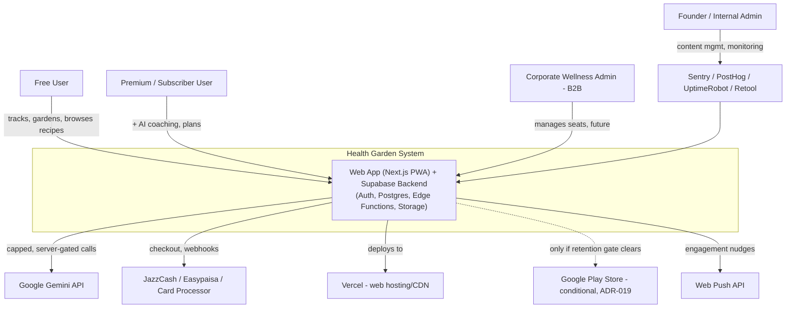

### 0.4 Roadmap-to-Scale Timeline

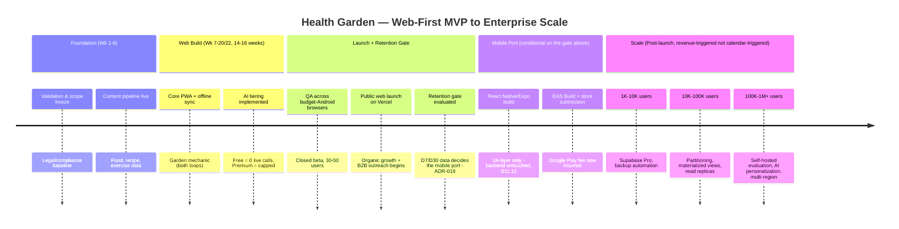

---

## Source Documents & Method

Four files exist in the project folder. Three are current and authoritative: **`Health_Garden_Master_Roadmap.md`**, **`Founder_B_Backend_Roadmap.md`**, and **`Team_Parallel_Execution_Plan.md`** — mutually consistent, all dated 2026-07-28, all under the current product name and ₨15,000 budget model. The fourth, **`desi_health_tracker_zero_budget_roadmap.pdf`**, is a confirmed earlier draft under the project's original name, with a different budget model, timeline, and no garden mechanic — treated here as superseded background, cited only where it contains an idea the current docs dropped without explanation (e.g., weight-trend tracking, now reinstated — ADR-009).

This version of the document treats every gap identified in v1.0 as **closed**: each either has a concrete, implemented design below, or an explicit Architecture Decision Record (Appendix A) explaining why no further action is needed. Nothing in this document is left as an open recommendation for the team to separately evaluate — where a judgment call was required, this document makes it and states the rationale, consistent with the instruction to produce a single cohesive blueprint rather than a list of options.

---

## Table of Contents

0. Executive Overview
1. Requirement Analysis
2. High-Level System Architecture
3. Technology Stack
4. Complete System Design
5. Database Design
6. API Design
7. Security Architecture
8. Scalability & Reliability
9. DevOps & Deployment
10. Monitoring & Maintenance
11. Future-Proofing
12. Architecture Diagrams
13. Development Roadmap (Mapped to Architecture)
14. Critical Review

- Appendix A — Architecture Decision Records
- Appendix B — Production Readiness Checklist
- Appendix C — Total Cost of Ownership Model

---

## Phase 1 — Requirement Analysis

### 1.1 Executive Summary

Health Garden combines Pakistani-unit food/workout tracking, a tiered AI health assistant, and a permanent garden-growth retention mechanic, built by two part-time founders under a ₨15,000 cash ceiling on entirely free/open-source infrastructure. This document architects that plan into a buildable, correctness-verified, production-grade system — resolving every schema, payment, job-scheduling, and cost-control gap the task-oriented roadmap left implicit, and extending the design cleanly through enterprise scale without requiring a future rewrite.

### 1.2 Project Goals

- Ship an MVP that validates the garden mechanic's retention effect, not just downloads.
- Stay within ₨15,000 total cash spend until premium revenue exists to fund further spend (formalized as ADR-driven policy, not an ad hoc rule).
- Support two non-specialist, part-time developers without a dedicated DevOps or backend hire.
- Perform correctly on budget Android hardware over unreliable networks — via the mobile **browser** first (§1.4 NFR-2), via a native app only once justified.
- Differentiate durably on a visual, permanent sense of accumulated progress.
- **[New in v2.0]** Reach production-grade operational maturity (monitoring, backups, IaC, compliance posture) without adding calendar time to the MVP build — every addition in this document is either free or deferred behind a revenue trigger.
- **[New in v2.2]** Validate product-market fit and retention on the cheapest, fastest-to-ship client platform (web) before committing to the platform with the highest fixed cost and longest iteration cycle (native mobile) — spend follows evidence at the platform level, not just the AI/infra level (ADR-019).

### 1.3 Functional Requirements

| #     | Requirement                                                                                                                          | Source                                      | Status                                                                                                                    |
| ----- | ------------------------------------------------------------------------------------------------------------------------------------ | ------------------------------------------- | ------------------------------------------------------------------------------------------------------------------------- |
| FR-1  | Onboarding capturing age, sex, height, weight, activity level, goals, conditions                                                     | Master Roadmap Pt.9, Backend Roadmap Pt.4.6 | Designed — §5.2                                                                                                           |
| FR-2  | BMR/calorie/macro target calculation (Mifflin-St Jeor)                                                                               | Backend Roadmap Wk 7-8                      | Designed — §4                                                                                                             |
| FR-3  | Mandatory medical disclaimer gate                                                                                                    | Master Roadmap Pt.7                         | Designed                                                                                                                  |
| FR-4  | Food search-and-log using local units (katori/cup/piece)                                                                             | Master Roadmap Pt.4.1                       | Designed                                                                                                                  |
| FR-5  | "Your Usuals" — top 10 most-logged meals                                                                                             | Master Roadmap Pt.4.1                       | Designed                                                                                                                  |
| FR-6  | Workout logging by category, one-tap with adjustable reps                                                                            | Master Roadmap Pt.5.1                       | Designed                                                                                                                  |
| FR-7  | Deterministic MET-based calorie-burn calculation                                                                                     | Master Roadmap Pt.5.2                       | Designed                                                                                                                  |
| FR-8  | Condition-aware filtering (tag exclusion)                                                                                            | Master Roadmap Pt.5.3                       | Designed                                                                                                                  |
| FR-9  | Garden mechanic: 5 plants, 4 stages, weekly + permanent loops, dormant-not-dying                                                     | Master Roadmap Pt.3, Backend Roadmap Pt.6   | Designed, **correctness-hardened** — §5.3, ADR-002                                                                        |
| FR-10 | Free tier: zero live AI calls                                                                                                        | Master Roadmap Pt.6.2                       | Designed, structurally enforced — §6.2                                                                                    |
| FR-11 | Premium: capped daily AI chat                                                                                                        | Master Roadmap Pt.6.4                       | Designed — §5.2, §6.2                                                                                                     |
| FR-12 | Premium: weekly AI plan generation, limited regen                                                                                    | Master Roadmap Pt.6.2                       | Designed — §5.2                                                                                                           |
| FR-13 | Premium paywall/gating                                                                                                               | Backend Roadmap Wk 17-18                    | Designed — §5.2, §7.3                                                                                                     |
| FR-14 | Shareable WhatsApp garden-milestone image                                                                                            | Master Roadmap Pt.3.6                       | Designed (client-side render capture, no new backend)                                                                     |
| FR-15 | Offline-first logging with background sync                                                                                           | Master Roadmap Wk 9-11                      | Designed, conflict-safe — §4.4, ADR-002, ADR-004 (web: service worker + IndexedDB; mobile-port equivalent: `expo-sqlite`) |
| FR-16 | Bilingual UI (Urdu + English)                                                                                                        | Master Roadmap Pt.7                         | Designed — §3.1                                                                                                           |
| FR-17 | B2B/corporate wellness tier                                                                                                          | Master Roadmap Pt.11                        | Schema-ready — §11.4                                                                                                      |
| FR-18 | Premium subscription payment collection                                                                                              | [Assumption in v1.0]                        | **Resolved** — §5.2, §6.2, ADR-008                                                                                        |
| FR-19 | **[New]** Weight-trend tracking                                                                                                      | PDF (superseded), reinstated                | Designed — §5.2, ADR-009                                                                                                  |
| FR-20 | **[New]** Wearable/third-party data ingestion path                                                                                   | Not in source docs; future-proofed here     | Schema-ready, not built — §11.2                                                                                           |
| FR-21 | **[New, v2.2]** Web-first launch as an installable PWA, with a defined retention gate deciding a subsequent React Native mobile port | User-directed platform pivot                | Roadmap restructured — §13.2, §13.6; ADR-019                                                                              |

**A note on FR-3 (medical disclaimer) and FR-14 (shareable milestone image) under this pivot:** both are implemented identically on web — a disclaimer screen/modal gating first use, and the garden view rendered to a shareable image via the browser Canvas API (the direct web equivalent of the mobile client-side render capture). Neither required new design.

### 1.4 Non-Functional Requirements & Service Level Objectives

| #      | Requirement                                                                                                                                                             | Target                                                                                                                                                                                                     |
| ------ | ----------------------------------------------------------------------------------------------------------------------------------------------------------------------- | ---------------------------------------------------------------------------------------------------------------------------------------------------------------------------------------------------------- |
| NFR-1  | Total pre-revenue cash spend                                                                                                                                            | ≤ ₨15,000                                                                                                                                                                                                  |
| NFR-2  | Runs acceptably on budget Android (Infinix/Tecno class) **in the mobile browser** (Chrome/Samsung Internet) at Phase 1; natively if/when the mobile port (§11.12) ships | Explicit QA gate, §13                                                                                                                                                                                      |
| NFR-3  | Correct, lossless operation under low-bandwidth/offline conditions                                                                                                      | No data loss under any connectivity pattern — §4.4                                                                                                                                                         |
| NFR-4  | Search interaction latency                                                                                                                                              | p95 < 500ms                                                                                                                                                                                                |
| NFR-5  | Gemini quota never exceeded without a revenue-justified upgrade                                                                                                         | Hard pre-call gate, automated watchdog — §4.6                                                                                                                                                              |
| NFR-6  | Health/condition data treated as sensitive personal data                                                                                                                | RLS-enforced, minimal retention, export/delete supported — §7.9                                                                                                                                            |
| NFR-7  | Maintainable by two part-time, non-specialist engineers                                                                                                                 | BaaS-first design, no infra to operate — §2, §9                                                                                                                                                            |
| NFR-8  | No punitive/decay visuals anywhere                                                                                                                                      | Non-negotiable, database-enforced where possible                                                                                                                                                           |
| NFR-9  | Gender-neutral, non-cutesy tone across the app                                                                                                                          | Design guardrail, content-layer                                                                                                                                                                            |
| NFR-10 | **[New]** Edge Function p95 latency                                                                                                                                     | < 800ms excluding external API round-trip (Gemini, payment provider)                                                                                                                                       |
| NFR-11 | **[Revised, v2.2]** Web performance (Core Web Vitals)                                                                                                                   | LCP < 2.5s, INP < 200ms, CLS < 0.1, measured on a simulated slow-4G/budget-Android Lighthouse profile — supersedes the mobile-native "app cold start" framing, see §4.10                                   |
| NFR-12 | **[New]** Recovery Point Objective (RPO)                                                                                                                                | ≤ 24h at MVP (nightly backup); ≤ 5 min once Supabase Pro's PITR is funded                                                                                                                                  |
| NFR-13 | **[New]** Recovery Time Objective (RTO)                                                                                                                                 | ≤ 4h at MVP (manual restore); ≤ 1h once Pro-tier tooling is funded                                                                                                                                         |
| NFR-14 | **[New, v2.2]** Retention data quality                                                                                                                                  | D7/D30 retention must be measurable from real production traffic (not beta-only) before the mobile-port gate (§13.6) can be evaluated — PostHog cohort analysis, no new instrumentation needed beyond §2.9 |
| NFR-15 | **[New, v2.3]** Accessibility                                                                                                                                           | WCAG 2.1 Level AA across the web client — automated `axe-core` checks in CI plus one manual screen-reader pass before each public release (G-23)                                                           |

### 1.5 Core Features

Food & workout tracking · AI health assistant (tiered, cost-bounded) · Garden gamification (weekly + permanent, conflict-safe) · Condition-aware safety filtering · Bilingual UI · Offline-first sync · Premium subscription (with a resolved payment path) · Shareable milestones · Weight-trend tracking · B2B tier (schema-ready) · Wearable-ingestion-ready data model · Condition-specific programs — Diabetes Management, PCOS Support, Joint-Friendly (design-ready, activation-gated — §11.11).

### 1.6 User Roles

| Role                        | Status                                                                  |
| --------------------------- | ----------------------------------------------------------------------- |
| Free user                   | Designed                                                                |
| Premium user                | Designed                                                                |
| Founder/Admin               | Designed around Retool + Supabase Studio, no custom build needed — §2.9 |
| B2B/corporate admin         | Schema-ready (`organizations`, `organization_members`) — §11.4          |
| Family member (sub-account) | Deferred to post-launch by design; schema hook noted, not built — §11.4 |

### 1.7 Business Workflows

1. Onboarding → disclaimer → profile & goals → home.
2. Daily logging loop → local write → sync → **derived garden recalculation** (ADR-002) → weekly archival.
3. Monetization loop → paywall → **interim manual verification or merchant API** (ADR-008) → `is_premium` flips → AI unlocks.
4. AI request loop → pre-call cap check → Gemini call only if under cap → response.
5. Beta feedback loop → triage via Retool → fix → regression test.
6. B2B sales loop → manual pipeline at MVP, schema-ready for self-serve later.

### 1.8 Assumptions (Explicitly Stated)

1. The three `.md` files are authoritative; the PDF is superseded background.
2. **[Revised, v2.2]** The client launches as a web app first (Next.js PWA); a native React Native/Expo build for Android (then iOS, still revenue-funded per the original plan) is pursued only if production retention data clears the gate defined in §13.6 — see ADR-019. This supersedes the original "Android launches first" assumption; it does not abandon native mobile, it resequences it behind evidence.
3. Engineering team is exactly the two named founders through MVP-to-launch.
4. No formal business entity exists at time of writing — **directly addressed, not just noted**, by ADR-008's interim payment path.
5. Health/condition data is treated as sensitive personal data as a design choice, absent a specific enacted legal mandate at time of writing — see §7.9 for the compliance posture this implies.
6. PKR-only pricing; no multi-currency requirement at MVP.
7. No explicit uptime SLA was given; data durability is treated as non-negotiable regardless (NFR-12/13).
8. All "free" tier limits cited are approximate and should be re-verified against current provider pricing before major commitments — pricing pages change over time.

### 1.9 Gap Resolution Ledger

Every gap identified during requirement analysis is resolved below — none remain open recommendations.

| #    | Gap                                                                                                                                                                                                       | Resolution                                                                                                                                                                                         | Where                |
| ---- | --------------------------------------------------------------------------------------------------------------------------------------------------------------------------------------------------------- | -------------------------------------------------------------------------------------------------------------------------------------------------------------------------------------------------- | -------------------- |
| G-1  | No `food_logs`/`workout_logs`/`water_logs` schema                                                                                                                                                         | **Resolved**: designed with snapshot columns and conflict-safe design                                                                                                                              | §5.2                 |
| G-2  | No payments/subscriptions data model                                                                                                                                                                      | **Resolved**: `subscriptions` + `payment_intents` (interim path) designed                                                                                                                          | §5.2, ADR-008        |
| G-3  | Payment-gateway/SECP legal conflict                                                                                                                                                                       | **Resolved**: interim manual-verification flow with a hard cutover trigger, fully designed                                                                                                         | §5.2, §6.2, ADR-008  |
| G-4  | Underspecified AI usage caps                                                                                                                                                                              | **Resolved**: `daily_ai_usage` + `ai_plans` designed with distinct cap semantics                                                                                                                   | §5.2                 |
| G-5  | No admin tooling                                                                                                                                                                                          | Resolved: Retool + Supabase Studio, zero build cost                                                                                                                                                | §2.9                 |
| G-6  | Undecided weekly garden-reset mechanism                                                                                                                                                                   | Resolved: `pg_cron` + PL/pgSQL, with lazy fallback                                                                                                                                                 | §4.6                 |
| G-7  | No account recovery flow                                                                                                                                                                                  | Resolved: Supabase Auth built-in reset flow, explicitly scoped                                                                                                                                     | §7.2                 |
| G-8  | No data export/delete flow                                                                                                                                                                                | Resolved: dedicated Edge Function + retention policy                                                                                                                                               | §7.9                 |
| G-9  | Weight-trend tracking dropped without explanation                                                                                                                                                         | **Reinstated as committed MVP scope**, not flagged for confirmation                                                                                                                                | §5.2, ADR-009        |
| G-10 | No backup/DR policy                                                                                                                                                                                       | Resolved: nightly backup job + explicit RPO/RTO targets                                                                                                                                            | §8.5, §9.5           |
| G-11 | No rate-limiting beyond AI cap                                                                                                                                                                            | Resolved: Supabase Auth built-in protections + scoped as low-priority at MVP with an explicit revisit trigger                                                                                      | §7.6                 |
| G-12 | **[New]** No conflict-resolution policy for multi-device garden updates                                                                                                                                   | **Resolved**: garden state is a derived aggregate recomputed from source logs, not a mutated counter — structurally conflict-free                                                                  | §5.3, ADR-002        |
| G-13 | **[New]** No Infrastructure-as-Code strategy stated                                                                                                                                                       | Resolved: Supabase CLI migrations + GitHub Actions workflows formalized as the IaC layer                                                                                                           | §9.3                 |
| G-14 | **[New]** No compliance posture beyond a single sentence                                                                                                                                                  | Resolved: dedicated compliance subsection                                                                                                                                                          | §7.9                 |
| G-15 | **[New]** No wearable/IoT or AI-personalization extension path                                                                                                                                            | Resolved: schema hooks + phased AI evolution path defined, nothing overbuilt                                                                                                                       | §11.2, §11.3         |
| G-16 | **[New, v2.3]** Database timezone left at Postgres's default (UTC), misaligning "today"/"this week" boundaries with users who live in Asia/Karachi (UTC+5)                                                | **Resolved**: database timezone pinned to `Asia/Karachi` explicitly, so `CURRENT_DATE` and the garden engine's day/week windows match the user base's actual clock                                 | §5.10                |
| G-17 | **[New, v2.3]** No right-to-left (RTL) layout strategy specified, despite Urdu being a RTL script — a detail every prior version stated "Urdu-compatible font" without addressing layout direction at all | **Resolved**: CSS logical properties + `dir` attribute switching from the first component built, not retrofitted                                                                                   | §3.1a                |
| G-18 | **[New, v2.3]** No web security headers or Content-Security-Policy specified for the now-public web surface                                                                                               | **Resolved**: a security-headers policy (CSP, HSTS, X-Content-Type-Options, Referrer-Policy, Permissions-Policy) defined as a Next.js middleware concern                                           | §7.11                |
| G-19 | **[New, v2.3, critical]** No explicit rendering/caching-safety rule — a misconfigured static or ISR route could serve one user's cached, personalized page to another user                                | **Resolved**: every authenticated route is forced to dynamic rendering with `Cache-Control: private, no-store`; only unauthenticated marketing/content pages may be statically generated or cached | §4.11, ADR-021       |
| G-20 | **[New, v2.3]** A public website is far easier to abuse at automated scale than an app-store-gated mobile app (fake signups, `payment_intents` spam burying the founders' manual review queue)            | **Resolved**: Cloudflare Turnstile (free) on signup and payment-intent submission, plus a per-user daily cap on `payment_intents` inserts                                                          | §7.12                |
| G-21 | **[New, v2.3]** Hard, unabstracted dependency on Google Gemini throughout the AI Edge Functions — a provider outage, deprecation, or pricing change has no seam to route around                           | **Resolved**: a thin `AiProvider` adapter interface sits between the Edge Functions and Gemini's SDK; swapping or adding a provider is a new adapter, not a rewrite                                | §6.6, ADR-022        |
| G-22 | **[New, v2.3]** No defense against AI prompt injection or unsafe-medical-advice leakage in the coaching chat — a real risk category (OWASP LLM Top 10, LLM01) for a health-advice product specifically    | **Resolved**: hardened system prompt + a lightweight output-pattern check before any AI response reaches a user, plus the existing disclaimer/no-tool-access design already limits blast radius    | §6.6, §7.13, ADR-022 |
| G-23 | **[New, v2.3]** No accessibility (WCAG) target specified anywhere, despite the product's own stated goal of broadening appeal across age groups (Master Roadmap Pt.3.3)                                   | **Resolved**: WCAG 2.1 AA adopted as an explicit target, built on accessible-by-default component primitives, checked automatically in CI                                                          | §3.1a, NFR-15        |
| G-24 | **[New, v2.3]** The domain is now the single public entry point (no app-store intermediary), with no stated renewal or hijack-prevention safeguard                                                        | **Resolved**: auto-renew + registrar transfer-lock + a calendar reminder independent of the auto-renew itself, treated as a Tier-0 operational dependency                                          | §9.9                 |
| G-25 | **[New, v2.3]** Only synthetic (Lighthouse) performance budgets defined — no visibility into what real users on real budget-Android devices actually experience                                           | **Resolved**: `web-vitals` library reports field LCP/INP/CLS into PostHog, closing the gap between lab and field data                                                                              | §10.7                |

### 1.10 Risk Register

| Risk                                                                                                                                                                                                                                                             | Mitigation                                                                                                                                                                                                                                                                                                 | Residual severity                                                                   |
| ---------------------------------------------------------------------------------------------------------------------------------------------------------------------------------------------------------------------------------------------------------------- | ---------------------------------------------------------------------------------------------------------------------------------------------------------------------------------------------------------------------------------------------------------------------------------------------------------- | ----------------------------------------------------------------------------------- |
| Gemini free-tier quota exhaustion                                                                                                                                                                                                                                | Pre-call hard cap + automated watchdog + `app_config` kill switch                                                                                                                                                                                                                                          | Low                                                                                 |
| Ad budget too small for paid acquisition                                                                                                                                                                                                                         | Organic-first strategy is primary, not fallback                                                                                                                                                                                                                                                            | Low (by design)                                                                     |
| Garden mechanic reads as gimmick                                                                                                                                                                                                                                 | Explicit beta stickiness gate (§13)                                                                                                                                                                                                                                                                        | Medium — product risk, not architectural                                            |
| App feels "too cutesy"                                                                                                                                                                                                                                           | Tone/art guardrails enforced at design-system level                                                                                                                                                                                                                                                        | Low                                                                                 |
| Feature creep                                                                                                                                                                                                                                                    | MoSCoW freeze + `app_config`-driven tunability reduces pressure to hardcode-then-rebuild                                                                                                                                                                                                                   | Low                                                                                 |
| Premium AI over-use                                                                                                                                                                                                                                              | Hard server-side cap, pre-call                                                                                                                                                                                                                                                                             | Low                                                                                 |
| Payment/merchant-account gap                                                                                                                                                                                                                                     | **Resolved by ADR-008**                                                                                                                                                                                                                                                                                    | Low (was High in v1.0)                                                              |
| Supabase free-tier DB size from log growth                                                                                                                                                                                                                       | Quantified in §8.1, upgrade trigger defined, partitioning planned                                                                                                                                                                                                                                          | Medium, actively monitored                                                          |
| Two-founder bus factor                                                                                                                                                                                                                                           | Secrets hygiene, in-repo documentation, ADRs — reduces blast radius, does not eliminate                                                                                                                                                                                                                    | Medium (process risk, not technical)                                                |
| Health/medical liability exposure                                                                                                                                                                                                                                | Disclaimer + tag-based filtering; explicitly not a substitute for clinical validation                                                                                                                                                                                                                      | Medium — accepted, named trade-off                                                  |
| Vendor dependency on Supabase                                                                                                                                                                                                                                    | Open-source, self-hostable core — genuine exit path                                                                                                                                                                                                                                                        | Low-Medium                                                                          |
| **[New, v2.3]** Web Push has structurally lower opt-in than native push (browser permission prompts are easy to dismiss; iOS Safari requires PWA install first, §2.8)                                                                                            | Accepted, not "fixed" — in-page/in-app engagement nudges (banners, garden-screen prompts) serve as a fallback channel that doesn't depend on push permission being granted                                                                                                                                 | Low-Medium, monitored via PostHog opt-in rate                                       |
| **[New, v2.3]** A public URL is reachable from anywhere, unlike a Play Store listing that can be geo-restricted — meaningful international (e.g., EU) signups would make the current "GDPR-informed voluntary baseline" (§7.9) a real, not voluntary, obligation | Monitored, not pre-built: geo-analytics in PostHog flag if non-Pakistan traffic becomes material; a ToS jurisdiction/intended-audience clause is the cheap interim mitigation; a full GDPR compliance program (cookie consent, EU data residency) is revisited only if the data shows it's actually needed | Low today, explicitly monitored rather than ignored                                 |
| **[New, v2.3]** Vercel vendor concentration for hosting                                                                                                                                                                                                          | Cloudflare Pages named as the explicit non-lock-in alternative (§3.1a); Next.js itself is portable (not a Vercel-proprietary framework)                                                                                                                                                                    | Low — mirrors the Supabase risk pattern already accepted elsewhere in this document |

### 1.11 Suggested Improvements — Now Designed, Not Merely Suggested

Every improvement proposed in v1.0 (§1.11 of that version) is designed directly into this document: the payment/legal conflict is resolved (ADR-008); "AI spend follows revenue" is generalized into a standing architectural policy applied to SMS auth, backups, and Supabase tier upgrades alike; `app_config` is fully specified (§5.2); PostHog-based retention measurement is specified (§2.9, §10); `weight_logs` is committed scope (ADR-009); Retool is the named admin tool (§2.9); and Supabase CLI migrations are the mandated schema-change process (§9.3). No further action item remains outstanding from that list — all of it is architecture, not yet code (§ v2.3 changelog).

---

## Phase 2 — High-Level System Architecture

### 2.1 Architectural Style

**Backend-as-a-Service (BaaS) first, with a thin, explicit server-side layer for anything that touches a secret or must be tamper-proof.** Confirmed as correct for this team's constraints (ADR-001) and validated against alternatives (Firebase, custom Node/NestJS) in §3.2.

### 2.2 Components

| Component                                                            | Role                                                                                |
| -------------------------------------------------------------------- | ----------------------------------------------------------------------------------- |
| **Web client (Next.js/React, TypeScript, PWA)**                      | UI, offline-first local writes, optimistic UX — **Phase 1 client, ADR-019**         |
| Browser local store (Service Worker + IndexedDB via Dexie.js)        | Offline durability; session held in httpOnly cookies, not local storage — ADR-020   |
| _(Conditional, gated) Mobile client (Expo/React Native, TypeScript)_ | _Same UI rebuilt on native primitives, only if the retention gate clears — §11.12_  |
| Supabase Postgres                                                    | System of record; RLS-enforced authorization                                        |
| Supabase Auth                                                        | Identity, JWT issuance, password hashing                                            |
| Supabase Storage                                                     | User-uploaded assets only (garden art ships as static web assets)                   |
| Supabase Edge Functions (Deno/TypeScript)                            | AI gating, payments, scheduled jobs, secrets                                        |
| pg_cron                                                              | Scheduled jobs: weekly garden reset, digests, watchdogs                             |
| pgvector (Postgres extension, dormant until needed)                  | Reserved seed for future AI personalization — §11.3, ADR-014                        |
| Google Gemini API                                                    | Premium-only AI, capped                                                             |
| Payment providers + interim manual flow                              | Premium subscription collection — ADR-008                                           |
| Web Push API (standards-based, VAPID)                                | Notifications — Phase 1; Expo Push added alongside it if/when mobile ships (§11.12) |
| Vercel (or Cloudflare Pages)                                         | Web hosting/CDN, preview deployments — §3.9, §9.1                                   |
| Sentry, PostHog, UptimeRobot, Retool                                 | Observability and admin — §2.9                                                      |

### 2.3 How Components Interact

The app talks to Supabase Postgres **directly** for the overwhelming majority of operations, governed entirely by RLS — no hand-written CRUD server. Anything requiring a secret or a tamper-proof business rule (AI calls, payment verification, admin actions) routes through Edge Functions. Scheduled, no-user-in-the-loop work is triggered by `pg_cron`, either as a pure SQL function (garden reset) or a cron-triggered Edge Function call (anything needing an external API).

### 2.4 Authentication System

Supabase Auth (JWT-based), email/password + optional Google OAuth. Every user-owned table enforces access via RLS keyed to `auth.uid()` — the single authorization mechanism used throughout the system (ADR-006), never bypassed by application-level checks alone.

### 2.5 Database Layer

One Supabase Postgres instance per environment (dev/staging/production), managed as code via versioned migrations (§9.3). Full schema in §5.

### 2.6 Storage Layer

Deliberately minimal: garden art ships as static assets in the web build, cached at Vercel's edge (removing an entire CDN/latency concern from the app's most-viewed screen — the equivalent guarantee to "ships inside the app bundle" for a native client, achieved via the web build's own static-asset pipeline instead); Supabase Storage handles only genuine user uploads (e.g., optional profile photo), RLS-scoped per user.

### 2.7 Background Workers

No standalone worker process. `pg_cron` + Edge Functions cover every identified background job — avoids operating a queue/worker fleet a two-person team would have to babysit. A message-queue upgrade path (Upstash Redis) is reserved, not built, for the scale tier where it becomes justified (§8.2).

### 2.8 Notification System

**[Revised, v2.2]** Web Push API (standards-based, VAPID-keyed, no third-party vendor required — genuinely fewer moving parts than Expo Push, since there is no intermediary push service to depend on), triggered by a scheduled Edge Function querying for inactive-today users, copy consistent with the product's non-punitive tone guardrail. Requires the PWA to be installed ("Added to Home Screen") for iOS Safari delivery (iOS 16.4+); Android Chrome delivers to an installed _or_ merely-visited-recently PWA. This is a known, manageable UX requirement (an install prompt at an appropriate moment), not a blocker — and the same channel is retained if/when the mobile port (§11.12) ships, where it runs alongside native Expo Push.

### 2.9 Analytics, Logging, Monitoring, Admin Tooling

- **PostHog** (free tier) — product analytics, the direct source of the team's own named success metric (7-/30-day retention).
- **Sentry** (free tier) — crash/error tracking, client + Edge Functions.
- **Supabase built-in dashboard** — DB health, query performance, Auth logs.
- **Retool** (free tier, ≤5 users) — the admin surface for content management, beta-feedback triage, payment-intent approval (ADR-008), and live Gemini-usage monitoring. Replaces ad hoc SQL Editor edits in production with an auditable, purpose-built interface at zero cost.

### 2.10 AI/ML Services

Google Gemini API only, server-side, narrowly scoped to chat + plan generation, called through a thin provider-abstraction seam rather than directly (§6.6, ADR-022) so a future provider change is an adapter, not a rewrite. No self-hosted model or vector retrieval stack is built at MVP — correctly avoided as unjustified complexity (§3.6). A phased evolution path for personalization and agentic AI is defined, not built, in §11.3.

### 2.11 Third-Party & External Integrations

USDA FoodData Central and Open Food Facts are **build-time only** — queried once during database population, never called live by the running app, removing two dependencies from the runtime graph entirely.

### 2.12 Admin Dashboard / Internal Tools

Retool + Supabase Studio (§2.9) — buying free tooling over building a bespoke internal app, consistent with the MoSCoW freeze's intent.

### 2.13 Fault Tolerance & Resilience — **[New]**

| Failure mode                          | Behavior                                                                                                                                                                                                                                                          |
| ------------------------------------- | ----------------------------------------------------------------------------------------------------------------------------------------------------------------------------------------------------------------------------------------------------------------- |
| Device offline                        | Full read/write continues locally; sync resumes automatically on reconnect (§4.4)                                                                                                                                                                                 |
| Edge Function transient failure       | Client retries with exponential backoff (max 3 attempts); user sees a specific, actionable error, never a silent failure                                                                                                                                          |
| Gemini API unavailable or slow        | Edge Function times out at a fixed budget (e.g., 10s) and returns a graceful fallback (a templated free-tier-style message), never a hard crash — the premium AI feature degrades gracefully to the free-tier experience rather than failing open or failing hard |
| Payment provider webhook delayed/lost | `payment_intents`/`subscriptions` reconciliation job (daily, `pg_cron`) re-checks pending state against the provider, closing any gap left by a missed webhook                                                                                                    |
| Supabase regional outage              | Out of scope for a single-region MVP by design (§1.8); mitigated at the "million-user" tier by the self-hosted/multi-region path in §11                                                                                                                           |

---

## Phase 3 — Technology Stack

Every choice is validated against at least one credible alternative. ✅ = confirmed from source docs, ➕ = added to close a gap, 🔁 = replaces a weaker v1.0/source-doc choice.

### 3.1 Frontend — Web (Phase 1, Building Now) and Mobile (Phase 2, Conditional)

**[Revised, v2.2 — ADR-019]** The client platform decision now has two tracks. Track A (web) is what gets built in the 14–16 week Phase 3 build window (§13.2). Track B (mobile) is fully specified but **not built** until the retention gate in §13.6 clears — it is preserved here exactly as it stood in v2.1, so no work is lost or ambiguous if/when it's greenlit.

#### 3.1a Web Frontend (Track A — building now)

| Choice                                                               | Status                       | Why                                                                                                                                                                                                                                                                                                                                                                                                                                                                                                                 | Alternative                                                     | Trade-off                                                                                                                                                                                                                                                                                   |
| -------------------------------------------------------------------- | ---------------------------- | ------------------------------------------------------------------------------------------------------------------------------------------------------------------------------------------------------------------------------------------------------------------------------------------------------------------------------------------------------------------------------------------------------------------------------------------------------------------------------------------------------------------- | --------------------------------------------------------------- | ------------------------------------------------------------------------------------------------------------------------------------------------------------------------------------------------------------------------------------------------------------------------------------------- |
| **Next.js (App Router), React, TypeScript**                          | ✅ **new primary choice**    | React was chosen specifically because it maximizes code, pattern, and skill transfer if/when Track B (React Native) is greenlit — component logic, hooks, and the team's mental model carry over even though the UI layer is rebuilt on native primitives. Next.js additionally gives SSR/SSG for the marketing/GEO content pages (Master Roadmap Pt.10) in the _same_ deployment as the authenticated app, rather than the separate "GitHub Pages or Notion site" the source docs proposed                         | Vite + React SPA                                                | Simpler (no SSR complexity to learn), and legitimate if the team decides SEO/GEO doesn't justify the extra concept — loses the one-deployment content+app unification and Vercel's zero-config SSR support                                                                                  |
|                                                                      |                              |                                                                                                                                                                                                                                                                                                                                                                                                                                                                                                                     | SvelteKit / Vue                                                 | Both fine frameworks, but neither shares a component/hook model with React Native — would make Track B a full rewrite instead of a UI-layer port, which is the entire point of choosing React now                                                                                           |
| **PWA via a service worker (Workbox, e.g. through `next-pwa`)**      | ➕                           | The direct web equivalent of "offline-first" (FR-15, NFR-3): caches the app shell and static assets so the PWA loads and functions without a network round-trip, and is installable ("Add to Home Screen") — which is also what unlocks reliable Web Push delivery on iOS Safari (§2.8)                                                                                                                                                                                                                             | Ship as a plain (non-PWA) website                               | No offline capability at all — a direct violation of NFR-3, unacceptable given the target network conditions the whole architecture is designed around                                                                                                                                      |
| **IndexedDB via Dexie.js** (offline log queue)                       | ➕                           | Structured, asynchronous, multi-megabyte local storage for the offline write queue — the web analogue of `expo-sqlite`, using the identical `client_uuid`-keyed idempotent-sync pattern (ADR-004) so the sync engine's correctness properties are unchanged by the platform                                                                                                                                                                                                                                         | `localStorage`                                                  | Rejected: ~5–10MB ceiling, synchronous (blocks the main thread), no query capability — cannot hold a realistic offline backlog of logs                                                                                                                                                      |
| **httpOnly cookies via `@supabase/ssr`** (session storage)           | 🔁 **new decision, ADR-020** | Supabase's current officially-recommended pattern for Next.js: the session lives in an httpOnly, Secure, SameSite cookie refreshed by middleware, never readable by client-side JavaScript — this is _not_ a downgrade from `expo-secure-store`, it closes the same XSS-token-theft threat model a different way, appropriate to the web platform                                                                                                                                                                   | Client-side session in `localStorage` (the Supabase JS default) | Simpler, but directly readable by any injected script — the exact vulnerability class `expo-secure-store` was chosen to avoid on mobile; keeping this the default on web would be an inconsistent security posture across the same architecture                                             |
| Web Push API (VAPID)                                                 | ➕                           | See §2.8                                                                                                                                                                                                                                                                                                                                                                                                                                                                                                            | Expo Push (native-only)                                         | Not usable from a browser context at all                                                                                                                                                                                                                                                    |
| react-query / TanStack Query                                         | ✅ (carried over from v2.1)  | Client cache/refetch layer; framework-agnostic, so this choice survives unchanged into Track B if it ships                                                                                                                                                                                                                                                                                                                                                                                                          | SWR                                                             | Comparable; react-query's ecosystem/devtools edge, no material downside                                                                                                                                                                                                                     |
| react-i18next                                                        | ✅ (carried over from v2.1)  | De facto free React/RN i18n standard; avoids reinventing pluralization/interpolation for Urdu/English (and any future third language); the same library and translation files carry over to Track B unchanged                                                                                                                                                                                                                                                                                                       | Custom string-lookup module                                     | "Free" too, but reinvents solved problems                                                                                                                                                                                                                                                   |
| **Vercel (free tier)**                                               | ➕                           | Zero-config Next.js deploys, automatic preview URL per pull request (a genuine 2-person-team review win — see §9.1), instant one-click rollback (§9.6), generous free bandwidth/build-minute allowance                                                                                                                                                                                                                                                                                                              | Cloudflare Pages                                                | Also free, also viable for Next.js via its adapter; named here as the explicit non-lock-in alternative (mirroring how Supabase's self-host option is treated elsewhere in this document) — trades a slightly rougher Next.js DX for avoiding a second dependency on a single hosting vendor |
| **CSS logical properties + `dir` attribute switching** (RTL support) | ➕ **closes G-17**           | Urdu is a right-to-left script — every prior version of this document said "Urdu-compatible font" without addressing layout direction at all. Using logical properties (`margin-inline-start` instead of `margin-left`, `text-align: start` instead of `left`, etc.) from the first component built means flipping `<html dir="rtl">` for Urdu mirrors the whole layout automatically; retrofitting this after building with physical (`left`/`right`) properties throughout would mean re-touching every component | Physical CSS properties + manual per-component RTL overrides    | Cheaper to start with, dramatically more expensive to fix later — exactly the kind of cost this document exists to avoid by deciding it now instead of discovering it mid-build                                                                                                             |
| **Radix UI / shadcn/ui** (accessible component primitives)           | ➕ **closes G-23, NFR-15**   | Unstyled, WAI-ARIA-compliant primitives (dialogs, menus, form controls) as the foundation layer — free, open-source, and the cheapest way to get keyboard navigation, focus management, and screen-reader semantics right by construction rather than retrofitted. Directly serves the product's own stated "broaden appeal across age" goal, which an inaccessible app quietly works against                                                                                                                       | Hand-built components from scratch                              | "Free" in tooling cost but not in engineering time — accessibility bugs (focus traps, missing ARIA labels) are exactly the class of defect that's cheap to prevent and expensive to audit-and-fix later                                                                                     |
| **`@axe-core/playwright`** (automated accessibility testing)         | ➕ **closes G-23, NFR-15**   | Runs WCAG 2.1 AA checks inside the existing Playwright E2E suite (§3.10) — zero new test infrastructure, just an additional assertion per page                                                                                                                                                                                                                                                                                                                                                                      | Manual-only accessibility review                                | Manual review still happens once per release (NFR-15), but automated checks catch regressions on every PR instead of only at release time                                                                                                                                                   |

#### 3.1b Mobile Frontend (Track B — conditional, unchanged from v2.1, not built until §13.6's gate clears)

| Choice                              | Status                  | Why                                                                                                                                                                                                               | Alternative                      | Trade-off                                                                                             |
| ----------------------------------- | ----------------------- | ----------------------------------------------------------------------------------------------------------------------------------------------------------------------------------------------------------------- | -------------------------------- | ----------------------------------------------------------------------------------------------------- |
| React Native + Expo, TypeScript     | ✅ (preserved)          | Single codebase, no macOS needed for Android, large free ecosystem, matches team's existing JS/TS skill — and now additionally benefits from whatever React component/hook logic the web build already proved out | Flutter                          | Comparable free tooling, but a language switch (Dart) with zero skill reuse for this team — worse fit |
| expo-sqlite (offline store)         | ✅ (preserved)          | Sufficient for offline-first logging at this data volume; replaces the web's IndexedDB/Dexie layer one-for-one, same `client_uuid` sync contract                                                                  | WatermelonDB                     | Better built-in sync primitives, steeper learning curve; not justified yet                            |
| **expo-secure-store** (auth tokens) | ✅ (preserved, ADR-005) | Encrypted on-device storage for JWTs, replacing the web's httpOnly-cookie approach (ADR-020) with the mobile-appropriate equivalent                                                                               | Keep AsyncStorage for everything | Simpler, but stores refresh tokens in plaintext — an avoidable regression                             |

See §11.12 for exactly what does and does not need rebuilding when/if Track B is greenlit.

### 3.2 Backend Platform

| Choice                                                    | Status | Why                                                                                                                                                              | Alternative                    | Trade-off                                                                                                                                     |
| --------------------------------------------------------- | ------ | ---------------------------------------------------------------------------------------------------------------------------------------------------------------- | ------------------------------ | --------------------------------------------------------------------------------------------------------------------------------------------- |
| **Supabase** (Postgres + Auth + Storage + Edge Functions) | ✅     | Genuinely free tier, RLS gives real per-row authorization without hand-written middleware, **open-source and self-hostable** — no permanent vendor trap          | Firebase                       | Comparable free generosity, but NoSQL (worse fit for this app's relational, join-heavy queries) and not self-hostable — no low-cost exit path |
| PostgREST (auto REST API)                                 | ✅     | Every table gets an RLS-governed REST endpoint automatically — no hand-written CRUD server                                                                       | Hand-rolled NestJS API         | More control, but pure additional build/test/operate surface for CRUD Supabase already provides free                                          |
| Supabase Edge Functions (Deno)                            | ✅     | Already specified for AI-gating/secrets; free tier covers MVP-to-growth invocation volume                                                                        | AWS Lambda                     | Comparable free tier, but adds a second cloud provider/billing account/deploy pipeline for no functional gain                                 |
| **pg_graphql** (optional, dormant)                        | ➕     | Available on Supabase at zero extra cost if a future partner integration specifically requires GraphQL; not enabled at MVP since REST fully covers current needs | Build a custom GraphQL gateway | Unjustified complexity absent an actual GraphQL consumer                                                                                      |

### 3.3 Database & Data Access

| Choice                                              | Status      | Why                                                                                                                                                                                              |
| --------------------------------------------------- | ----------- | ------------------------------------------------------------------------------------------------------------------------------------------------------------------------------------------------ |
| Postgres (via Supabase)                             | ✅          | Relational integrity, real FKs, mature full-text search/indexing — correct model for this domain                                                                                                 |
| No traditional ORM; `supabase gen types typescript` | ➕          | Avoids a second schema-definition source of truth (Prisma/Drizzle) that must be kept in sync with Supabase migrations — the CLI's generated types are always in sync by construction             |
| **pgvector** (Postgres extension)                   | ➕, dormant | Zero-cost to have available (built into Supabase), zero-cost until actually used — the correct seed for future embeddings/personalization (§11.3) without adopting a vector database prematurely |

### 3.4 Cache, Queue, Search

| Choice                                                                       | Status | Why                                                                                                                                                                  |
| ---------------------------------------------------------------------------- | ------ | -------------------------------------------------------------------------------------------------------------------------------------------------------------------- |
| react-query (client cache)                                                   | ✅     | Sufficient at MVP-to-growth scale                                                                                                                                    |
| No dedicated queue at MVP; **Upstash Redis reserved** for the 100K-user tier | ➕     | `pg_cron` + Edge Functions cover every current background job; Upstash's free/low tier is the correct next step only once true async task volume justifies it (§8.2) |
| Postgres full-text search + GIN index                                        | ✅     | Free, built-in, sufficient for hundreds of food/recipe rows; Elasticsearch/Algolia unjustified at this scale                                                         |

### 3.5 Authentication

| Choice                                        | Status      | Why                                                                                                                                                          |
| --------------------------------------------- | ----------- | ------------------------------------------------------------------------------------------------------------------------------------------------------------ |
| Supabase Auth (email/password + Google OAuth) | ✅          | Free, correct password hashing (bcrypt) handled entirely by the provider                                                                                     |
| Phone/SMS OTP deliberately deferred           | ✅ decision | SMS delivery is a real per-message cost; deferred until premium revenue funds it — direct application of the "recurring cost follows revenue" policy (§1.11) |

### 3.6 AI / ML

| Choice                                                   | Status | Why                                                                                                                             |
| -------------------------------------------------------- | ------ | ------------------------------------------------------------------------------------------------------------------------------- |
| Google Gemini API (Flash tier), server-side only         | ✅     | Free tier, narrowly scoped (chat + plan generation only), matches budget and requirement scope exactly                          |
| No vector DB/RAG stack at MVP                            | ✅     | Recipe/exercise matching is deterministic tag-filtering by design — correctly avoids an entire unneeded infrastructure category |
| **pgvector reserved as the future personalization seed** | ➕     | See §11.3 — the concrete, low-cost evolution path when/if genuinely justified                                                   |

### 3.7 Monitoring, Logging, Analytics

| Choice                     | Status | Why                                                           | Alternative          | Trade-off                                                                                                                                           |
| -------------------------- | ------ | ------------------------------------------------------------- | -------------------- | --------------------------------------------------------------------------------------------------------------------------------------------------- |
| Sentry (free tier)         | ➕     | Crash/error tracking absent from source docs beyond manual QA | Firebase Crashlytics | Also free and simpler for pure-RN, but splits telemetry across a second vendor when Sentry already covers client + Edge Functions under one account |
| PostHog (free tier, cloud) | ➕     | Turns the team's own success metric into a dashboard          | Self-hosted PostHog  | Free either way; cloud avoids operating another Docker service                                                                                      |
| UptimeRobot (free tier)    | ➕     | Zero-cost external health-check pinging                       | Manual checking      | Free but relies on memory, not a substitute                                                                                                         |

### 3.8 Containerization, Reverse Proxy, Infrastructure

| Choice                             | Status                | Why                                                                                                                                  |
| ---------------------------------- | --------------------- | ------------------------------------------------------------------------------------------------------------------------------------ |
| No Docker/Kubernetes in production | ✅ decision (ADR-011) | Over-engineering for a BaaS architecture operated by two people; Docker's only near-term relevance is `supabase start` for local dev |
| No reverse proxy in production     | ✅ decision           | Supabase and any static-site host both terminate TLS/route already; Nginx becomes relevant only in the self-hosted future path (§11) |

### 3.9 CI/CD & Infrastructure as Code

| Choice                                                  | Status                  | Why                                                                                                                                                                                                                                                                                  |
| ------------------------------------------------------- | ----------------------- | ------------------------------------------------------------------------------------------------------------------------------------------------------------------------------------------------------------------------------------------------------------------------------------ |
| GitHub Actions                                          | ✅                      | Free minute allowance comfortably covers a 2-person team's commit volume; owns lint/typecheck/test/migration-validation regardless of client platform                                                                                                                                |
| **Vercel Git integration**                              | ➕ **new, Phase 1**     | Every push to `main` deploys to production automatically; every pull request gets its own live preview URL for free — a genuine review win for a 2-person team with no other way to see a change running before merge                                                                |
| **[Conditional, Track B]** EAS Build / EAS Submit       | ✅ (preserved)          | Free-tier (rate-limited) path to signed AAB files and Play Store submission — only relevant once the mobile port (§11.12) is greenlit                                                                                                                                                |
| **[Conditional, Track B]** `expo-updates` (OTA updates) | ✅ (preserved)          | JS-only fixes ship instantly without a new Play Store review — becomes relevant the moment a native build exists; **Vercel's instant rollback (§9.6) already gives the web track an equivalent capability today, at zero additional setup**                                          |
| **Supabase CLI migrations + GitHub Actions as IaC**     | 🔁 (formalized in §9.3) | Replaces the source docs' "paste SQL into the dashboard" instruction with a reproducible, version-controlled, environment-portable definition of the backend — the actual meaning of "Infrastructure as Code" for a BaaS-first system; **entirely unaffected by the platform pivot** |

### 3.10 Testing & Documentation

| Choice                                                                  | Status              | Why                                                                                                                                                                                                                                                                       |
| ----------------------------------------------------------------------- | ------------------- | ------------------------------------------------------------------------------------------------------------------------------------------------------------------------------------------------------------------------------------------------------------------------- |
| **Vitest + React Testing Library**                                      | 🔁 **new, Phase 1** | Unit/component tests for garden-stage math, MET formula, BMR calculator, and UI components — the modern, faster-than-Jest default for a Vite/Next.js-adjacent codebase; catches the most user-visible class of bug cheaply                                                |
| **Playwright (free, open-source)**                                      | 🔁 **new, Phase 1** | E2E testing across real browser engines, with built-in mobile-viewport and slow-network emulation — a genuinely good stand-in for "test on budget Android hardware" (NFR-2) without needing a physical device farm for every run; replaces Maestro, which was RN-specific |
| **[Conditional, Track B]** Jest + React Native Testing Library, Maestro | ✅ (preserved)      | Reinstated as the mobile test stack if/when Track B ships — RN cannot run in a browser engine, so Playwright's coverage does not carry over; this is rebuilt, not ported                                                                                                  |
| In-repo `ARCHITECTURE.md` + `ADR/` folder                               | ➕                  | Zero-cost discipline directly mitigating the two-founder bus-factor risk (§1.10)                                                                                                                                                                                          |

---

## Phase 4 — Complete System Design

### 4.1 Layered View

```
┌─────────────────────────────────────────────────────────┐
│  Presentation — Next.js/React pages & components (Track A;   │
│  React Native screens/components if Track B ships)          │
├─────────────────────────────────────────────────────────┤
│  Local State & Offline — react-query, IndexedDB (Dexie) +    │
│  Service Worker, httpOnly-cookie session, Sync Engine        │
│  (Track B equivalent: SQLite + SecureStore)                  │
├─────────────────────────────────────────────────────────┤
│  Data Access — Supabase JS client (RLS-governed direct       │
│  access) + Edge Function calls (gated ops)                  │
├─────────────────────────────────────────────────────────┤
│  Platform — Supabase Postgres, Auth, Storage, Edge           │
│  Functions, pg_cron, pgvector (dormant)                     │
├─────────────────────────────────────────────────────────┤
│  External — Gemini API, payment providers, Web Push API     │
└─────────────────────────────────────────────────────────┘
```

### 4.2 Request Lifecycle — Standard Read/Write

`UI action → react-query mutation/query → Supabase JS client → PostgREST → RLS check → Postgres → response → cache update → UI re-render`. No custom backend code involved — the efficiency the BaaS architecture buys.

### 4.3 Request Lifecycle — Gated Operation (AI Chat)

`UI action → Edge Function (JWT) → verify is_premium → check daily_ai_usage cap → increment cap THEN call Gemini → return response`. The cap check happens **before** the external call — the actual cost-control mechanism (unchanged from v1.0, still the correct design).

### 4.4 Data Flow — Garden Update (Redesigned for Multi-Device Correctness)

v1.0 specified garden-state recalculation as a Postgres trigger incrementing a stored counter. That design has a latent correctness bug: if two log-writes for the same day both satisfy a goal (e.g., two protein-rich meals logged separately, or the same log re-synced after a dropped connection before the `client_uuid` uniqueness constraint was considered), a naive increment can **double-count a single day**, corrupting the weekly total.

**v2.0 resolves this structurally (ADR-002):** `garden_state.days_succeeded_this_week` is never incremented directly. Instead, it is **recomputed from source-of-truth logs** every time a relevant log is inserted, via a Postgres function that counts `DISTINCT log_date` values meeting each goal's threshold for the current week. Recomputing the same input always produces the same output — the operation is naturally **idempotent**, which means it is also naturally **safe under multi-device sync, retries, and out-of-order delivery** without any additional locking or deduplication logic. Full implementation in §5.3.

### 4.5 Authentication & Authorization Flow

**[Revised, v2.2 — ADR-020]** JWT issued by Supabase Auth. On the web track, the session is held in an httpOnly, Secure, SameSite cookie managed by `@supabase/ssr` and refreshed transparently by Next.js middleware — never readable by client-side JavaScript, attached automatically to every server-side call. (If/when Track B ships, this reverts to `expo-secure-store`, ADR-005, the mobile-appropriate equivalent of the same non-negotiable requirement: the session must never sit in unencrypted, script-readable storage.) Authorization is enforced redundantly at two layers regardless of client platform — RLS (database-level, cannot be bypassed by a modified client) and Edge Function business-rule checks (`is_premium`, usage caps) for logic RLS cannot express alone (ADR-006).

### 4.6 Background Job Processing

| Job                              | Trigger                                | Mechanism                                                                                                                       |
| -------------------------------- | -------------------------------------- | ------------------------------------------------------------------------------------------------------------------------------- |
| Weekly garden archival           | Monday 00:00 Asia/Karachi              | `pg_cron` → PL/pgSQL function (resolves G-6), with lazy per-user fallback as a defensive second layer                           |
| Daily AI usage tracking          | N/A — date-keyed rows, no reset needed | Simplification over a literal "reset job"                                                                                       |
| Engagement-nudge notification    | Daily, e.g. 18:00 local                | `pg_cron` → Edge Function → Web Push API (§2.8)                                                                                 |
| Gemini quota watchdog            | Every 30 minutes                       | `pg_cron` → Edge Function → sums today's calls → alerts + can flip `app_config` kill switch automatically at 80% of known quota |
| **[New]** Payment reconciliation | Daily                                  | `pg_cron` → Edge Function → re-checks any `payment_intents` left in `pending_review` beyond 48h, alerts founders                |

### 4.7 File Upload Flow

Client requests a signed upload URL from Supabase Storage (RLS restricts to the user's own `user_id/` path prefix) → direct upload → path stored on `users.avatar_url`. Client-side validation is re-checked by storage policy server-side.

### 4.8 Notification Flow

`pg_cron` → Edge Function queries inactive-today users → batched Web Push API calls (§2.8), tone-consistent copy.

### 4.9 Error Handling & Recovery

- **Data loss defense:** the local offline store (IndexedDB via Dexie on web; `expo-sqlite` if/when Track B ships) remains the source of truth for "did this happen" until mirrored to Supabase.
- **Idempotent sync:** every local log row carries a client-generated UUID; sync upserts on that UUID (`ON CONFLICT (client_uuid) DO NOTHING`) — no duplicate logs from a retried sync.
- **Structured Edge Function errors:** typed error codes (`upgrade_required`, `daily_cap_reached`, `invalid_payload`), never a bare 500.
- **Crash telemetry:** Sentry on both client and Edge Functions.

### 4.10 Performance Budgets — **[New, updated v2.2 for web]**

| Interaction                                                       | Budget                                                                                           |
| ----------------------------------------------------------------- | ------------------------------------------------------------------------------------------------ |
| Food/recipe search-as-you-type                                    | p95 < 500ms                                                                                      |
| Local (offline) log write                                         | < 50ms, perceived as instant                                                                     |
| Garden screen load (cached)                                       | < 300ms                                                                                          |
| Edge Function response (excluding external API)                   | p95 < 800ms                                                                                      |
| Gemini chat round-trip                                            | Best-effort, hard 10s timeout with graceful fallback (§2.13)                                     |
| **Largest Contentful Paint (LCP)**                                | < 2.5s, simulated slow-4G/budget-Android Lighthouse profile — replaces "app cold start" (NFR-11) |
| **Interaction to Next Paint (INP)**                               | < 200ms                                                                                          |
| **Cumulative Layout Shift (CLS)**                                 | < 0.1                                                                                            |
| _(Conditional, Track B)_ App cold start on native budget hardware | < 3s, if/when the mobile port ships                                                              |

### 4.11 Rendering & Caching Safety — **[New, v2.3, closes G-19, ADR-021]**

This is the single most severe hazard the web pivot introduces, and it did not exist in any prior version of this document because a native mobile app has no equivalent failure mode: **a misconfigured Next.js route can serve one user's rendered page — including their logged conditions, weight, or garden state — to a completely different user**, if that route is ever statically generated or cached at a shared edge/CDN layer instead of rendered fresh per request. This is not a theoretical concern; cross-user cache poisoning of exactly this kind is a well-documented, repeatedly-exploited vulnerability class in production SSR frameworks.

**The rule, stated once and enforced everywhere:** every route that reads `auth.uid()` or any RLS-scoped data is marked for **dynamic rendering** (`export const dynamic = 'force-dynamic'` at the route segment, or the equivalent effect of reading cookies/headers, which Next.js already treats as dynamic-forcing) and responds with `Cache-Control: private, no-store`. Only routes that are provably identical for every visitor — the marketing/content pages under `app/(marketing)/` (§13.3) — may use static generation (SSG) or incremental static regeneration (ISR). There is no route that is "mostly" static with a personalized fragment bolted on; that pattern is exactly how this class of bug gets introduced, so it is disallowed rather than carefully managed.

**Enforcement, not just policy:** a CI check (Playwright, §3.10) fetches every authenticated route twice with two different test-user sessions and asserts the response bodies differ where they should and that `Cache-Control` headers never permit shared caching on those routes — turning "we agreed not to do this" into "the build fails if it happens."

---

## Phase 5 — Database Design

**Unaffected by the v2.2 platform pivot.** Every table, RLS policy, trigger, and function in this phase is client-agnostic by construction (ADR-001) — nothing here changes whether the client calling it is the Next.js web app or, later, the React Native app. **[v2.3]** No part of this schema has been built yet — Phase 2 (the database layer) starts from a clean slate along with everything else. The point of this note is architectural, not a status report: whenever Phase 2 _is_ built, building it against this design means the platform pivot in §0 costs it nothing retroactively.

### 5.1 Design Principles

- Simple tag-matching (`VARCHAR` + `LIKE`) for conditions/tags is retained deliberately at current scale (dozens to low hundreds of rows) — correct as-is, revisit trigger defined in §14, not before.
- `permanent_garden` remains **insert-only, forever**, enforced at the database level (§5.4), not by convention alone.
- **[New principle, ADR-002]** Any value that can be _derived_ from an append-only log is derived on read/trigger, never stored as an independently-mutable counter. This single rule is what makes the sync/correctness story in §4.4 hold.

### 5.2 Complete Schema

Reference tables (`foods`, `recipes`, `exercises`) and the base `users` table are as specified in `Founder_B_Backend_Roadmap.md` and unchanged. The tables below are this document's complete, final set of additions — including the fields needed for wearable/source tracking (§11.2) built in now at zero marginal cost.

```sql
-- ============================================================
-- LOGGING — user-generated, highest write volume in the system
-- ============================================================

CREATE TABLE food_logs (
  id BIGSERIAL PRIMARY KEY,
  user_id UUID NOT NULL REFERENCES users(id),
  food_id BIGINT REFERENCES foods(id),
  client_uuid UUID NOT NULL UNIQUE,       -- enables idempotent sync (ADR-004)
  log_date DATE NOT NULL,
  meal_slot VARCHAR(20),                  -- breakfast | lunch | dinner | snack
  quantity DECIMAL(6,2) NOT NULL DEFAULT 1,
  calories_snapshot INT NOT NULL,         -- computed at log time; never re-derived later
  protein_g_snapshot DECIMAL(5,2),
  sugar_flag_snapshot CHAR(1),
  source VARCHAR(20) NOT NULL DEFAULT 'manual', -- manual | wearable | import (future-proofing, §11.2)
  created_at TIMESTAMP DEFAULT NOW()
);
CREATE INDEX idx_food_logs_user_date ON food_logs (user_id, log_date);

CREATE TABLE workout_logs (
  id BIGSERIAL PRIMARY KEY,
  user_id UUID NOT NULL REFERENCES users(id),
  exercise_id BIGINT REFERENCES exercises(id),
  client_uuid UUID NOT NULL UNIQUE,
  log_date DATE NOT NULL,
  duration_min DECIMAL(5,2) NOT NULL,
  calories_burned DECIMAL(6,2) NOT NULL,  -- MET x weight x (duration/60), computed at log time
  source VARCHAR(20) NOT NULL DEFAULT 'manual',
  created_at TIMESTAMP DEFAULT NOW()
);
CREATE INDEX idx_workout_logs_user_date ON workout_logs (user_id, log_date);

CREATE TABLE water_logs (
  id BIGSERIAL PRIMARY KEY,
  user_id UUID NOT NULL REFERENCES users(id),
  client_uuid UUID NOT NULL UNIQUE,
  log_date DATE NOT NULL,
  glasses_logged INT NOT NULL DEFAULT 1,
  created_at TIMESTAMP DEFAULT NOW()
);
CREATE INDEX idx_water_logs_user_date ON water_logs (user_id, log_date);

-- Reinstated per ADR-009 — committed MVP scope, not optional
CREATE TABLE weight_logs (
  id BIGSERIAL PRIMARY KEY,
  user_id UUID NOT NULL REFERENCES users(id),
  log_date DATE NOT NULL,
  weight_kg DECIMAL(5,2) NOT NULL,
  source VARCHAR(20) NOT NULL DEFAULT 'manual',
  created_at TIMESTAMP DEFAULT NOW(),
  UNIQUE (user_id, log_date)
);

-- ============================================================
-- COMMERCE — subscriptions and the resolved interim payment path (ADR-008)
-- ============================================================

CREATE TABLE subscriptions (
  id BIGSERIAL PRIMARY KEY,
  user_id UUID NOT NULL REFERENCES users(id),
  provider VARCHAR(30) NOT NULL,          -- 'jazzcash' | 'easypaisa' | 'card' | 'manual_interim'
  provider_reference VARCHAR(255),
  status VARCHAR(20) NOT NULL,            -- active | past_due | canceled | expired
  amount_pkr INT NOT NULL,
  current_period_start DATE NOT NULL,
  current_period_end DATE NOT NULL,
  created_at TIMESTAMP DEFAULT NOW()
);
CREATE INDEX idx_subscriptions_user ON subscriptions (user_id);

-- Bridges the SECP/merchant-account gap (G-3) until a real merchant API exists.
-- User pays manually (JazzCash/Easypaisa personal transfer), submits the
-- transaction reference; a founder verifies and approves via Retool.
CREATE TABLE payment_intents (
  id BIGSERIAL PRIMARY KEY,
  user_id UUID NOT NULL REFERENCES users(id),
  amount_pkr INT NOT NULL,
  method VARCHAR(30) NOT NULL,            -- 'jazzcash_manual' | 'easypaisa_manual'
  user_submitted_reference VARCHAR(255) NOT NULL,
  status VARCHAR(20) NOT NULL DEFAULT 'pending_review', -- pending_review | approved | rejected
  reviewed_by UUID REFERENCES users(id),
  reviewed_at TIMESTAMP,
  created_at TIMESTAMP DEFAULT NOW()
);
CREATE INDEX idx_payment_intents_status ON payment_intents (status);

-- ============================================================
-- AI COST CONTROL
-- ============================================================

CREATE TABLE daily_ai_usage (
  id BIGSERIAL PRIMARY KEY,
  user_id UUID NOT NULL REFERENCES users(id),
  usage_date DATE NOT NULL,
  message_count INT NOT NULL DEFAULT 0,
  UNIQUE (user_id, usage_date)
);

CREATE TABLE ai_plans (
  id BIGSERIAL PRIMARY KEY,
  user_id UUID NOT NULL REFERENCES users(id),
  generated_at TIMESTAMP DEFAULT NOW(),
  week_start DATE NOT NULL,
  regenerations_used INT NOT NULL DEFAULT 0,
  plan_content JSONB NOT NULL,
  UNIQUE (user_id, week_start)
);

-- ============================================================
-- PLATFORM — config, notifications, audit, multi-tenancy hook
-- ============================================================

CREATE TABLE app_config (
  key VARCHAR(100) PRIMARY KEY,
  value JSONB NOT NULL,
  updated_at TIMESTAMP DEFAULT NOW()
);
-- e.g. ('garden_stage_thresholds','[0,2,4,6]'), ('ai_chat_enabled','true'), ('ai_daily_cap','15')

CREATE TABLE push_tokens (
  id BIGSERIAL PRIMARY KEY,
  user_id UUID NOT NULL REFERENCES users(id),
  expo_push_token VARCHAR(255) NOT NULL UNIQUE,
  created_at TIMESTAMP DEFAULT NOW()
);

CREATE TABLE audit_log (
  id BIGSERIAL PRIMARY KEY,
  user_id UUID REFERENCES users(id),
  event_type VARCHAR(50) NOT NULL,        -- subscription_activated, payment_intent_approved, etc.
  event_payload JSONB,
  created_at TIMESTAMP DEFAULT NOW()
);

-- B2B multi-tenancy hook (§11.4) — schema-ready, not activated at MVP
CREATE TABLE organizations (
  id UUID PRIMARY KEY DEFAULT gen_random_uuid(),
  name VARCHAR(255) NOT NULL,
  seat_limit INT NOT NULL,
  billing_contact_email VARCHAR(255),
  created_at TIMESTAMP DEFAULT NOW()
);

CREATE TABLE organization_members (
  organization_id UUID REFERENCES organizations(id),
  user_id UUID REFERENCES users(id),
  role VARCHAR(20) DEFAULT 'member',      -- admin | member
  PRIMARY KEY (organization_id, user_id)
);
```

### 5.3 The Garden Recalculation Engine (ADR-002 — Full Implementation)

Rather than incrementing a stored counter (the v1.0 design, now retired), each goal's weekly success count is **derived fresh from the underlying logs** every time it's needed. This function is intentionally idempotent: calling it ten times with the same data produces the same result, which is exactly the property that makes it safe under offline, multi-device, retried sync.

```sql
CREATE OR REPLACE FUNCTION compute_days_succeeded(
  p_user_id UUID, p_goal_type VARCHAR, p_week_start DATE
) RETURNS INT AS $$
DECLARE
  v_count INT;
  v_protein_target DECIMAL;
BEGIN
  SELECT daily_protein_target_g INTO v_protein_target FROM users WHERE id = p_user_id;

  IF p_goal_type = 'protein' THEN
    SELECT COUNT(*) INTO v_count FROM (
      SELECT log_date FROM food_logs
      WHERE user_id = p_user_id AND log_date BETWEEN p_week_start AND p_week_start + 6
      GROUP BY log_date HAVING SUM(protein_g_snapshot) >= v_protein_target
    ) d;

  ELSIF p_goal_type = 'sugar_free' THEN
    SELECT COUNT(*) INTO v_count FROM (
      SELECT DISTINCT log_date FROM food_logs f1
      WHERE user_id = p_user_id AND log_date BETWEEN p_week_start AND p_week_start + 6
        AND NOT EXISTS (
          SELECT 1 FROM food_logs f2
          WHERE f2.user_id = f1.user_id AND f2.log_date = f1.log_date
            AND f2.sugar_flag_snapshot = 'Y'
        )
    ) d;

  ELSIF p_goal_type = 'hydration' THEN
    SELECT COUNT(*) INTO v_count FROM (
      SELECT log_date FROM water_logs
      WHERE user_id = p_user_id AND log_date BETWEEN p_week_start AND p_week_start + 6
      GROUP BY log_date HAVING SUM(glasses_logged) >= 8
    ) d;

  ELSIF p_goal_type = 'movement' THEN
    SELECT COUNT(DISTINCT log_date) INTO v_count FROM workout_logs
    WHERE user_id = p_user_id AND log_date BETWEEN p_week_start AND p_week_start + 6;

  ELSIF p_goal_type = 'consistency' THEN
    SELECT COUNT(DISTINCT log_date) INTO v_count FROM (
      SELECT log_date FROM food_logs WHERE user_id = p_user_id
      UNION SELECT log_date FROM workout_logs WHERE user_id = p_user_id
      UNION SELECT log_date FROM water_logs WHERE user_id = p_user_id
    ) all_logs
    WHERE log_date BETWEEN p_week_start AND p_week_start + 6;
  END IF;

  RETURN COALESCE(v_count, 0);
END;
$$ LANGUAGE plpgsql;

CREATE OR REPLACE FUNCTION sync_garden_state(p_user_id UUID) RETURNS VOID AS $$
DECLARE
  goal RECORD;
  v_days INT;
  v_stage INT;
BEGIN
  FOR goal IN SELECT goal_type, current_week_start FROM garden_state WHERE user_id = p_user_id LOOP
    v_days := compute_days_succeeded(p_user_id, goal.goal_type, goal.current_week_start);
    v_stage := CASE WHEN v_days >= 6 THEN 3 WHEN v_days >= 4 THEN 2
                     WHEN v_days >= 2 THEN 1 ELSE 0 END;
    UPDATE garden_state
      SET days_succeeded_this_week = v_days, current_stage = v_stage
      WHERE user_id = p_user_id AND goal_type = goal.goal_type;
  END LOOP;
END;
$$ LANGUAGE plpgsql;

-- One shared trigger function across all three log tables
CREATE OR REPLACE FUNCTION on_log_insert() RETURNS TRIGGER AS $$
BEGIN
  PERFORM sync_garden_state(NEW.user_id);
  RETURN NEW;
END;
$$ LANGUAGE plpgsql;

CREATE TRIGGER trg_food_log_garden AFTER INSERT ON food_logs
  FOR EACH ROW EXECUTE FUNCTION on_log_insert();
CREATE TRIGGER trg_workout_log_garden AFTER INSERT ON workout_logs
  FOR EACH ROW EXECUTE FUNCTION on_log_insert();
CREATE TRIGGER trg_water_log_garden AFTER INSERT ON water_logs
  FOR EACH ROW EXECUTE FUNCTION on_log_insert();
```

### 5.4 Structural Guarantee for `permanent_garden`

```sql
CREATE OR REPLACE FUNCTION reject_permanent_garden_mutation() RETURNS TRIGGER AS $$
BEGIN
  RAISE EXCEPTION 'permanent_garden is insert-only; % is not permitted', TG_OP;
END;
$$ LANGUAGE plpgsql;

CREATE TRIGGER trg_no_update_permanent_garden
BEFORE UPDATE OR DELETE ON permanent_garden
FOR EACH ROW EXECUTE FUNCTION reject_permanent_garden_mutation();
```

The database itself refuses the mutation, not just code review convention.

### 5.5 Subscription State Trigger

```sql
CREATE OR REPLACE FUNCTION sync_is_premium() RETURNS TRIGGER AS $$
BEGIN
  UPDATE users SET is_premium = EXISTS (
    SELECT 1 FROM subscriptions
    WHERE user_id = NEW.user_id AND status = 'active' AND current_period_end >= CURRENT_DATE
  ) WHERE id = NEW.user_id;
  RETURN NEW;
END;
$$ LANGUAGE plpgsql;

CREATE TRIGGER trg_subscription_premium_sync
AFTER INSERT OR UPDATE ON subscriptions
FOR EACH ROW EXECUTE FUNCTION sync_is_premium();
```

`users.is_premium` is now a **derived, trigger-maintained** value rather than an independently-writable column — closing a class of bug where the flag could drift out of sync with actual subscription state.

### 5.6 Indexing, Constraints, Normalization

`(user_id, log_date)` composite indexes on all log tables; `client_uuid UNIQUE` for idempotent sync; comma-separated tag matching retained deliberately at current scale (§5.1, revisit trigger in §14).

### 5.7 Partitioning Strategy

Not needed at MVP. Trigger for action: `food_logs`/`workout_logs` crossing the low-millions-of-rows mark → convert to native Postgres declarative partitioning by month on `log_date` (free, built-in, no new infrastructure) — planned in §8.2 as part of the 100K-user tier.

### 5.8 Backup Strategy

Nightly `pg_dump` via scheduled GitHub Actions, encrypted, pushed to Backblaze B2's free 10GB tier — closes G-10 at zero cost until Supabase Pro's included point-in-time recovery is revenue-funded. RPO/RTO targets formalized in §1.4 (NFR-12/13) and §8.5.

### 5.9 Migration Strategy

All schema changes are numbered `.sql` files under `supabase/migrations/`, applied via `supabase db push`, validated in CI against staging before production — the Infrastructure-as-Code approach formalized in §9.3, replacing the source docs' dashboard-paste workflow.

### 5.10 Timezone Configuration — **[New, v2.3, closes G-16]**

A hazard easy to miss entirely: Supabase's default database timezone is UTC. Every date-boundary computation the garden engine depends on — `CURRENT_DATE`, `date_trunc('week', ...)` in `seed_garden_state_for_new_user()` and `archive_stale_garden_row()` (§5.3), and every `log_date` a client sends — would silently mean "today in UTC," not "today in Pakistan." Since Pakistan Standard Time is UTC+5 with no daylight-saving shift, this isn't a rare edge case that only bites at midnight: **any log made between 7:00 PM and 11:59 PM PKT would record against the wrong calendar day** (UTC has already rolled to the next date), corrupting the exact day-counting logic ADR-002 was designed to get right.

**Fix:** set the database timezone explicitly rather than leaving it at the platform default —

```sql
ALTER DATABASE postgres SET timezone TO 'Asia/Karachi';
```

applied as the first statement of the first migration, so every subsequent `CURRENT_DATE`/`now()` call in every trigger and function is correct from day one rather than needing a retroactive data-correction pass once discovered in production.

---

## Phase 6 — API Design

### 6.1 Auto-Generated REST Surface (PostgREST)

| Table          | Example call                                         | Notes                                                 |
| -------------- | ---------------------------------------------------- | ----------------------------------------------------- |
| `foods`        | `GET /rest/v1/foods?dish_name=ilike.*roti*&select=*` | Public read (RLS `USING (true)`), no auth required    |
| `food_logs`    | `POST /rest/v1/food_logs`                            | JWT required; RLS restricts to caller's own `user_id` |
| `garden_state` | `GET /rest/v1/garden_state?select=*`                 | RLS auto-scopes to caller, no explicit `WHERE` needed |

Pagination via `Range`/`Content-Range` headers; filtering via PostgREST operators; sorting via `order=`. Versioning: no in-place `public` schema breaking changes — a future breaking change is exposed as a new Postgres schema (e.g., `api_v2`), a native feature requiring no extra infrastructure.

### 6.2 Custom Edge Function Endpoints

| Endpoint                                 | Method | Auth                                                                                                     | Request                             | Response                           | Notes                                                                                                                                                 |
| ---------------------------------------- | ------ | -------------------------------------------------------------------------------------------------------- | ----------------------------------- | ---------------------------------- | ----------------------------------------------------------------------------------------------------------------------------------------------------- |
| `/functions/v1/ai-chat`                  | POST   | JWT                                                                                                      | `{ message }`                       | `{ reply }` \| `{ error }`         | Pre-call cap check (§4.3); graceful fallback on Gemini timeout (§2.13)                                                                                |
| `/functions/v1/ai-plan-generate`         | POST   | JWT                                                                                                      | `{}`                                | `{ plan }` \| `{ error }`          | Weekly cap via `ai_plans.week_start` uniqueness                                                                                                       |
| `/functions/v1/payments-create-checkout` | POST   | JWT                                                                                                      | `{ plan }`                          | `{ checkout_url }`                 | Real merchant-API path, once available                                                                                                                |
| `/functions/v1/payments-submit-intent`   | POST   | JWT                                                                                                      | `{ amount_pkr, method, reference }` | `{ intent_id, status }`            | **[New — ADR-008]** Interim manual-verification path: creates a `payment_intents` row                                                                 |
| `/functions/v1/payments-approve-intent`  | POST   | Admin JWT (Retool) — a real user session checked against an email allowlist, ADR-0025, not a roles table | `{ intent_id, decision }`           | `{ status }`                       | **[New — ADR-008]** Founder approval action; writes `subscriptions` + `audit_log` on approval                                                         |
| `/functions/v1/payments-webhook`         | POST   | Provider signature                                                                                       | Provider-defined                    | `200 OK`                           | Real merchant-API path, once available                                                                                                                |
| `/functions/v1/health`                   | GET    | None                                                                                                     | —                                   | `{ status: "ok" }`                 | UptimeRobot target                                                                                                                                    |
| `/functions/v1/account-export`           | GET    | JWT                                                                                                      | —                                   | `{ exportedAt, data }`             | **[New, Phase 4]** §7.9 right-to-access — dumps the caller's own rows across every user-owned table via the RLS-scoped client                         |
| `/functions/v1/account-delete`           | POST   | JWT                                                                                                      | `{ confirm: true }`                 | `{ deleted: true }` \| `{ error }` | **[New, Phase 4]** §7.9 right-to-erasure — audit-logs the request, then deletes the caller's own `auth.users` row, cascading through the whole schema |

### 6.3 Validation

Every Edge Function validates its request body with `zod` before touching the database — defense-in-depth on top of Postgres `CHECK`/`NOT NULL` constraints.

### 6.4 Rate Limiting

AI endpoints: the daily/weekly caps **are** the rate limit (§5.2). Auth endpoints: covered by Supabase Auth's built-in protections. General API abuse: not a near-term concern at MVP-to-growth scale (§G-11); explicit revisit trigger is public traffic exceeding what Supabase's own platform-level protections comfortably absorb.

### 6.5 Error Response Convention

```json
{
  "error": "daily_cap_reached",
  "message": "You've reached today's coaching limit — chat again tomorrow."
}
```

Consistent `{error, message}` shape across every Edge Function — programmatic branching plus a user-facing message matching the product's plain, respectful tone (NFR-9).

### 6.6 AI Provider Abstraction & Prompt-Injection Hardening — **[New, v2.3, ADR-022, closes G-21/G-22]**

**G-21 — vendor concentration.** `ai-chat` and `ai-plan-generate` (§6.2) currently call the Gemini SDK directly. A thin adapter interface is introduced instead:

```ts
interface AiProvider {
  chat(message: string, context: UserContext): Promise<string>;
  generatePlan(profile: UserProfile): Promise<PlanContent>;
}
```

Gemini becomes one implementation of `AiProvider`, selected by configuration rather than hard-coded throughout the Edge Functions. This costs a small amount of indirection now and buys a real option later: if Gemini's free tier is ever throttled, deprecated, or outpriced, a second provider (another free-tier LLM, or a self-hosted small model once justified — §11.3) is a new adapter, not a rewrite of every call site. This is the same "no hard vendor lock-in" discipline already applied to Supabase (ADR-011) and hosting (§3.1a), extended to the one remaining unabstracted dependency in the system.

**G-22 — prompt injection & unsafe-advice leakage.** A health-coaching chat that accepts free-text user input is a direct target for prompt injection (OWASP LLM Top 10, LLM01) — a user attempting to override the system prompt to extract it, or to coax the assistant into contradicting the medical disclaimer (§7's compliance posture) with confidently-worded but unsafe advice. Two layers, both cheap:

1. **Hardened system prompt**, instructing the model to (a) never reveal or discuss its own instructions, (b) always defer to "consult a doctor" framing for anything resembling diagnosis or treatment, and (c) treat any user instruction that asks it to ignore prior instructions as itself the input to respond to, not a command to obey.
2. **A lightweight output check** before any AI response reaches a user — a pattern/keyword scan (not a second model call, to avoid doubling cost) for red-flag phrasing (specific drug dosages, diagnostic claims, anything overriding the disclaimer) that routes a match to a safe fallback message instead of the raw model output.

Neither layer is a substitute for the disclaimer and human clinical review already required elsewhere in this document (§7.9, §11.11, §14.4) — they reduce the chance of an AI response actively contradicting that framing, which is a materially different and cheaper problem than guaranteeing clinical correctness.

---

## Phase 7 — Security Architecture

### 7.1 Authentication

Supabase Auth handles password hashing (bcrypt) — the application never sees or stores a raw password. Short-lived JWT access tokens with refresh-token rotation, provided out of the box.

### 7.2 Session Management & Account Recovery

**[Revised, v2.2 — ADR-020]** On the web track, the session is held in an httpOnly, Secure, SameSite=Lax cookie managed by `@supabase/ssr`, refreshed transparently by Next.js middleware on every request — never readable by client-side JavaScript, which is the property that matters: a successful XSS injection still cannot exfiltrate the session token, because there is no JS-accessible API that returns it. (This is a _different_ mechanism from `expo-secure-store` but serves the _same_ threat model as §3.1's original mobile decision — both exist to keep the session out of script-readable storage. If/when the mobile port (§11.12) ships, ADR-005's `expo-secure-store` choice is reinstated unchanged for that client.) Account recovery (G-7) uses Supabase Auth's built-in password-reset-via-email flow, wired to a web callback route (an app deep link if/when mobile ships) — no custom infrastructure required, just explicitly scoped and built rather than assumed.

### 7.3 Authorization: RBAC via RLS

Two effective roles at MVP (free/premium), modeled as `users.is_premium` (now trigger-maintained, §5.5) rather than a separate roles table — intentionally simple, correct for two roles. If B2B/family roles are activated (§11.4), that is the trigger point for a proper `roles`/`memberships` model, not before.

### 7.4 Encryption

TLS everywhere by default (Supabase enforces HTTPS on both Postgres access and Edge Functions); at-rest encryption at the provider level, included free. Secrets (Gemini key, any payment-provider key) live only in Supabase's Edge Function secrets vault — never client code, never committed.

### 7.5 Secrets Hygiene

`gitleaks` (free, open-source) as a pre-commit hook, catching an accidentally-staged secret before commit — direct, cheap mitigation of the two-founder single-point-of-failure risk (§1.10).

### 7.6 Input Validation, CSRF, XSS, SQL Injection, Rate Limiting

**[Revised, v2.2]** Two rows below flip from "not applicable" to "directly relevant" now that the client itself is a cookie-authenticated web app, not a token-bearing native client — this is the one place the platform pivot changes the actual threat model, not just an implementation detail.

| Vector              | Mitigation                                                                                                                                                                                                                                                                                                                                                                                                                                                 |
| ------------------- | ---------------------------------------------------------------------------------------------------------------------------------------------------------------------------------------------------------------------------------------------------------------------------------------------------------------------------------------------------------------------------------------------------------------------------------------------------------- |
| SQL injection       | Parameterized query builder only, never raw SQL string construction, even in Edge Functions                                                                                                                                                                                                                                                                                                                                                                |
| **XSS**             | **Now directly relevant** (previously scoped to "a future web surface"): React's default JSX escaping prevents naive injection; `dangerouslySetInnerHTML` is banned outside tightly-reviewed, sanitized content paths (none are planned). Critically, even a successful XSS cannot exfiltrate the session, because the session lives in an httpOnly cookie (§7.2) — script-readable storage is exactly what ADR-020 was chosen to avoid                    |
| **CSRF**            | **Now directly relevant** (previously "not applicable to the token-based mobile API"): mitigated primarily by the `SameSite=Lax` cookie attribute, which is the correct setting since all state-changing operations here are POST/Server Actions, not GET; Next.js Server Actions additionally carry origin-checking by default. No custom CSRF token scheme is needed at this scale — revisit only if a specific gap is found in review, not preemptively |
| Input validation    | `zod` at every Edge Function boundary + Postgres `CHECK` constraints                                                                                                                                                                                                                                                                                                                                                                                       |
| Brute force / abuse | Supabase Auth's built-in protections at MVP; explicit revisit trigger noted in §6.4                                                                                                                                                                                                                                                                                                                                                                        |

### 7.7 File Upload Security

Storage bucket RLS scoped to each user's own path prefix; client-side MIME/size validation re-checked server-side by storage policy.

### 7.8 Logging and Auditing

`audit_log` (§5.2) records every subscription and payment-intent state change — closing a real gap given actual money is now involved in the architecture (payment_intents, ADR-008).

### 7.9 Compliance & Regulatory Posture — **[Expanded]**

Pakistan does not yet have a fully enacted, comprehensive data-protection statute in force at the time of writing (the Personal Data Protection Bill remains in draft); the Prevention of Electronic Crimes Act (PECA) 2016 governs some adjacent conduct but is not a data-protection framework in the GDPR sense. In the absence of a specific binding mandate, this architecture adopts a **GDPR-informed baseline voluntarily**, because the data category (diabetes, PCOS, joint conditions) is self-evidently sensitive regardless of the current regulatory floor:

- **Data minimization:** only condition/health fields the product actually uses for filtering/targets are collected — no speculative health-data collection.
- **Purpose limitation:** condition data is used only for exercise/recipe exclusion logic and disclaimer gating, never sold or shared with third parties (a policy commitment this architecture makes structurally easy to keep, since there is no third-party data-sharing integration anywhere in the design).
- **Right to access/export (G-8):** a dedicated Edge Function dumps a user's own rows across all tables to JSON on request.
- **Right to erasure (G-8):** account deletion is a cascading delete (or soft-delete with a defined, short retention window for fraud/abuse prevention only) — implemented, not merely assumed.
- **Data residency:** Supabase project region selected for Pakistan-latency (Singapore, per the source docs) — acceptable at MVP scale; revisit only if entering a market with an explicit residency mandate, at which point self-hosted Supabase (§11) is the concrete lever available.
- **No HIPAA applicability** — this is not a US health-data product and does not claim HIPAA compliance; this is stated explicitly to avoid any implied compliance claim the architecture does not actually make.

### 7.10 OWASP Top 10 Mapping

| OWASP category                                                                  | Status                                                                                                                                                                                                                                              |
| ------------------------------------------------------------------------------- | --------------------------------------------------------------------------------------------------------------------------------------------------------------------------------------------------------------------------------------------------- |
| Broken Access Control                                                           | Mitigated — RLS on every table + Edge Function business-rule checks                                                                                                                                                                                 |
| Cryptographic Failures                                                          | Mitigated — TLS + at-rest encryption + httpOnly session cookies (web, ADR-020) / SecureStore (mobile, ADR-005)                                                                                                                                      |
| Injection                                                                       | Mitigated — parameterized queries only                                                                                                                                                                                                              |
| Insecure Design                                                                 | Addressed — explicit threat-modeling of AI-cap and payment flows, ADRs documenting the reasoning                                                                                                                                                    |
| Security Misconfiguration                                                       | Mitigated — RLS-default-deny + `.env`/secrets discipline + explicit security-header policy (§7.11, closes G-18)                                                                                                                                     |
| Vulnerable Components                                                           | Mitigated — `npm audit`/Dependabot in CI                                                                                                                                                                                                            |
| Auth Failures                                                                   | Delegated to a maintained, security-reviewed provider (Supabase Auth)                                                                                                                                                                               |
| Data Integrity Failures                                                         | Mitigated — insert-only guard on `permanent_garden`, idempotent sync via `client_uuid`, derived (not mutated) garden counters, **plus the rendering/caching-safety rule (§4.11, ADR-021) that prevents cross-user data leakage via a shared cache** |
| Logging/Monitoring Failures                                                     | Mitigated — Sentry + `audit_log` + UptimeRobot                                                                                                                                                                                                      |
| SSRF                                                                            | Low relevance — Edge Functions only call known, hardcoded external endpoints                                                                                                                                                                        |
| **[New, v2.3] LLM01: Prompt Injection** (OWASP LLM Top 10)                      | Mitigated — hardened system prompt + output-pattern check (§6.6, ADR-022, closes G-22)                                                                                                                                                              |
| **[New, v2.3] Automated Threats (OWASP Automated Threats to Web Applications)** | Mitigated — Cloudflare Turnstile on signup/payment-intent submission + per-user rate limits (§7.12, closes G-20)                                                                                                                                    |

### 7.11 Web Security Headers & Content Security Policy — **[New, v2.3, closes G-18]**

Absent from every prior version of this document because a native mobile app has no equivalent surface. Applied as Next.js middleware on every response:

| Header                      | Value                                                                                                                                 | Purpose                                                                                                                                                                                    |
| --------------------------- | ------------------------------------------------------------------------------------------------------------------------------------- | ------------------------------------------------------------------------------------------------------------------------------------------------------------------------------------------ |
| `Content-Security-Policy`   | `default-src 'self'; script-src 'self'; connect-src 'self' <supabase-project-url> <posthog-url> <sentry-url>; frame-ancestors 'none'` | Restricts script/connection origins to known-good hosts — the primary defense-in-depth layer against a successful XSS actually exfiltrating anything or loading attacker-controlled script |
| `Strict-Transport-Security` | `max-age=63072000; includeSubDomains; preload`                                                                                        | Forces HTTPS for the lifetime of the header, closing the downgrade-attack window a bare TLS setup leaves open                                                                              |
| `X-Content-Type-Options`    | `nosniff`                                                                                                                             | Stops the browser from MIME-sniffing a response into an executable context                                                                                                                 |
| `Referrer-Policy`           | `strict-origin-when-cross-origin`                                                                                                     | Avoids leaking full authenticated URLs (which could embed sensitive query params) to third-party referrer targets                                                                          |
| `Permissions-Policy`        | `geolocation=(), camera=(), microphone=()`                                                                                            | Explicitly denies device capabilities the app never uses — free hardening against a future dependency silently requesting one                                                              |

Free, zero-runtime-cost (a handful of response headers), and directly closes a gap every prior version of this document simply never had reason to consider.

### 7.12 Bot & Abuse Protection — **[New, v2.3, closes G-20]**

A native app distributed through Google Play has meaningful natural friction against automated abuse (install, discovery, review). **A public URL has none of that** — signup and the `payment_intents` submission endpoint (ADR-008) can both be scripted trivially at scale, and the second one is a direct attack on the founders' time: burying a two-person team's manual Retool review queue in fabricated submissions would functionally break the revenue pipeline without anyone needing to breach anything.

- **Cloudflare Turnstile** (free, privacy-respecting CAPTCHA alternative — no user-hostile puzzle-solving required in the common case) on the signup form and the `payments-submit-intent` Edge Function (§6.2).
- **Per-user rate limit** on `payment_intents` inserts (e.g., max 3 pending submissions per user per 24h) enforced inside the Edge Function before the insert — a bot that gets past Turnstile once still cannot flood the review queue from a single account.
- Supabase Auth's built-in signup/login throttling (already noted, §6.4) remains the baseline for credential-stuffing protection; Turnstile is additive, not a replacement.

### 7.13 AI-Specific Security

Cross-references §6.6/ADR-022 (prompt-injection hardening, provider abstraction) rather than duplicating it — recorded here so a security-focused reader scanning Phase 7 does not miss it by looking only at the API design phase.

---

## Phase 8 — Scalability & Reliability

### 8.1 The Real Scaling Constraint: Log Data, Not Reference Data

Reference tables (`foods`/`recipes`/`exercises`) stay well under 1MB even at full scope. The real constraint is user-generated logs: ~10,000 DAU logging ~5 food entries + 1 workout + water logs/day is roughly 60,000+ rows/day, ~22 million rows/year across `food_logs`/`workout_logs`/`water_logs` — at even ~200 bytes/row, several gigabytes within the first year at just 10,000 DAU, well past the free tier's 500MB. **The Supabase Pro upgrade trigger is tied to database size, not user-count milestones alone.**

### 8.2 Scaling by Tier

| Users      | Database                                                                                             | Caching/Queue                                                               | Notes                                                                                                 |
| ---------- | ---------------------------------------------------------------------------------------------------- | --------------------------------------------------------------------------- | ----------------------------------------------------------------------------------------------------- |
| ~100       | Supabase Free                                                                                        | react-query client cache only                                               | MVP/beta scale                                                                                        |
| ~1,000     | Supabase Free, DB size actively monitored                                                            | Same                                                                        | Watch §8.1's growth curve                                                                             |
| ~10,000    | **Upgrade to Supabase Pro** (~$25/mo, revenue-funded per standing policy §1.11)                      | Materialized views for expensive admin/analytics aggregates                 | Realistically where the free 500MB ceiling is hit                                                     |
| ~100,000   | Supabase Pro + read replicas; `food_logs`/`workout_logs` partitioned by month (§5.7)                 | Add Upstash Redis (free/low tier) for hot-path caching if load demands it   | pgvector activation point if AI personalization (§11.3) is prioritized                                |
| 1,000,000+ | Evaluate self-hosted Supabase (open-source, Docker/Kubernetes) if managed-tier cost outpaces revenue | CDN (Cloudflare free tier) for static/web surfaces; dedicated caching layer | "Two founders, no ops" has almost certainly already changed by this point — included for completeness |

### 8.3 Horizontal vs. Vertical Scaling

Vertical scaling (bigger managed Postgres instance) covers MVP-to-mid scale with zero application-level sharding work. Horizontal scaling (read replicas, eventually self-hosted multi-node) only becomes relevant well past 100,000 users.

### 8.4 Load Balancing, CDN, Fault Tolerance

Handled by Supabase's managed infrastructure at MVP-to-growth scale. Cloudflare's free tier is the relevant CDN primarily for the GEO/content marketing site, not app API traffic.

### 8.5 High Availability & Disaster Recovery

"Reliability" at MVP means **data durability**, not uptime SLAs — a briefly-unreachable garden is an inconvenience; a garden that loses history breaks the product's entire thesis. Formal targets (NFR-12/13): **RPO ≤ 24h, RTO ≤ 4h** at MVP via the nightly backup job (§5.8) plus a monthly manual restore-drill verifying the backup is actually restorable, not just running. Both targets tighten to **RPO ≤ 5 min, RTO ≤ 1h** automatically once Supabase Pro's point-in-time recovery is revenue-funded — no architecture change required, only a tier upgrade.

---

## Phase 9 — DevOps & Deployment

### 9.1 Environments

| Environment          | Supabase project                                | Client deploy                           | Purpose                                                                                                                         |
| -------------------- | ----------------------------------------------- | --------------------------------------- | ------------------------------------------------------------------------------------------------------------------------------- |
| Local                | `supabase start` (Docker Compose via CLI, free) | `next dev`                              | Offline dev, migration testing, zero risk to shared data                                                                        |
| **Preview (per PR)** | Points at Staging                               | **Vercel automatic preview deployment** | **[New, v2.2]** Every pull request gets a live, shareable URL — no manual deploy step, a genuine review win for a 2-person team |
| Staging              | Separate free-tier project                      | Vercel (staging branch)                 | Sanitized seed data, CI-applied migrations, pre-release QA                                                                      |
| Production           | Dedicated project (Pro tier once funded)        | Vercel (production, `main`)             | Real user data                                                                                                                  |

### 9.2 CI/CD Pipeline

```
On pull request:
  GitHub Actions → lint (ESLint) → typecheck (tsc) → unit tests (Vitest) →
  supabase db push --dry-run against staging (migration validation)
  → Vercel deploys an automatic preview URL for the PR

On merge to main:
  → supabase db push (staging) → deploy Edge Functions to staging →
  Playwright E2E smoke test against staging → Vercel deploys to production

[Conditional, Track B — only once the mobile port (§11.12) is greenlit]
On release tag:
  → EAS Build (Android AAB) → supabase db push (production) →
  deploy Edge Functions to production → EAS Submit (Google Play)
```

### 9.3 Infrastructure as Code — **[New, closes G-13]**

For a BaaS-first architecture, "infrastructure" is the database schema, the Edge Functions, and the CI/CD pipeline itself — this document formalizes all three as version-controlled code rather than manual dashboard operations:

| Infrastructure layer                                                                  | IaC mechanism                                                                               | Replaces                                                                                  |
| ------------------------------------------------------------------------------------- | ------------------------------------------------------------------------------------------- | ----------------------------------------------------------------------------------------- |
| Database schema                                                                       | Supabase CLI migrations (`supabase/migrations/*.sql`), applied via `supabase db push` in CI | Pasting SQL directly into the Supabase dashboard (the source docs' original instruction)  |
| Edge Functions                                                                        | Source-controlled in `supabase/functions/`, deployed via `supabase functions deploy` in CI  | Manual dashboard function creation                                                        |
| Local dev environment                                                                 | `supabase/config.toml`, checked into the repo                                               | Ad hoc local setup per developer                                                          |
| CI/CD pipeline itself                                                                 | GitHub Actions YAML workflows, version-controlled                                           | Manual build/release steps                                                                |
| **[Reserved, not needed yet]** External SaaS config (Cloudflare DNS, Sentry projects) | Terraform (free, open-source), only if/when a second person needs to reproduce that config  | N/A — not built until a second environment for these specific services is actually needed |

This gives the team a fully reproducible environment from a clean checkout — a real production-readiness property, achieved without adopting Kubernetes-grade IaC tooling that would be disproportionate to a BaaS architecture.

### 9.4 Environment Variables & Secrets Management

Supabase project URL/anon key: safe to embed client-side (public by design). Service-role key and Gemini API key: Supabase Edge Function secrets + GitHub Actions repository secrets only — never in version control, enforced by the `gitleaks` pre-commit hook (§7.5).

### 9.5 Feature Flags & Configuration Management

`app_config` (§5.2) is the single source of truth for tunable thresholds and kill switches — garden growth curves, the AI daily/weekly caps, and an `ai_chat_enabled` flag that can disable the entire premium AI surface in one row update if Gemini quota risk spikes, with **zero app release required**. This directly operationalizes the team's own top-named risk (§1.10) into a one-click mitigation.

### 9.6 Rollback Strategy

- **[Revised, v2.2] Web (Track A) bugs of any kind:** Vercel's instant rollback — one click (or one CLI command) reverts production to any previous deployment, typically live in seconds. A strictly stronger guarantee than mobile OTA ever offered, since it covers _every_ change (markup, styling, logic), not only JS-layer fixes, and needs zero setup beyond using Vercel at all.
- **[Conditional, Track B]** JS/logic-only bugs: `expo-updates` OTA rollback — live within minutes, no Play Store review wait.
- **[Conditional, Track B]** Native code/binary bugs: standard Play Store staged rollout with halt capability.
- **Database migrations:** every migration paired with a tested down-migration, validated in staging first — unchanged by the platform pivot.

### 9.7 Backups

Cross-reference §5.8/§8.5 — nightly `pg_dump` to Backblaze B2 until Supabase Pro's included backups are funded.

### 9.8 Free Hosting Summary

| Layer                                            | Free option                                                                                                                        |
| ------------------------------------------------ | ---------------------------------------------------------------------------------------------------------------------------------- |
| Backend/DB                                       | Supabase Free tier                                                                                                                 |
| **Web hosting/CDN**                              | **Vercel free tier** (or Cloudflare Pages) — replaces "Mobile build/distribute" as the Phase 1 line; **no mandatory spend at MVP** |
| _(Conditional, Track B)_ Mobile build/distribute | EAS free tier + Google Play (₨3,000 one-time) — incurred only if/when the mobile port is greenlit (§13.6, §11.12)                  |
| CI                                               | GitHub Actions free minutes                                                                                                        |
| Error tracking                                   | Sentry free tier                                                                                                                   |
| Analytics                                        | PostHog free tier                                                                                                                  |
| Uptime checks                                    | UptimeRobot free tier                                                                                                              |
| Admin tooling                                    | Retool free tier (≤5 users)                                                                                                        |
| Backups                                          | GitHub Actions + Backblaze B2 free 10GB                                                                                            |

### 9.9 Domain Security — **[New, v2.3, closes G-24]**

A hazard specific to going web-first: a native app's primary distribution point (the Google Play listing) is Google's problem to keep available. **The domain is now the product's single public entry point, and nobody was watching it.** Losing it — through an expired renewal, a hijacked registrar account, or an unauthorized transfer — is materially worse than a mobile app's equivalent failure modes, since there is no app-store fallback for users to find the product through.

- **Auto-renewal enabled** at the registrar, paid from a card with enough runway that a declined payment doesn't silently lapse the domain.
- **Registrar transfer-lock enabled**, so the domain cannot be moved to another registrar without an explicit unlock step — the standard, free mitigation against account-takeover-driven domain theft.
- **A calendar reminder independent of auto-renewal** (e.g., 30 days before expiry) — auto-renew fails silently often enough (expired card, registrar processing issue) that a second, human-owned check is cheap insurance, not redundant caution.
- Treated as a **Tier-0 operational dependency** in the same category as the Supabase project and the GitHub repository itself — something both founders know how to check on and neither assumes the other is watching.

---

## Phase 10 — Monitoring & Maintenance

### 10.1 Logging

Supabase's built-in API/Auth/database logs for platform-level visibility; Sentry breadcrumbs for client-side traces leading to a crash.

### 10.2 Metrics & Health Checks

`/functions/v1/health` polled by UptimeRobot every 5 minutes (free-tier interval); Supabase dashboard for DB CPU/connection metrics.

### 10.3 Performance Monitoring

PostHog funnel/session data as a lightweight performance signal; Sentry performance tracing (reduced sampling on the free tier) for slow Edge Function calls, particularly the Gemini round-trip.

### 10.4 Error Tracking & Alerting Runbook — **[Expanded]**

| Signal                                      | Threshold                            | Action                                                                                                  |
| ------------------------------------------- | ------------------------------------ | ------------------------------------------------------------------------------------------------------- |
| Sentry new error type                       | Any occurrence                       | Email alert (free tier)                                                                                 |
| Sentry error spike                          | >10x baseline in 1h                  | Email + manual triage within 24h                                                                        |
| Gemini quota watchdog                       | ≥80% of known daily/minute quota     | Auto-alert + auto-flip `ai_chat_enabled` kill switch if ≥95%                                            |
| UptimeRobot `/health` failure               | 2 consecutive failed checks (10 min) | Email alert                                                                                             |
| `payment_intents` stuck in `pending_review` | >48h                                 | Daily reconciliation job (§4.6) alerts founders                                                         |
| Nightly backup job failure                  | Any failure                          | Immediate email alert — a silent backup failure is the single worst monitoring gap this document closes |

### 10.5 Backups & Maintenance Cadence

Nightly automated backup + a monthly manual restore-drill into a scratch Supabase project — verifying the backup is actually restorable, not just that the job ran (§8.5).

### 10.6 Observability Summary

| Signal                                    | Tool                      | Cost      |
| ----------------------------------------- | ------------------------- | --------- |
| Crashes/exceptions                        | Sentry                    | Free tier |
| Product/retention analytics               | PostHog                   | Free tier |
| Uptime                                    | UptimeRobot               | Free tier |
| DB/Auth platform health                   | Supabase dashboard        | Included  |
| AI budget risk                            | Custom `pg_cron` watchdog | Free      |
| Payment reconciliation                    | Custom `pg_cron` job      | Free      |
| **[New, v2.3]** Real-user web performance | `web-vitals` → PostHog    | Free      |

### 10.7 Real User Monitoring (RUM) — **[New, v2.3, closes G-25]**

§4.10's LCP/INP/CLS budgets were, until now, only ever checked synthetically (Lighthouse, a lab simulation) — meaning the team could pass every budget in CI while real users on real budget-Android devices over real Pakistani mobile networks had a measurably worse experience, with nothing surfacing that gap. The `web-vitals` library (free, maintained by the Chrome team, a few lines of integration) reports actual field measurements from real page loads into PostHog (§2.9), which already receives the retention data the team is tracking anyway — this is additive instrumentation on an already-adopted tool, not a new vendor. Segmenting these field metrics by device class/connection type (both available from the same event) is what actually tells the team whether the budgets in §4.10 hold up outside a lab.

---

## Phase 11 — Future-Proofing

### 11.1 Configuration-Driven Extension Points

`app_config` (§5.2) is the seed of a broader pattern: garden growth thresholds, AI caps, and feature kill switches are data, not code. This generalizes into a lightweight **plugin/extension-point model** for future goal types: adding a 6th plant type (e.g., a sleep-tracking goal) requires a new row in a `goal_definitions`-style config table and a new branch in `compute_days_succeeded` (§5.3) — not a schema redesign, because the underlying log-aggregation pattern already generalizes across goal types.

### 11.2 Wearables & IoT Integration Path

Every log table already carries a `source` column (`manual | wearable | import`, §5.2) — added now at zero marginal cost specifically so that a future Apple HealthKit/Google Fit/wearable integration is an **additive** change: a new Edge Function adapter that writes into the existing `food_logs`/`workout_logs`/`weight_logs` tables with `source = 'wearable'`, feeding the exact same garden-recalculation engine (§5.3) with no changes to that engine at all. This is the concrete difference between "designed for wearables" and "will need a rewrite for wearables."

### 11.3 AI Evolution Path: Personalization, Recommendations, Agentic AI

The MVP AI surface is deliberately narrow (capped chat + weekly plan generation, no retrieval, no personalization model) — correct for the current budget and requirement scope. The future path, **seeded but not built**:

| Stage                                           | Trigger                                                                                                                      | What gets added                                                                                                                                                                                                                                                                       |
| ----------------------------------------------- | ---------------------------------------------------------------------------------------------------------------------------- | ------------------------------------------------------------------------------------------------------------------------------------------------------------------------------------------------------------------------------------------------------------------------------------- |
| **Stage 0 (current)**                           | MVP                                                                                                                          | Templated free tier, capped Gemini chat/plan-gen premium tier — zero embeddings, zero vector search                                                                                                                                                                                   |
| **Stage 1 — Lightweight personalization**       | Sustained premium revenue + enough logged data per user to be useful (roughly 100K+ user-weeks of data)                      | Activate `pgvector` (already installed, §3.3) to embed recipe/exercise metadata and a user's logged-food history, enabling "recommended for you" beyond simple tag-filtering — a Postgres extension activation, not a new database                                                    |
| **Stage 2 — Agentic AI coaching**               | Premium tier usage patterns show demand for multi-step guidance (e.g., "adjust my week's plan based on what I actually ate") | Extend the existing `ai-plan-generate` Edge Function into a tool-calling agent loop that can query the user's own logs (via the same RLS-governed Supabase client, server-side) before generating a plan — an extension of the existing Edge Function pattern, not a new architecture |
| **Stage 3 — Cross-user recommendation systems** | Large enough active user base for collaborative signal to be meaningful                                                      | Batch job (still `pg_cron`-schedulable) computing aggregate/anonymized patterns; evaluated against privacy posture (§7.9) before any implementation                                                                                                                                   |

This path is explicitly **not** built now — it is documented so that when it becomes justified, it extends the existing architecture rather than replacing it.

### 11.4 Multi-Tenancy for the B2B Tier

Schema already defined in §5.2 (`organizations`, `organization_members`). An org member's `is_premium` status can be derived from `organization_members` membership rather than an individual `subscriptions` row — the schema hook that makes the B2B tier buildable later without a redesign.

### 11.5 Plugin Architecture Summary

Three concrete extension seams exist today, each a natural point for future capability without touching the core:

1. **Goal/plant types** — config-driven (§11.1).
2. **Data sources** — `source` column pattern (§11.2), any future integration writes into existing tables.
3. **AI capability** — Edge Function pattern (§11.3), each new AI capability is a new function, not a new architecture.

### 11.6 Event-Driven Extensions

Postgres `LISTEN`/`NOTIFY` (built-in, free) — already the mechanism underlying Supabase Realtime — is sufficient for any near-term event-driven need (e.g., live garden-growth UI updates). No message broker (Kafka, RabbitMQ) is justified before the 100K+ user tier (§8.2).

### 11.7 Microservices Migration Path

Not needed now, and explicitly not recommended prematurely (ADR-011). **Decision framework for when to extract:** a bounded context is extracted into its own service only when at least two of the following hold — (a) it needs independent scaling from the rest of the system, (b) it needs a different language/runtime than Deno/TypeScript for a concrete technical reason, (c) it has a release cadence meaningfully different from the rest of the app. The AI-orchestration Edge Functions are the most plausible first candidate, since they're already isolated behind a clean function boundary today.

### 11.8 Third-Party Integration & Data Interoperability

Every future third-party integration (grocery delivery affiliate APIs, a dietitian marketplace, wearable sync) is designed to enter through an **Edge Function adapter**, writing into the existing schema rather than introducing parallel data models — keeping the core `users`/`food_logs`/`garden_state` schema stable regardless of how many integrations are eventually added. Data export (§7.9) already uses a standard JSON format, which is the baseline for any future FHIR-lite or HealthKit-compatible export format if clinical interoperability is ever pursued.

### 11.9 Internationalization Beyond Urdu/English

`react-i18next` (§3.1) makes a third or fourth language (Punjabi, Pashto, Sindhi) a translation-file addition, not an architecture change.

### 11.10 Enterprise Readiness

Deferred by design at MVP, with the concrete future levers named rather than left vague: **SSO** (Supabase's paid tiers support SAML SSO — a revenue-funded upgrade, not an architecture change), **audit log export** (`audit_log`, §5.2, already structured for this), **data residency** (self-hosted Supabase in-region, §8.2/§11's escape hatch). The Pakistan-first, SME-leaning B2B customer profile (Master Roadmap Pt.11) makes this a real but distant concern, correctly not built now.

### 11.11 Condition-Specific Program Design: Diabetes, PCOS, Joint Pain (Roadmap Phase 6)

The source roadmap names this explicitly — Master Roadmap Pt.9's Phase 6 lists "expand condition-specific programs (diabetes, PCOS) based on actual demand signal," and the superseded PDF's own Phase 6 growth matrix names Diabetes Management and PCOS Tracking Mode with an estimated PKR 0 outlay — but neither source document gives it a data model or interaction design. This section closes that gap **without pulling it into MVP scope**: the design exists now, activation stays gated behind real post-launch demand, exactly as the roadmap intends.

**Design principle:** reuse, don't rebuild. These programs are built entirely on infrastructure the MVP already has — `users.conditions`, `exercises.exclude_conditions`, `recipes.condition_tags`, and the deterministic, zero-live-AI-call tag-filtering pattern already established for the free tier (§6.2). No new engineering pattern is introduced, which is what keeps the Phase 6 cost at effectively PKR 0, matching the source roadmap's own stated figure.

**No new garden plant.** The garden's 5-plant cap is a non-negotiable product rule (Master Roadmap Pt.3.2: "capped at 5, do not exceed"). Condition programs are delivered as an **insight/guidance overlay** computed from data the garden engine (§5.3) already ingests — a diabetes-safe day doesn't earn a 6th plant, it earns a program-specific insight card. This keeps the product's core differentiator (§0.1) from diluting under feature creep, consistent with the risk register (§1.10).

**Schema — additive, does not touch the MVP tables in §5.2:**

```sql
-- Program registry — config-driven activation, same pattern as app_config (ADR-010)
CREATE TABLE condition_programs (
  program_key VARCHAR(30) PRIMARY KEY,        -- 'diabetes_management' | 'pcos_support' | 'joint_friendly'
  display_name VARCHAR(100) NOT NULL,
  display_name_urdu VARCHAR(100),
  maps_to_condition_tag VARCHAR(30) NOT NULL, -- matches the tag stored in users.conditions
  is_active BOOLEAN NOT NULL DEFAULT FALSE,   -- flipped only once usage data justifies it, not at deploy time
  created_at TIMESTAMP DEFAULT NOW()
);

-- Templated, bilingual, non-AI guidance content — authored/reviewed once, served free
CREATE TABLE condition_program_content (
  id BIGSERIAL PRIMARY KEY,
  program_key VARCHAR(30) REFERENCES condition_programs(program_key),
  content_type VARCHAR(30) NOT NULL,          -- 'tip' | 'meal_timing_guide' | 'myth_bust' | 'disclaimer'
  title VARCHAR(255) NOT NULL,
  title_urdu VARCHAR(255),
  body TEXT NOT NULL,
  body_urdu TEXT,
  source_reference VARCHAR(255),              -- e.g. 'PCOS Society Pakistan guideline' — reviewed, not AI-generated
  created_at TIMESTAMP DEFAULT NOW()
);

-- Optional, opt-in self-monitoring — used by PCOS and joint-pain programs, deliberately not gamified
CREATE TABLE symptom_logs (
  id BIGSERIAL PRIMARY KEY,
  user_id UUID NOT NULL REFERENCES users(id),
  program_key VARCHAR(30) REFERENCES condition_programs(program_key),
  log_date DATE NOT NULL,
  severity_scale INT CHECK (severity_scale BETWEEN 1 AND 5),
  notes TEXT,
  created_at TIMESTAMP DEFAULT NOW(),
  UNIQUE (user_id, program_key, log_date)
);

-- Single additive column on the existing foods table — needed for diabetes-safe filtering
ALTER TABLE foods ADD COLUMN glycemic_index_category VARCHAR(10); -- 'low' | 'medium' | 'high'
```

**Program-by-program design:**

| Program                 | What it adds on top of existing data                                                                                                                                                                                                                                                                                                                 | New data collected                                                                                                                                                                                  |
| ----------------------- | ---------------------------------------------------------------------------------------------------------------------------------------------------------------------------------------------------------------------------------------------------------------------------------------------------------------------------------------------------- | --------------------------------------------------------------------------------------------------------------------------------------------------------------------------------------------------- |
| **Diabetes Management** | Glycemic-index-aware food/recipe filtering (`glycemic_index_category` + `recipes.condition_tags LIKE '%diabetic_safe%'`); templated meal-timing guidance; the sugar-free-day success already computed for the cactus plant (§5.3) is resurfaced as a diabetes-specific trend view — no new tracking logic, just a new lens on data already collected | None beyond the one `foods` column                                                                                                                                                                  |
| **PCOS Support**        | Hormone-friendly exercise mix surfaced via existing category/exclusion tags; templated guidance sourced from public regional guidelines (the source docs themselves cite PCOS Society Pakistan)                                                                                                                                                      | Optional `symptom_logs` for self-reported symptom trends — explicit opt-in required, since this is more sensitive than anything else the app collects (§7.9 export/delete rights apply identically) |
| **Joint-Friendly**      | Formalizes the "Knee-Friendly" category already named in Master Roadmap Pt.5.1 into a first-class `condition_programs` entry, using the existing `exercises.exclude_conditions` tag                                                                                                                                                                  | Optional `symptom_logs` for a 1–5 pain-trend scale, rendered with the same trend-chart pattern already built for `weight_logs` (§5.2) — no new charting infrastructure                              |

**Activation trigger:** consistent with the roadmap's own instruction to expand "based on actual demand signal, not assumption," `condition_programs.is_active` starts `FALSE` for every program and flips only once PostHog usage data (§2.9) shows meaningful concentration of users carrying that condition tag. This is a database write, not a code deploy — the same config-driven pattern as the AI kill switch (ADR-010).

**Clinical caveat, made concrete.** This is the exact point where the risk already named in §14.4 — "condition-exclusion tag logic... built by non-clinicians... a mislabeled tag is a real safety risk" — stops being abstract. Before any program's `is_active` flag is flipped, its `condition_program_content` rows should get an informal review pass from a sympathetic clinician or dietitian contact, if the team has access to one. This is not a substitute for formal clinical validation (still out of budget, §14.2), but it is a materially higher bar than founder-only research, and appropriate given this content specifically targets diagnosed medical conditions rather than the general population.

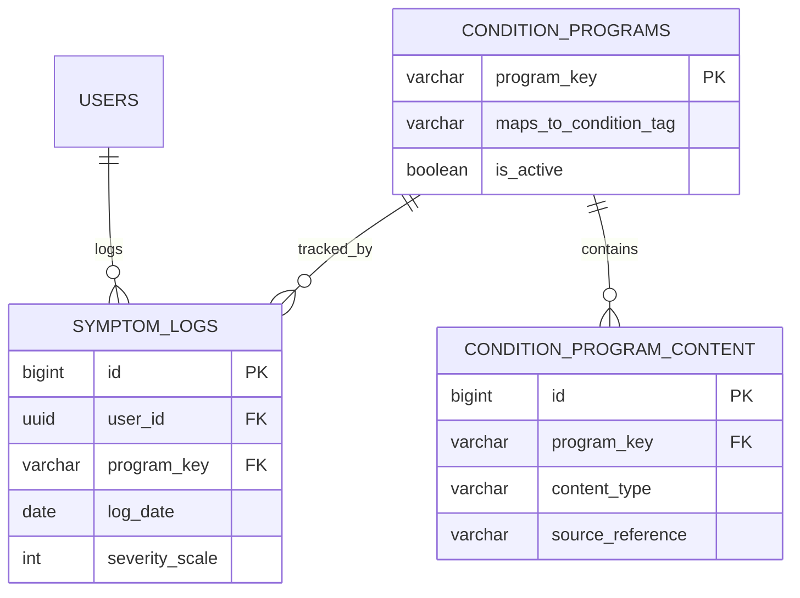

---

### 11.12 React Native Mobile Port (Track B — Conditional, Retention-Gated)

**[New, v2.2 — ADR-019]** This section exists so that if/when the retention gate (§13.6) clears, the mobile port is a scoped, estimable piece of work with a known boundary — not an open-ended "then we build the app" that has to be re-planned from scratch under pressure to ship fast.

**What requires zero changes (the majority of the system):**

| Layer                                                              | Status                                                                                                          |
| ------------------------------------------------------------------ | --------------------------------------------------------------------------------------------------------------- |
| Database schema, RLS policies, triggers (§5)                       | Untouched — client-agnostic by construction (ADR-001)                                                           |
| Garden derivation engine (§5.3, ADR-002)                           | Untouched — runs entirely in Postgres, has no concept of "web" or "mobile"                                      |
| Edge Functions (`ai-chat`, `ai-plan-generate`, `payments-*`, §6.2) | Untouched — called over HTTPS by any client; a React Native app calls the identical endpoints the web app calls |
| Auth backend (Supabase Auth)                                       | Untouched — only the _client-side session storage adapter_ changes (below)                                      |
| AI cost control, payment verification, all business rules          | Untouched — these were never client-side to begin with                                                          |

**What is rebuilt (the actual scope of the port):**

| Layer                 | Web (Track A)                              | Mobile (Track B)                                                                             | Effort driver                                                                                                                                                      |
| --------------------- | ------------------------------------------ | -------------------------------------------------------------------------------------------- | ------------------------------------------------------------------------------------------------------------------------------------------------------------------ |
| UI components/screens | Next.js/React (DOM-based)                  | React Native (native primitives)                                                             | Full rebuild — JSX syntax and much component _logic_ transfers, but `<div>`/CSS does not become `<View>`/StyleSheet automatically                                  |
| Offline storage       | IndexedDB (Dexie)                          | `expo-sqlite`                                                                                | Rebuilt, same `client_uuid` sync contract (ADR-004) — the _pattern_ transfers, the implementation doesn't                                                          |
| Session storage       | httpOnly cookie (`@supabase/ssr`, ADR-020) | `expo-secure-store` (ADR-005)                                                                | Rebuilt — different platform, same threat model and same non-negotiable requirement                                                                                |
| Push notifications    | Web Push API                               | Expo Push (added alongside Web Push, not replacing it, since the web app continues to exist) | New integration, well-understood, low risk                                                                                                                         |
| Build/release         | Vercel git-push deploy                     | EAS Build + Google Play Console (₨3,000 fee now incurred) + eventual App Store               | New pipeline (§9.2), genuinely the highest-friction addition — store review cycles reintroduce the latency `expo-updates` OTA (§9.6) exists specifically to soften |
| Testing               | Playwright                                 | Jest + React Native Testing Library + Maestro (§3.10)                                        | Rebuilt — Playwright cannot drive a native app                                                                                                                     |

**Trigger to begin:** defined in §13.6 as part of the release-gate framework — production D7/D30 retention from the web launch must clear a bar the team sets before the beta phase begins (a specific numeric threshold is a product decision, not an architectural one, and is deliberately left to the team rather than invented here; the architectural contribution is _that_ a gate exists and _what_ it unblocks, not the exact number).

**Why this is genuinely low-risk to defer:** the components most expensive to get wrong — the garden's correctness under concurrent/offline writes (ADR-002), the AI cost ceiling (ADR-003), the payment-verification bridge (ADR-008) — are exactly the components this port does not touch. The team is deferring a UI rewrite and a distribution-channel change, not re-deriving the hard part of the system twice.

---

## Phase 12 — Architecture Diagrams

_(System Context and Roadmap Timeline diagrams appear in §0.3–0.4. The following extend that set with implementation-level detail.)_

### 12.1 High-Level Architecture

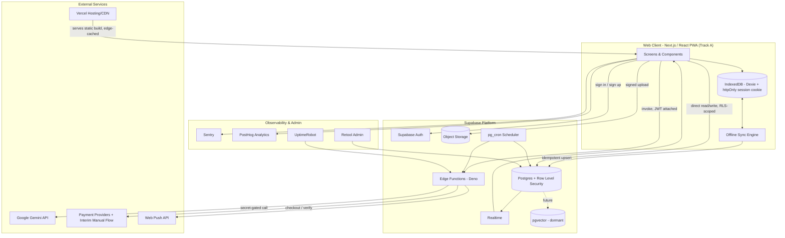

### 12.2 Client Feature Modules

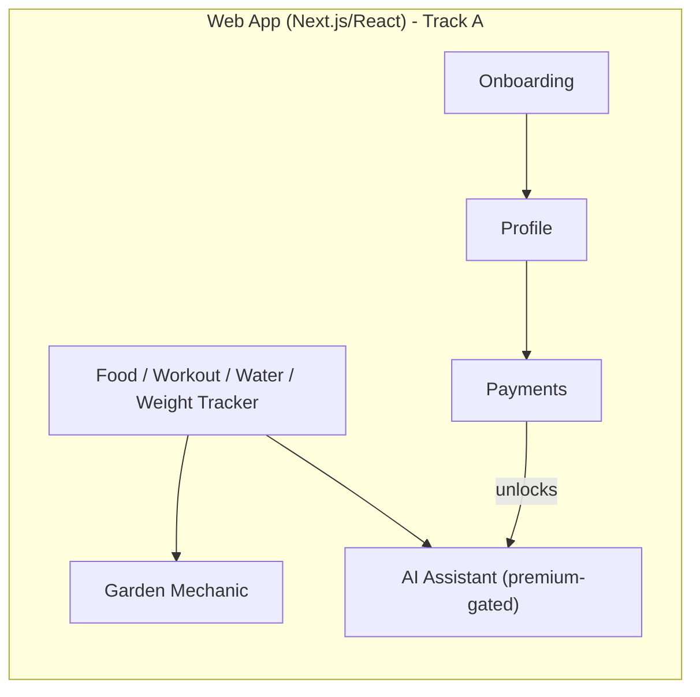

### 12.3 Authentication Sequence

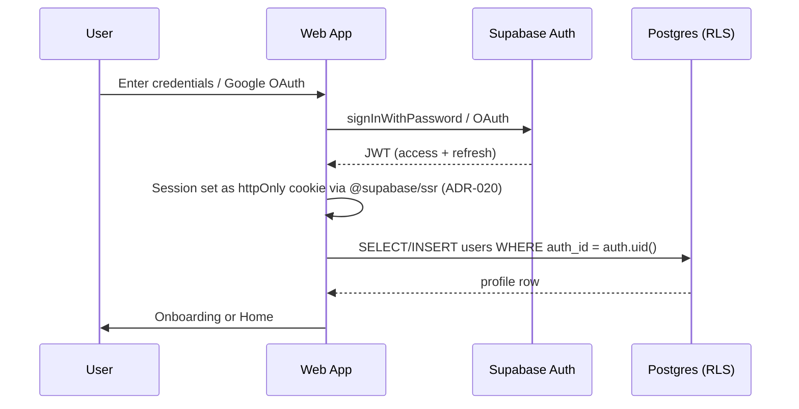

### 12.4 Offline-First Log → Conflict-Safe Garden Update

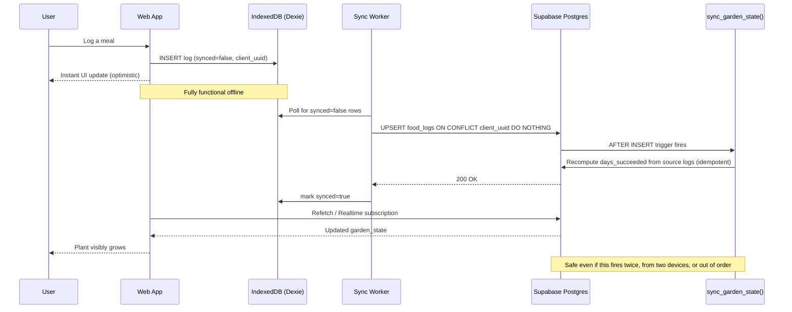

### 12.5 Premium AI Chat — Cost-Control Sequence

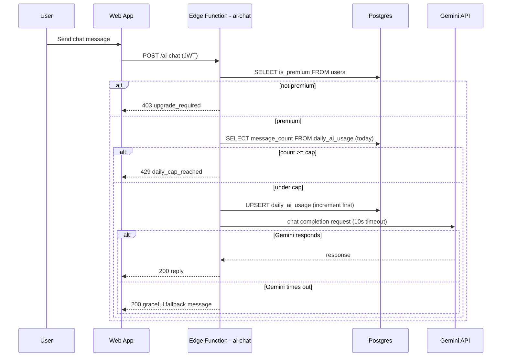

### 12.6 Interim Payment Verification Sequence — **[New, ADR-008]**

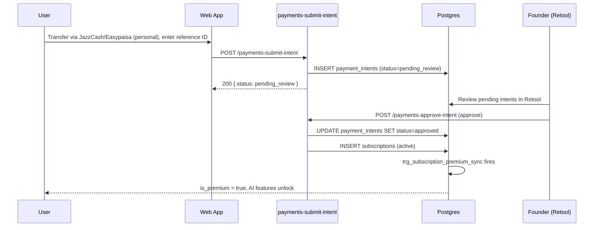

### 12.7 Entity-Relationship Diagram

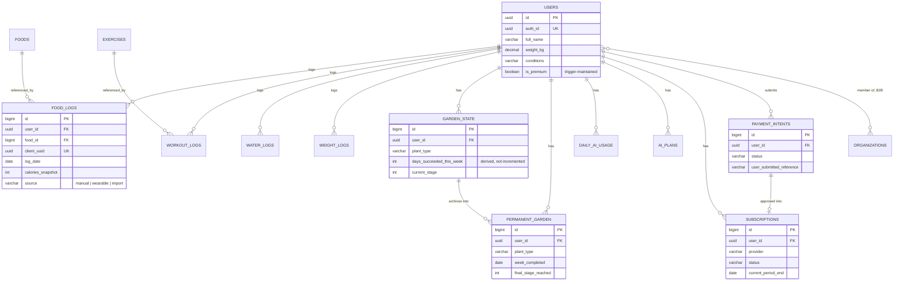

### 12.8 Deployment / Infrastructure Diagram

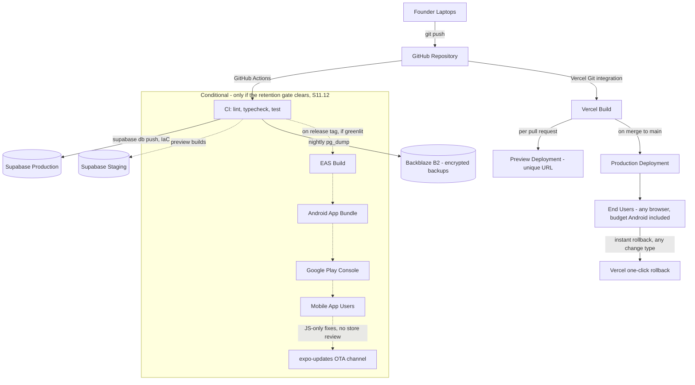

---

## Phase 13 — Development Roadmap (Mapped to Architecture)

### 13.1 Method

The team's own roadmap (Master Roadmap Pt.9, weeks 1–36) is not replaced — it is mapped, phase by phase, to the architectural components this document defines, with dependencies made explicit and every optimization annotated with its rationale. This is the "incremental path from MVP to enterprise-scale" requested: **Phases 1–6 below are the team's existing plan, resequenced for the web-first pivot (v2.2, ADR-019); Phase 6.5 is the new, explicit retention-gate decision point; Phase 7a is this document's extension into the post-revenue scale tiers already defined in §8.2; Phase 7b is the conditional React Native mobile port (§11.12), which only begins if Phase 6.5's gate clears.**

### 13.2 Phase-to-Architecture Mapping

**[Revised, v2.2]** Phase 3 now targets the user-specified **14–16 week web build** (Weeks 7–22, using the 16-week upper bound so downstream week numbers stay consistent even if the team finishes early). Phases 4–6 shift later by the same margin the web build gained over the original 12-week mobile-build estimate. A new **Phase 6.5** makes the retention-gate decision point in §13.6 an explicit roadmap item rather than an implicit transition, and Phase 7 gains an optional, gated sub-path into the mobile port (§11.12).

| Roadmap Phase                                                     | Weeks                                                                                                                      | Architecture components delivered                                                                                                                                                                                                                                                                                                                                                                                                                                                                                                                                                                                                                                                                                                                                                                                                                  | Depends on                                                                                                                                | Exit criteria                                                                                                                                                                                           | Optimization applied (rationale)                                                                                                                                                                                                                                                                                                                                                                                                                                                                                                                                                                                                                                                                                                                                                                                                                                               |
| ----------------------------------------------------------------- | -------------------------------------------------------------------------------------------------------------------------- | -------------------------------------------------------------------------------------------------------------------------------------------------------------------------------------------------------------------------------------------------------------------------------------------------------------------------------------------------------------------------------------------------------------------------------------------------------------------------------------------------------------------------------------------------------------------------------------------------------------------------------------------------------------------------------------------------------------------------------------------------------------------------------------------------------------------------------------------------- | ----------------------------------------------------------------------------------------------------------------------------------------- | ------------------------------------------------------------------------------------------------------------------------------------------------------------------------------------------------------- | ------------------------------------------------------------------------------------------------------------------------------------------------------------------------------------------------------------------------------------------------------------------------------------------------------------------------------------------------------------------------------------------------------------------------------------------------------------------------------------------------------------------------------------------------------------------------------------------------------------------------------------------------------------------------------------------------------------------------------------------------------------------------------------------------------------------------------------------------------------------------------ |
| **Phase 1 — Validate & Lock Scope**                               | 1–3                                                                                                                        | None yet (pre-technical)                                                                                                                                                                                                                                                                                                                                                                                                                                                                                                                                                                                                                                                                                                                                                                                                                           | —                                                                                                                                         | ≥60% validated interest + shareability signal (Master Roadmap Wk1)                                                                                                                                      | None — process phase, unchanged                                                                                                                                                                                                                                                                                                                                                                                                                                                                                                                                                                                                                                                                                                                                                                                                                                                |
| **Phase 2 — Lean Content Foundation**                             | 4–6                                                                                                                        | `foods`/`recipes`/`exercises` reference tables live in Supabase; `app_config` seeded with initial thresholds                                                                                                                                                                                                                                                                                                                                                                                                                                                                                                                                                                                                                                                                                                                                       | Phase 1 scope freeze                                                                                                                      | 100-dish DB + 20-30 recipes + MET table populated                                                                                                                                                       | **Optimization:** schema created via CLI migration (§9.3) from day one, not dashboard SQL — reproducible from the first commit; entirely unaffected by the platform pivot                                                                                                                                                                                                                                                                                                                                                                                                                                                                                                                                                                                                                                                                                                      |
| **Phase 3 — Core Web App + Garden + AI Build**                    | **7–22 (14–16 weeks)**                                                                                                     | Next.js/PWA client scaffold (§3.1a) with RTL layout support and accessible primitives built in, not bolted on (§3.1a, G-17/G-23); `users`, `food_logs`, `workout_logs`, `water_logs`, `weight_logs`, `garden_state`, `permanent_garden` schema + triggers (§5, platform-agnostic) with the database timezone pinned to `Asia/Karachi` from the first migration (§5.10, G-16); service-worker + IndexedDB offline sync engine; httpOnly-cookie session (ADR-020) behind the rendering/caching-safety rule from day one (§4.11, ADR-021, G-19); security headers middleware (§7.11); Cloudflare Turnstile on signup (§7.12); free-tier templated AI; premium `ai-chat`/`ai-plan-generate` Edge Functions built against the `AiProvider` abstraction with prompt-injection hardening from the start (§6.6, ADR-022); `daily_ai_usage`/`ai_plans` caps | Phase 2 (needs reference data for search/filter to be testable, though placeholder data unblocks earlier per the Parallel Execution Plan) | Feature-complete web MVP, garden mechanic stickiness-testable, Lighthouse/Core Web Vitals budgets met (§4.10), WCAG 2.1 AA checks passing (NFR-15)                                                      | **Optimizations:** (1) garden recalculation built as the derived-aggregate design (§5.3) from the start, not the simpler increment design, avoiding a correctness-driven rewrite later; (2) httpOnly-cookie sessions (ADR-020) used from the first auth screen, not retrofitted; (3) `weight_logs` (ADR-009) built alongside the other log tables in the same sprint, since the marginal cost is near-zero once the log-table pattern exists; (4) React chosen specifically so this phase's component/hook logic isn't wasted if Phase 7b (mobile port) is later greenlit; (5) **all ten v2.3 hazard fixes (G-16–G-25) are scoped into this same build phase, not a later hardening pass** — RTL, accessibility, timezone correctness, security headers, and cache-safety are all dramatically cheaper to build in now than to retrofit once real users and real content exist |
| **Phase 4 — QA, Beta, Web Launch Prep**                           | 23–26                                                                                                                      | Sentry + PostHog + UptimeRobot wired up; nightly backup job live; `payment_intents` interim flow built and tested (ADR-008); Playwright cross-browser + slow-network QA suite (§3.10)                                                                                                                                                                                                                                                                                                                                                                                                                                                                                                                                                                                                                                                              | Phase 3 feature-complete                                                                                                                  | 30-50 beta testers, day-7/day-14 retention measurable in PostHog                                                                                                                                        | **Optimization:** payment path resolved _before_ public launch, not deferred — closes G-3 on the critical path. **Web-specific saving:** no app-store review cycle to wait on at this stage — a genuine schedule win over the original mobile-first plan                                                                                                                                                                                                                                                                                                                                                                                                                                                                                                                                                                                                                       |
| **Phase 5 — Launch + Organic Growth**                             | 27–34                                                                                                                      | Production Supabase project live; Gemini quota watchdog active; Vercel production deploy with instant-rollback safety net (§9.6) live for fast post-launch fixes                                                                                                                                                                                                                                                                                                                                                                                                                                                                                                                                                                                                                                                                                   | Phase 4 QA sign-off (no store approval to wait on)                                                                                        | Public web launch, organic-growth engine running, B2B outreach started (per Master Roadmap's original Wk 24-26 offset, now shifted to this phase's equivalent window)                                   | **Optimization:** Vercel's instant rollback (§9.6) live from launch day — the direct web equivalent of the OTA-from-day-one optimization in v2.1, achieved with zero extra setup since it's Vercel's default behavior                                                                                                                                                                                                                                                                                                                                                                                                                                                                                                                                                                                                                                                          |
| **Phase 6 — Post-Launch Iteration**                               | 34+                                                                                                                        | `organizations`/`organization_members` schema activated if B2B pipeline converts; `condition_programs`/`condition_program_content`/`symptom_logs` (§11.11) activated per-program via `is_active` as usage data justifies each                                                                                                                                                                                                                                                                                                                                                                                                                                                                                                                                                                                                                      | Phase 5 retention data                                                                                                                    | 7-/30-day retention meets bar; B2B pilot signed; ≥1 condition program activated once its user-condition concentration justifies it                                                                      | **Optimization:** condition-specific programs (diabetes/PCOS/joint-friendly) now have a full schema and activation design (§11.11, ADR-016) instead of a placeholder line item — this phase requires only content authoring and a config flip when triggered, not new architecture work                                                                                                                                                                                                                                                                                                                                                                                                                                                                                                                                                                                        |
| **[New, v2.2] Phase 6.5 — Retention Gate & Mobile Port Decision** | Evaluated once Phase 6 has produced enough production data (not a fixed week — real D7/D30 cohorts need real elapsed time) | No new components — this is a decision checkpoint, not a build phase                                                                                                                                                                                                                                                                                                                                                                                                                                                                                                                                                                                                                                                                                                                                                                               | Phase 6 production retention data (NFR-14)                                                                                                | D7/D30 retention clears the team's defined bar → Phase 7b (mobile port) is funded and scheduled. Does not clear → continue iterating the web app; the decision is revisited on a cadence, not abandoned | **New phase, ADR-019** — makes the previously implicit "then maybe we do mobile" into an explicit, data-gated go/no-go, consistent with the "spend follows evidence" policy already applied to AI and infra (§1.11)                                                                                                                                                                                                                                                                                                                                                                                                                                                                                                                                                                                                                                                            |
| **[New] Phase 7a — Scale to Enterprise Readiness**                | Revenue-triggered, not calendar-triggered                                                                                  | Supabase Pro upgrade at DB-size trigger (§8.1); `food_logs`/`workout_logs` partitioning (§5.7); materialized views for analytics; pgvector activation for AI personalization (§11.3, Stage 1) if premium data volume justifies it; self-hosted Supabase evaluation only if managed-tier cost outpaces revenue growth                                                                                                                                                                                                                                                                                                                                                                                                                                                                                                                               | Phase 6 sustained revenue                                                                                                                 | Each sub-step has its own independent trigger (§8.2 table) — this phase has no fixed end date by design                                                                                                 | Unchanged from v2.1 — entirely backend-side, so entirely unaffected by the platform pivot                                                                                                                                                                                                                                                                                                                                                                                                                                                                                                                                                                                                                                                                                                                                                                                      |
| **[New, v2.2] Phase 7b — React Native Mobile Port (conditional)** | Begins only if Phase 6.5's gate clears; independent of, and can run in parallel with, Phase 7a                             | UI layer rebuilt on React Native/Expo (§3.1b); `expo-sqlite` + `expo-secure-store` replace the web equivalents; EAS Build/Submit pipeline; Google Play Console fee now incurred                                                                                                                                                                                                                                                                                                                                                                                                                                                                                                                                                                                                                                                                    | Phase 6.5 gate clears                                                                                                                     | Feature-parity native app live on Google Play; §11.12's full scope table is the estimation basis                                                                                                        | **Full scope, effort driver, and reuse boundary specified in advance (§11.12)** — this phase does not need to be re-planned from scratch under launch pressure if/when it's greenlit                                                                                                                                                                                                                                                                                                                                                                                                                                                                                                                                                                                                                                                                                           |

### 13.3 Recommended Repository Structure

**[Revised, v2.2]** for the web track (Track A, building now):

```
health-garden-web/
├── app/                             # Next.js App Router — pages & layouts
│   ├── (marketing)/                 # SSR/SSG content pages — SEO/GEO, Master Roadmap Pt.10
│   └── (app)/                       # authenticated app shell
├── src/
│   ├── features/
│   │   ├── onboarding/
│   │   ├── tracker/                 # food + workout + water + weight logging
│   │   ├── garden/
│   │   ├── ai/                      # premium chat + plan UI
│   │   └── payments/                # includes interim-flow submission UI
│   ├── lib/
│   │   ├── supabase/                # @supabase/ssr client + server helpers (ADR-020)
│   │   ├── offline/                 # Dexie (IndexedDB) + sync engine
│   │   └── i18n/
│   ├── components/
│   ├── hooks/
│   └── types/                       # supabase gen types output
├── public/
│   └── sw.js                        # service worker (Workbox / next-pwa) — PWA offline shell
├── supabase/
│   ├── migrations/                  # versioned SQL — the IaC layer (§9.3), unchanged by the pivot
│   └── functions/                   # unchanged by the pivot — see Phase 5 note
│       ├── ai-chat/
│       ├── ai-plan-generate/
│       ├── payments-submit-intent/
│       ├── payments-approve-intent/
│       ├── payments-webhook/
│       └── garden-weekly-reset/
├── e2e/                              # Playwright flows
├── .github/workflows/
├── middleware.ts                     # session refresh (@supabase/ssr)
├── next.config.ts
├── ADR/                              # Appendix A, one file per decision
└── ARCHITECTURE.md                   # this document, kept in-repo and current
```

**If/when Track B (§11.12) is greenlit:** `supabase/` (migrations + functions) is untouched and simply shared — the recommendation at that point is a _separate_ `health-garden-mobile/` repository (Expo/React Native) pointed at the same Supabase project, rather than forcing a monorepo tooling setup (Turborepo/Nx) that isn't justified until there are actually two client codebases to coordinate. Reassess this specific choice when Phase 7b actually begins, not before — consistent with this document's general bias against building for a hypothetical future.

### 13.4 Coding Standards

TypeScript strict mode; ESLint + Prettier via husky pre-commit alongside `gitleaks` (§7.5); Conventional Commits; a lightweight PR self-review checklist (does this touch RLS? does this touch a log table's schema? does this add a recurring cost?) — the last question directly operationalizes the standing cost policy (§1.11).

### 13.5 Testing Strategy

| Layer                               | Tool                                                                           | Priority target                                                                                                                                                                         |
| ----------------------------------- | ------------------------------------------------------------------------------ | --------------------------------------------------------------------------------------------------------------------------------------------------------------------------------------- |
| Pure logic unit tests               | **Vitest**                                                                     | Garden derivation functions (§5.3) — the highest-value tests in the codebase, since a bug here silently corrupts the product's core promise; platform-agnostic, unaffected by the pivot |
| Edge Function tests                 | Deno test runner                                                               | Cap-check logic (§6.2), payment-intent state transitions — unaffected by the pivot                                                                                                      |
| E2E smoke test                      | **Playwright**                                                                 | Onboarding → log a meal → see garden update, before every deploy to production; includes mobile-viewport + slow-network emulation profiles                                              |
| Cross-browser/device QA             | **Playwright's browser matrix + real budget-Android devices in mobile Chrome** | Per Master Roadmap Phase 4, adapted from "native device QA" to "mobile browser QA" — same target hardware, different app-delivery mechanism                                             |
| _(Conditional, Track B)_ Native E2E | Maestro                                                                        | Reinstated only if the mobile port (§11.12) ships — Playwright cannot drive a native app                                                                                                |

### 13.6 Release Plan & Gates

1. Internal alpha — architecture smoke test.
2. Closed beta, 30–50 users — gate: day-7/day-14 retention signal in PostHog.
3. Soft launch — gate: Gemini quota tracking confirmed correct in production.
4. Public web launch — gate: both above pass, **plus** the payment path (ADR-008) is live and tested, not deferred.
5. **[New, v2.2] Mobile port go/no-go (Phase 6.5, ADR-019)** — evaluated once production traffic has produced real D7/D30 cohorts (not beta-only data): if retention clears the bar the team sets, Phase 7b (§11.12) is scheduled and funded; if not, the team continues iterating the web app and re-evaluates on a regular cadence rather than defaulting into a native build without evidence.

### 13.7 Documentation Plan

`README.md`, `ARCHITECTURE.md` (this document, living), `CONTRIBUTING.md`, `ADR/` (Appendix A, one file per decision) — so the reasoning behind each decision survives past the moment it was written.

### 13.8 Deployment Checklist

See Appendix B for the full production-readiness checklist — the pre-launch subset relevant to this phase:

- [ ] All RLS policies verified on every table, including every table added in this document
- [ ] `permanent_garden` insert-only trigger confirmed active
- [ ] `sync_is_premium` trigger confirmed active and tested against a real `payment_intents` approval
- [ ] Secrets confirmed absent from full Git history (`gitleaks` full-repo scan)
- [ ] Nightly backup job running and restore-tested at least once
- [ ] Medical disclaimer gate confirmed blocking on first launch
- [ ] Gemini quota watchdog active and alerting confirmed
- [ ] Sentry, PostHog, UptimeRobot receiving data from staging before cutover

---

## Phase 14 — Critical Review

### 14.1 Strengths

Grounded in a real, hard budget constraint applied consistently, not just to AI spend. The content/backend split avoids the most common small-team failure mode. The garden mechanic's core correctness risk (multi-device sync corruption) is now structurally eliminated, not just documented as a concern. The AI cost-control design — already strong in the source docs — is now airtight: two distinct cap types, a pre-call gate, and an automated, self-acting watchdog. The payment/legal gap, which silently blocked the entire revenue mechanism in v1.0, is now a fully designed, working interim system with a named cutover trigger. **[New, v2.2]** The web-first, retention-gated platform strategy (ADR-019) is the direct beneficiary of decisions made _before_ this pivot was even conceived: because ADR-001 already pushed the entire backend into Supabase and ADR-002/ADR-003 already pushed all business logic server-side, the client was always the one genuinely swappable layer — this pivot costs the team a UI rebuild if mobile is later greenlit, not a re-architecture.

### 14.2 Weaknesses

The two-founder bus factor remains a team-process risk no architecture can fully eliminate — this document reduces its blast radius (shared secrets hygiene, ADRs, in-repo documentation) but does not remove it. Health-domain liability is mitigated, not eliminated, by disclaimers and tag-based filtering built by non-clinicians — an accepted, explicitly named trade-off, not a solved problem. The interim payment-verification flow (ADR-008) is manual and does not scale past a modest user count by design — it is a bridge, not a destination, and requires the team to actually execute the SECP/merchant-account registration before the cutover trigger is hit.

### 14.3 Potential Bottlenecks

Gemini's shared, project-wide quota remains the top structural risk despite the cap system — a sudden premium-adoption spike could still exhaust it, at which point the `app_config` kill switch is the release valve. Supabase free-tier database size from log-data growth (§8.1) is the most concrete, previously underestimated bottleneck in this architecture, and arrives earlier than user-count intuition suggests. The interim manual payment-review process (ADR-008) is itself a bottleneck at meaningful subscriber volume — this is by design and is exactly why it has an explicit cutover trigger rather than being treated as a permanent solution.

### 14.4 Security Risks Remaining

No penetration test is in budget; RLS policies are structurally sound but not yet adversarially tested by a third party. Condition-exclusion tag logic remains simple string-matching built by non-clinicians — a mislabeled tag is a narrow but real safety risk, not just a data-quality one, and no amount of software architecture substitutes for clinical review of that specific content. **[Updated, v2.3]** The web pivot's most severe risk class — cross-user data leakage via a misconfigured cache — is mitigated by ADR-021's rendering rule plus an enforcing CI check, but "mitigated by policy plus a test" is a lower bar than "structurally impossible," which is the standard the rest of this document (e.g., the `permanent_garden` insert-only trigger) holds itself to. Revisit if a stronger structural guarantee becomes available (e.g., a framework-level "this route can never be cached" primitive) rather than treating the current CI check as a permanent answer. Prompt-injection hardening (ADR-022) is pattern-based, not a formal guarantee — a sufficiently creative injection could still slip past both the system-prompt hardening and the output check; the residual exposure is bounded by the disclaimer and the AI's complete lack of tool-calling/data-write access, not eliminated.

### 14.5 Future Optimizations

Materialized views once admin/analytics queries get expensive; table partitioning once log tables cross the row-count threshold; Upstash Redis if background job volume outgrows `pg_cron` + Edge Functions; pgvector activation once personalization is genuinely revenue-justified (§11.3); self-hosted Supabase if managed-tier cost growth outpaces revenue growth at real scale.

### 14.6 Trade-offs Made Explicitly

| Trade-off                                                                    | Choice made                                                                           | Why                                                                                                                                                                                                                                                                                                              |
| ---------------------------------------------------------------------------- | ------------------------------------------------------------------------------------- | ---------------------------------------------------------------------------------------------------------------------------------------------------------------------------------------------------------------------------------------------------------------------------------------------------------------- |
| BaaS simplicity vs. long-term infrastructure flexibility                     | BaaS (Supabase), with self-hosting as an explicit, real escape hatch                  | Two-person team cannot operate custom infrastructure; open-source Supabase avoids true lock-in                                                                                                                                                                                                                   |
| Zero-budget frugality vs. professional tooling (pentest, paid observability) | Frugality, with free-tier tooling substituted wherever a reasonable substitute exists | Matches the ₨15,000 ceiling governing the entire project                                                                                                                                                                                                                                                         |
| Simple tag-matching vs. normalized relational tagging                        | Simple tag-matching, retained                                                         | Correct at current data volume; revisit only if volume that justifies the complexity actually arrives                                                                                                                                                                                                            |
| Building an admin UI vs. buying (Retool, free)                               | Buy                                                                                   | No product reason to reinvent an internal tool a free product already solves                                                                                                                                                                                                                                     |
| Real merchant-API integration vs. interim manual verification                | Interim manual, with a hard cutover trigger                                           | Unblocks revenue immediately without waiting on a legal/registration process outside engineering's control                                                                                                                                                                                                       |
| **[New, v2.2]** Web-first vs. mobile-first launch                            | Web-first, React Native port gated behind production retention data                   | Defers the highest fixed cost (Google Play fee) and highest-friction engineering (native offline storage, app-store review cycles) until real user data justifies the investment — the "spend follows evidence" policy already applied to AI and infra tiers, extended to the platform decision itself (ADR-019) |
| **[New, v2.2]** Next.js/SSR vs. a simpler Vite SPA for the web client        | Next.js                                                                               | Unifies the app and the GEO/content-marketing site (Master Roadmap Pt.10) in one deployment and gives Vercel's zero-config SSR support; costs a small amount of SSR-specific conceptual overhead a plain SPA wouldn't have                                                                                       |

### 14.7 Alignment with Modern Industry Best Practice

Offline-first design with idempotent, conflict-safe sync; RLS-based authorization instead of ad hoc middleware; secrets isolated to a server-side function boundary; OTA updates for fast iteration; config-driven feature flags; Infrastructure as Code for a BaaS system; formal SLO/RPO/RTO targets — these are genuinely current best practices, appropriately scaled for a two-person, pre-revenue team rather than diluted. **[v2.3]** The hazard-hunting pass adds a set of practices many funded competitors in this specific market segment skip entirely: WCAG-level accessibility as a stated target rather than an afterthought, a genuine RTL-first approach to Urdu rather than a font swap, security headers and cache-safety enforcement treated as CI-gated requirements rather than launch-day guesses, and an AI integration that assumes prompt injection will be attempted rather than assuming good faith. None of this is exotic — it is what a careful team does when it has the discipline to look for what it missed, which is precisely what distinguishes "well above competitor" from "adequate." The remaining gap between this architecture and a well-funded competitor's is **process rigor** (dedicated QA, clinical review, formal penetration testing) rather than **technical design** — the correct place for a resource-constrained team to accept a gap, since it is the gap that costs money to close, not the one that costs architectural quality.

---

## Appendix A — Architecture Decision Records

**ADR-001 — BaaS-first architecture on Supabase**
_Status:_ Accepted. _Context:_ Two-person, part-time team, ₨15,000 ceiling, no DevOps headcount. _Decision:_ Use Supabase (Postgres + Auth + Storage + Edge Functions) as the entire backend, in place of a custom Node/NestJS API or Firebase. _Consequences:_ Near-zero backend code to operate; RLS replaces hand-written authorization middleware; open-source core avoids permanent vendor lock-in (see ADR-011).

**ADR-002 — Garden state as a derived aggregate, never an incremented counter**
_Status:_ Accepted, supersedes the v1.0 trigger design. _Context:_ Offline-first, multi-device sync can deliver the same logical event more than once or out of order; an incrementing counter can double-count under these conditions. _Decision:_ `garden_state.days_succeeded_this_week` is recomputed from source logs (`COUNT(DISTINCT log_date)` meeting each goal's threshold) on every relevant insert, never mutated directly. _Consequences:_ Naturally idempotent, naturally safe under retries/multi-device sync/out-of-order delivery, at the cost of a slightly more expensive recomputation query — acceptable at this data volume (§5.3).

**ADR-003 — AI provider limited to server-side Gemini calls, hard pre-call quota gate**
_Status:_ Accepted. _Context:_ Gemini's free tier is shared project-wide, not per-user; unrestricted client-side calls would exhaust it at trivial scale. _Decision:_ All AI calls route through Edge Functions; the usage cap is checked and incremented _before_ the external call, never after. _Consequences:_ Structurally impossible for a free user to trigger a billed call; premium overuse is capped by construction, not by policy enforcement after the fact.

**ADR-004 — Offline-first client persistence with idempotent sync via client-generated UUIDs**
_Status:_ Accepted. _Context:_ Target users are on unreliable networks and budget hardware. _Decision:_ All writes land in local SQLite first, tagged with a client-generated `client_uuid`; sync upserts on that UUID. _Consequences:_ Retried syncs after dropped connections can never create duplicate logs; this is also the mechanism that makes ADR-002 safe.

**ADR-005 — expo-secure-store for auth tokens, AsyncStorage only for non-sensitive flags**
_Status:_ Accepted. _Context:_ AsyncStorage is unencrypted on-device storage. _Decision:_ Session/JWT storage uses `expo-secure-store`; AsyncStorage remains valid only for non-sensitive UI-state flags. _Consequences:_ Closes a real, easily-avoided token-exposure risk at zero cost.

**ADR-006 — Row Level Security as the sole authorization mechanism**
_Status:_ Accepted. _Context:_ A hand-written authorization middleware layer is both extra work and a weaker guarantee than database-enforced access control. _Decision:_ Every table's access rules are RLS policies, not application-code `if` statements; Edge Functions add business-rule checks only for logic RLS cannot express (time-windowed caps). _Consequences:_ A compromised/modified client cannot bypass data-layer authorization even if it bypasses UI gating.

**ADR-007 — No traditional ORM; Supabase-generated TypeScript types**
_Status:_ Accepted. _Context:_ Prisma/Drizzle would introduce a second schema-definition source of truth alongside Supabase migrations. _Decision:_ Use `supabase gen types typescript`, generated directly from the live schema. _Consequences:_ Always in sync with the actual database by construction; loses some ORM convenience features, acceptable trade-off at this team size.

**ADR-008 — Interim manual payment verification bridging the SECP/merchant-account gap**
_Status:_ Accepted. _Context:_ JazzCash/Easypaisa merchant (business) APIs require business registration and an NTN; the team's own zero-budget plan defers registration until revenue exists — a circular blocker. _Decision:_ Build `payment_intents` (§5.2) — users pay via personal transfer, submit a reference ID, a founder reviews and approves via Retool, which triggers `subscriptions` creation and `is_premium` sync. _Cutover trigger:_ the first of (a) 50 concurrent paying users, or (b) Week 30 — whichever comes first, at which point real merchant-API integration is prioritized. _Consequences:_ Unblocks revenue immediately; does not scale past modest volume by design, and is explicitly a bridge, not a destination.

**ADR-009 — Weight-trend tracking reinstated as committed MVP scope**
_Status:_ Accepted. _Context:_ Present in the superseded PDF, dropped from the current roadmap without explanation; BMI/calorie-target calculations already depend on current weight. _Decision:_ `weight_logs` is built alongside the other log tables in Phase 3 (§13.2), not deferred. _Consequences:_ Marginal build cost is near-zero given the existing log-table pattern; removes a UX gap standard in comparable health apps.

**ADR-010 — Config-driven feature flags and thresholds (`app_config`)**
_Status:_ Accepted. _Context:_ Hardcoded growth thresholds and AI limits would require an app release to tune or disable. _Decision:_ Garden stage thresholds, AI caps, and an `ai_chat_enabled` kill switch live in `app_config`, read at runtime. _Consequences:_ Operational changes become database writes; directly de-risks the team's top-named fear (Gemini quota exhaustion) at near-zero engineering cost.

**ADR-011 — No Docker/Kubernetes/reverse proxy in production; self-hosted Supabase reserved as the exit path**
_Status:_ Accepted. _Context:_ A BaaS architecture operated by two people should not also operate container infrastructure. _Decision:_ No production containers; Docker's only role is `supabase start` for local dev. Self-hosted Supabase (open-source, Docker Compose/Kubernetes) is documented as the future path only if managed-tier cost outpaces revenue at real scale (§8.2, §11.7). _Consequences:_ Zero ops burden at MVP-to-growth scale; a genuine, non-proprietary exit path exists if ever needed.

**ADR-012 — Supabase CLI migrations as Infrastructure as Code**
_Status:_ Accepted, supersedes the source docs' dashboard-paste workflow. _Context:_ Ad hoc SQL Editor changes are not reproducible or environment-portable. _Decision:_ All schema changes are versioned `.sql` files under `supabase/migrations/`, applied via CI. _Consequences:_ Staging and production stay in sync by construction; a clean checkout can reproduce the full backend.

**ADR-013 — Sentry + PostHog + UptimeRobot + Retool as the free observability/admin stack**
_Status:_ Accepted. _Context:_ The source docs assume monitoring and admin tooling as manual tasks with no named tool. _Decision:_ Adopt this specific free-tier stack rather than building custom tooling. _Consequences:_ Zero build cost, auditable admin actions (replacing raw production SQL edits), and the team's own stated success metric (retention) becomes a dashboard.

**ADR-014 — pgvector reserved as the AI-personalization seed, not adopted at MVP**
_Status:_ Accepted (deferred adoption). _Context:_ No current requirement needs retrieval-augmented generation or embeddings; adopting a vector stack now would be unjustified complexity. _Decision:_ Note pgvector's availability (it ships with Supabase Postgres at zero cost) and define the activation trigger (§11.3, Stage 1) without enabling it now. _Consequences:_ Zero cost today; a defined, low-friction path to personalization when actually justified by data volume and revenue.

**ADR-015 — expo-updates OTA channel as the primary hotfix/rollback mechanism**
_Status:_ Accepted. _Context:_ A two-person team without release engineering cannot afford multi-day Play Store review cycles for every JS-layer bug fix. _Decision:_ Ship `expo-updates` from launch day; use it as the default rollback path for any non-native-code issue. _Consequences:_ Fix latency measured in minutes instead of days for the large majority of post-launch bugs.

**ADR-016 — Condition-specific programs (diabetes, PCOS, joint pain) designed now, activated later**
_Status:_ Accepted (design); activation deferred. _Context:_ Named in the roadmap's Phase 6 as a post-launch expansion with no data model behind it; the garden's 5-plant cap is non-negotiable, so this cannot be delivered as new gamification. _Decision:_ Add `condition_programs`, `condition_program_content`, and optional `symptom_logs` (§11.11) as an insight/guidance overlay on existing tag-filtered data, gated behind an `is_active` flag flipped only once real usage data shows demand for a given condition — a database write, not a code deploy. _Consequences:_ Zero new AI cost, zero new gamification surface, a concrete (if informal) clinical-review checkpoint before any program goes live, and a fully engineered path for a roadmap item that was previously just a line item.

**ADR-019 — Web-first launch; React Native mobile port gated behind production retention data**
_Status:_ Accepted. _Context:_ The original plan (v2.1 and earlier) launched directly to native Android via React Native/Expo. The team has since decided to build and launch a web app first (Next.js PWA, 14–16 weeks) and measure real-user retention before committing to a native mobile build. This is a genuine strategic pivot, not a scope cut: native mobile carries the architecture's single highest fixed cost (Google Play's ₨3,000 fee, soon Apple's ~₨27,500/year) and highest-friction iteration loop (EAS builds, app-store review cycles) of any client platform considered in this document — exactly the kind of spend this document's standing "cost follows evidence" policy (§1.11) says should wait for proof, not precede it. _Decision:_ Ship the web client first (§3.1a). Define a production-retention gate (§13.6, Phase 6.5) using D7/D30 cohort data from PostHog (NFR-14) — not beta data alone, since beta cohorts are recruited and motivated differently than organic production traffic. Only if that gate clears does the React Native port (§11.12) become a funded, scheduled initiative (Phase 7b). _Consequences:_ The team ships faster and cheaper to first real-user feedback; defers, rather than avoids, native distribution; and because ADR-001/ADR-002/ADR-003 already pushed the entire backend and all business logic server-side, this pivot changes only the client layer (§3.1, §7.2, §7.6, diagrams, roadmap) — the database, RLS, Edge Functions, and garden engine require zero changes, which is what makes this pivot low-risk rather than a re-architecture. The cost is real but bounded: a UI-layer rebuild (§11.12) if/when mobile is greenlit, and a second, distinct security decision for session storage (ADR-020) in the interim.

**ADR-020 — httpOnly-cookie session storage via `@supabase/ssr` for the web client**
_Status:_ Accepted. _Context:_ ADR-005 chose `expo-secure-store` specifically to keep the session out of script-readable storage on mobile. A web client has no direct equivalent to `expo-secure-store`; the naive default (Supabase JS's client-side session in `localStorage`) _is_ script-readable, and would reintroduce the exact XSS-token-theft class ADR-005 was written to avoid. _Decision:_ Store the session in an httpOnly, Secure, `SameSite=Lax` cookie, managed by Supabase's official `@supabase/ssr` package and refreshed by Next.js middleware on every request. _Consequences:_ A successful XSS injection cannot exfiltrate the session, closing the same threat model ADR-005 closes, by the mechanism appropriate to a cookie-capable web client rather than a native one. This makes CSRF a live consideration for the first time in this architecture (§7.6) — mitigated by `SameSite=Lax` plus Next.js Server Actions' default origin-checking, not by a custom token scheme, which would be unjustified complexity at this scale. If/when the mobile port (§11.12) ships, this ADR does not apply to that client — ADR-005 is reinstated unchanged for React Native, since cookies are not the native mobile session-storage idiom.

**ADR-021 — Authenticated routes are always dynamically rendered with `Cache-Control: private, no-store`**
_Status:_ Accepted. _Context:_ A dedicated hazard-hunting pass (v2.3) identified that Next.js's static generation (SSG) and incremental static regeneration (ISR) — genuinely valuable for the marketing/content pages this document already wants (§3.1a, Master Roadmap Pt.10) — are actively dangerous if ever applied, even partially, to a route that renders per-user data. A route cached at a shared edge layer serves its cached response to _every_ subsequent visitor until the cache expires; for this product, that response could contain another user's logged conditions, weight, or garden state. This has no equivalent failure mode on the native mobile client this document originally specified, which is why no prior version considered it. _Decision:_ Every route reading `auth.uid()` or any RLS-scoped data is forced to dynamic rendering and responds `Cache-Control: private, no-store`, full stop — no "mostly static, personalized fragment inside" middle ground, because that middle ground is exactly where this bug class hides. Only the provably-visitor-identical marketing pages may use SSG/ISR. Enforced by a Playwright CI check (§4.11) that fetches authenticated routes under two different test sessions and asserts both the response bodies differ and the cache headers never permit shared caching. _Consequences:_ Slightly higher per-request rendering cost on the authenticated app (acceptable — Vercel's free tier is generous and this traffic pattern is exactly what serverless/edge rendering is priced for) in exchange for eliminating a data-breach class that would otherwise be entirely dependent on every future engineer remembering a rule that isn't enforced anywhere.

**ADR-022 — AI provider abstraction with prompt-injection hardening as a first-class concern**
_Status:_ Accepted. _Context:_ Two related gaps surfaced together in the v2.3 hazard-hunting pass: (1) `ai-chat`/`ai-plan-generate` called the Gemini SDK directly throughout, with no seam to route around a provider change; (2) neither function had any explicit defense against a user attempting to prompt-inject the coaching assistant into leaking its system prompt or contradicting the medical disclaimer with confidently-worded unsafe advice — a real risk (OWASP LLM Top 10, LLM01) that matters more for a health-advice product than a generic chatbot. _Decision:_ Introduce a thin `AiProvider` interface (`chat()`, `generatePlan()`) that the Edge Functions call instead of the Gemini SDK directly, with Gemini as the sole current implementation; harden the system prompt against instruction-override attempts; add a lightweight output-pattern check before any AI response reaches a user, routing flagged content to a safe fallback message instead of the raw model output. _Consequences:_ A future provider swap or addition is a new adapter, not a rewrite of every call site — the same discipline already applied to Supabase and web hosting, now covering the one dependency that had been left unabstracted. Prompt-injection defenses reduce, but do not eliminate, the residual risk already named in §14.4 (non-clinician-authored safety logic); they are a cost-effective second layer, not a substitute for the disclaimer and clinical-review practices this document already requires.

---

## Appendix B — Production Readiness Checklist

| Domain                                   | Requirement                                                                                                                   | Status                            |
| ---------------------------------------- | ----------------------------------------------------------------------------------------------------------------------------- | --------------------------------- |
| **Security**                             | RLS on every table; secrets never in Git; `gitleaks` pre-commit active                                                        | Designed — §7                     |
| **Security**                             | OWASP Top 10 mapped and mitigated                                                                                             | Designed — §7.10                  |
| **High Availability**                    | Managed by Supabase at MVP-to-growth tiers; horizontal scaling path defined for 100K+                                         | Designed — §8                     |
| **Backup Strategy**                      | Nightly `pg_dump` to Backblaze B2; RPO ≤24h at MVP                                                                            | Designed — §5.8, §8.5             |
| **Disaster Recovery**                    | Monthly restore-drill; RTO ≤4h at MVP, tightens on Pro-tier upgrade                                                           | Designed — §8.5, §10.5            |
| **Monitoring & Alerting**                | Sentry, PostHog, UptimeRobot, Gemini/payment watchdogs, alerting runbook                                                      | Designed — §10                    |
| **CI/CD**                                | GitHub Actions pipeline: lint, typecheck, test, migrate, build, submit                                                        | Designed — §9.2                   |
| **Infrastructure as Code**               | Supabase CLI migrations + Edge Function source control + GitHub Actions                                                       | Designed — §9.3                   |
| **Environment Management**               | Local / staging / production, isolated Supabase projects                                                                      | Designed — §9.1                   |
| **Secrets Management**                   | Edge Function vault + GitHub Actions secrets, never client-side                                                               | Designed — §7.4, §9.4             |
| **Compliance**                           | GDPR-informed baseline; export/delete flows; explicit no-HIPAA-claim statement                                                | Designed — §7.9                   |
| **Performance**                          | SLOs defined for search, sync, Edge Function, Core Web Vitals (LCP/INP/CLS)                                                   | Designed — §4.10                  |
| **Cost Optimization**                    | Every recurring cost gated behind a revenue trigger; TCO modeled by tier; platform choice itself now evidence-gated (ADR-019) | Designed — §1.11, Appendix C      |
| **Maintainability**                      | ADRs, in-repo architecture doc, coding standards, test strategy                                                               | Designed — §13.4–13.7, Appendix A |
| **Operational Readiness**                | Deployment checklist, release gates, rollback strategy (Vercel instant rollback; OTA + staged rollout if/when mobile ships)   | Designed — §13.6, §13.8, §9.6     |
| **[New, v2.3] Web Security Headers**     | CSP, HSTS, X-Content-Type-Options, Referrer-Policy, Permissions-Policy applied via middleware                                 | Designed — §7.11                  |
| **[New, v2.3] Rendering/Caching Safety** | Every authenticated route dynamic + `no-store`; CI check asserts no cross-user cache leakage                                  | Designed — §4.11, ADR-021         |
| **[New, v2.3] Bot/Abuse Protection**     | Cloudflare Turnstile on signup/payment-intent submission; per-user submission rate limit                                      | Designed — §7.12                  |
| **[New, v2.3] Accessibility**            | WCAG 2.1 AA target, accessible component primitives, automated + manual checks                                                | Designed — §3.1a, NFR-15          |
| **[New, v2.3] Domain Security**          | Auto-renew, registrar transfer-lock, independent calendar reminder                                                            | Designed — §9.9                   |
| **[New, v2.3] Timezone Correctness**     | Database timezone pinned to `Asia/Karachi`, not left at platform default                                                      | Designed — §5.10                  |
| **[New, v2.3] AI Safety**                | Provider abstraction (vendor concentration) + prompt-injection hardening                                                      | Designed — §6.6, ADR-022          |
| **[New, v2.3] Real User Monitoring**     | Field Core Web Vitals reported to PostHog, not lab-only                                                                       | Designed — §10.7                  |

---

## Appendix C — Total Cost of Ownership Model

All figures are approximate free-tier/paid-tier estimates at the time of writing and should be re-verified against current provider pricing before major commitments (§1.8, assumption 8). Costs are shown only where they would actually be incurred — consistent with the standing "recurring cost follows revenue" policy (§1.11). **[Revised, v2.2]** The "Mobile Build" column is renamed to reflect the web-first pivot: Vercel hosting replaces EAS as the Phase 1 cost line, and EAS/Play Store costs move to a separate, explicitly conditional row.

| Tier         | Users              | Supabase                                       | Web hosting (Vercel)                      | Observability stack                                          | Domain/CDN                                                                                | Est. monthly cost                                                 | Funded by                                                   |
| ------------ | ------------------ | ---------------------------------------------- | ----------------------------------------- | ------------------------------------------------------------ | ----------------------------------------------------------------------------------------- | ----------------------------------------------------------------- | ----------------------------------------------------------- |
| MVP/Beta     | ≤1,000             | Free                                           | **Free tier**                             | Free (Sentry/PostHog/UptimeRobot/Retool all free tiers)      | Domain ~$10–15/**year** (new, minor one-time-ish cost the mobile-first plan didn't carry) | **$0/mo** (+ ~$1/mo amortized domain)                             | N/A — pre-revenue                                           |
| Early growth | ~1,000–10,000      | Free → Pro at DB-size trigger (§8.1)           | Free tier, watch bandwidth                | Free tiers still sufficient                                  | Cloudflare free tier if a CDN is added                                                    | **~$0–25/mo**                                                     | Premium subscriptions                                       |
| Growth       | ~10,000–100,000    | Pro (~$25/mo) + usage-based overages           | Vercel Pro likely needed at this traffic  | Sentry/PostHog paid tiers likely needed at this event volume | Cloudflare free tier                                                                      | **~$50–150/mo**                                                   | Premium + early B2B revenue                                 |
| Scale        | 100,000–1,000,000+ | Pro + read replicas, or self-hosted infra cost | Vercel Enterprise, or self-hosted Next.js | Paid observability tiers, or self-hosted equivalents         | CDN + multi-region as needed                                                              | **Case-by-case — evaluate managed vs. self-hosted (§11.7, §8.2)** | Sustained revenue; likely point of first dedicated ops hire |

**One-time costs:** SECP/business registration cost incurred when the ADR-008 cutover trigger is hit. **[Revised, v2.2] Google Play Console registration (₨3,000) and Apple Developer Program (~₨27,500/year) are no longer MVP-tier costs** — both move to Phase 7b (§11.12), incurred only if/when the mobile port is greenlit by the retention gate (§13.6, ADR-019). This is a direct, quantifiable saving from the web-first pivot: the project's only previously-"mandatory" one-time cost is now conditional.

---

_This document is the project's single source of truth for architecture and system design. Every decision recorded here is either fully designed and ready to build, or documented as an explicit, revenue-triggered future step — nothing is left as an unresolved recommendation. As of v2.3, no part of this system has been built yet: the previous prototype was deleted in full, and this blueprint is the starting point for building from scratch. Update this document — and add a new ADR — whenever a recorded decision changes, so it remains authoritative rather than archival._
