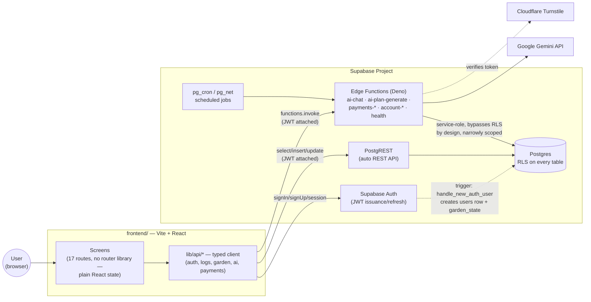
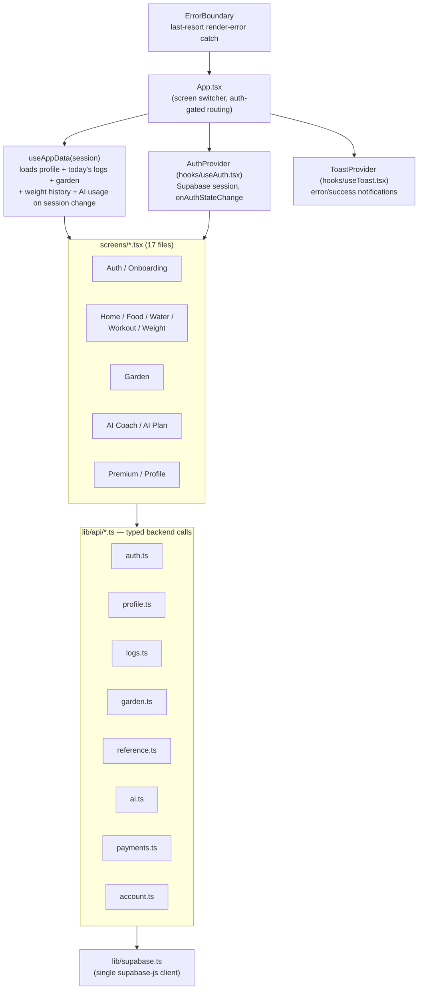
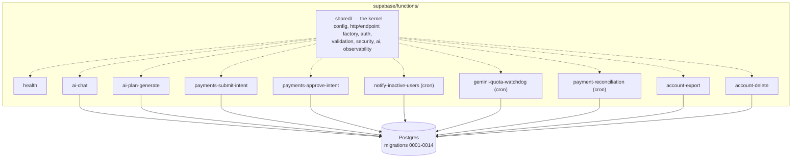
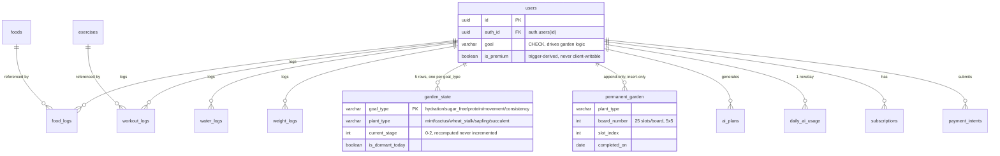
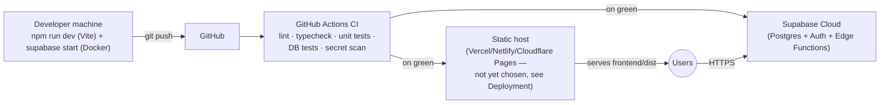
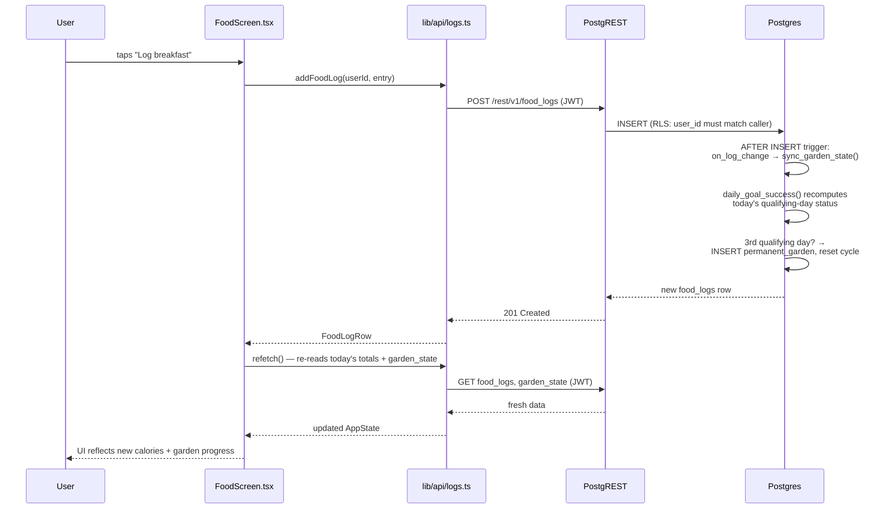
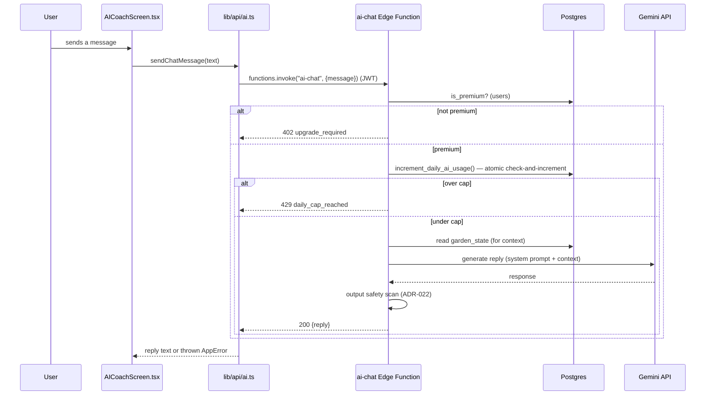

# Health Garden

Pakistani-native health app pairing local-unit food/workout tracking with a permanent,
non-punitive "garden" that grows as habits stick — never resets. Condition-aware
(diabetes/PCOS/joint-safe), offline-aware, bilingual Urdu/English, with a cost-capped AI coach
for premium plans/chat.

> **Architecture is specified before it is built.** The authoritative design document is
> [`Health-Garden-System-Architecture-Blueprint.md`](Health-Garden-System-Architecture-Blueprint.md)
> (**v2.3**). Every decision in this repository traces to a section or ADR in that document. If
> code and blueprint disagree, one of them is a bug — resolve it, do not let them drift.
>
> **Status: backend complete, frontend built and integrated, not yet deployed.** The Supabase
> backend (schema, RLS, Edge Functions, background jobs) and the Vite/React web client are both
> code-complete and wired together — every screen calls real data, not mock state. No live
> Supabase project has been provisioned against this code yet; see
> [Remaining work & assumptions](#remaining-work--assumptions) before treating this as
> production-ready.

---

## Contents

- [Status](#status)
- [Architecture](#architecture)
- [Requirements](#requirements)
- [Getting started](#getting-started)
- [Environment variables](#environment-variables)
- [Commands](#commands)
- [Repository layout](#repository-layout)
- [Development workflow](#development-workflow)
- [Testing](#testing)
- [Deployment](#deployment)
- [Security essentials](#security-essentials)
- [Remaining work & assumptions](#remaining-work--assumptions)
- [Contributing](#contributing)

---

## Status

| Layer                        | Scope                                                                                              | State                                          |
| ---------------------------- | -------------------------------------------------------------------------------------------------- | ---------------------------------------------- |
| **Database**                 | Schema (22 tables), RLS, garden engine, seed data                                                  | ✅ Complete                                    |
| **Edge Functions**           | Auth-adjacent (export/delete), AI (chat/plan), interim payments, background jobs                   | ✅ Complete                                    |
| **Background processing**    | `pg_cron`/`pg_net`: engagement nudges, quota watchdog, payment reconciliation                      | ✅ Complete                                    |
| **Web client (`frontend/`)** | Vite + React 19 + Tailwind v4, all 17 screens wired to real Supabase Auth/PostgREST/Edge Functions | ✅ Complete, unverified against a live project |
| **Real merchant payments**   | `payments-create-checkout`/`payments-webhook` (ADR-008's real-API path)                            | ⏳ Gated — no merchant account yet             |
| **Production accounts**      | Sentry, PostHog, UptimeRobot, live Supabase project, Google OAuth, Cloudflare Turnstile            | ⏳ Not provisioned                             |
| **Automated frontend tests** | Unit/E2E suite for the web client                                                                  | ❌ Does not exist yet                          |
| React Native mobile port     | Only if the retention gate (Blueprint §13.6) clears                                                | Gated                                          |

The backend was built first, phase by phase, against the blueprint (§13.2) — see
[CONTRIBUTING.md](CONTRIBUTING.md) for that history and the ADR log under `docs/adr/`. The
frontend started as a design-tool-generated (Figma Make) static scaffold with realistic UI but
zero backend wiring; this round of work replaced every piece of mock state with real calls,
without changing the visual design or component structure. See
[Remaining work & assumptions](#remaining-work--assumptions) for exactly what is and isn't
verified end-to-end.

---

## Architecture

### System context

No custom backend server exists. Supabase provides Postgres, Auth, and a Deno-based Edge
Function runtime; the web client talks **directly** to Postgres through PostgREST for ordinary
CRUD, with every access governed by Row Level Security rather than hand-written middleware
(ADR-001, ADR-006). Edge Functions exist only for work a client must not be trusted with —
anything holding a secret (the Gemini API key), or enforcing a rule a client could otherwise
bypass (AI usage caps, payment verification, derived garden state).



### Frontend architecture

Single-page app, no router library — one `screen: Screen` state variable in `App.tsx` selects
which component renders, matching the original design's simplicity rather than introducing
React Router for its own sake. Auth session state and all live data are lifted into two hooks
consumed at the root and passed down as props, exactly like the original mock did — only the
data source changed.



### Backend architecture



Every function follows the same two-file split (`handler.ts` logic, `index.ts` entrypoint) so
handlers stay testable without binding a port. See
["Writing a new Edge Function"](#writing-a-new-edge-function) below.

### Database

Full schema, RLS policy list, and the garden-derivation algorithm are documented in the
blueprint (§5) and are not duplicated here to avoid drift — this is the load-bearing summary:



`garden_state` and `permanent_garden` are **SELECT-only** for the authenticated role — every
write happens inside a `SECURITY DEFINER` trigger function (`sync_garden_state`, migration 0005),
never a direct client write (ADR-0024). The frontend only ever reads these two tables; it writes
`food_logs`/`workout_logs`/`water_logs`/`weight_logs`, and the database derives the garden from
that on every insert/delete.

### Infrastructure



### Request flow — logging a meal (representative write path)



Garden state is never computed or cached client-side — every screen that shows it re-reads
`garden_state`/`permanent_garden` after any write that could affect it, so the client can never
drift from the database's own derivation.

### Request flow — AI chat (gated, secret-holding path)



The Gemini API key never reaches the browser — it lives only in Edge Function secrets. The daily
cap is enforced atomically inside Postgres (`increment_daily_ai_usage`, ADR-003), not recomputed
in JavaScript, closing the race a naive count-then-write would have.

---

## Requirements

| Tool         | Version               | Needed for                                                                  |
| ------------ | --------------------- | --------------------------------------------------------------------------- |
| Node.js      | ≥ 20 (24 recommended) | Both backend tooling and the frontend build                                 |
| Docker       | Any current version   | Local Supabase stack (backend DB tests only — the frontend doesn't need it) |
| Deno         | Provided via npm      | Edge Function runtime, tests, lint, format                                  |
| Supabase CLI | Provided via npm      | Migrations, local stack, type generation                                    |
| gitleaks     | Optional, recommended | Local secret scanning; CI runs it regardless                                |

Deno and the Supabase CLI install with `npm ci` at the repo root — no global installs required.
The frontend has its own, separate `npm install` under `frontend/` (see below) — it is not part
of the root workspace, by design (its own toolchain: Vite, Tailwind v4, `oxfmt`).

---

## Getting started

### Backend

```bash
npm ci
cp .env.example .env
npm run verify        # kernel tests — no Supabase stack needed
npm run db:start       # starts the local Supabase stack (Docker)
```

Populate `.env` with the values `supabase status` just printed, then:

```bash
npm run test:db
```

### Frontend

```bash
cd frontend
npm install
cp .env.example .env.local
```

Fill in `.env.local` with a real Supabase project's URL and anon key (see
[Environment variables](#environment-variables) — the app throws a clear error at boot if these
are missing, rather than failing silently later). Then:

```bash
npm run dev      # http://localhost:8443
npm run build    # production bundle to dist/
```

The frontend works against **any** Supabase project that has these migrations applied — local
stack or a real cloud project. It has never been run against a live, migrated project in this
environment (no Docker/live project available here) — see
[Remaining work & assumptions](#remaining-work--assumptions).

---

## Environment variables

### Backend (`.env`, repo root — see `.env.example`)

| Variable                           | Required        | Purpose                                                        |
| ---------------------------------- | --------------- | -------------------------------------------------------------- |
| `SUPABASE_URL`                     | Yes             | Project URL (local stack or cloud)                             |
| `SUPABASE_ANON_KEY`                | Yes             | Public key — RLS enforces the real limits                      |
| `SUPABASE_SERVICE_ROLE_KEY`        | Yes             | Bypasses RLS — Edge Functions and tests only, never the client |
| `GEMINI_API_KEY`                   | For AI features | Google AI Studio key                                           |
| `GEMINI_MODEL`                     | No              | Defaults to `gemini-3.5-flash`                                 |
| `SENTRY_DSN`                       | No              | Error tracking — silent no-op until set (Phase 8)              |
| `POSTHOG_API_KEY` / `POSTHOG_HOST` | No              | Analytics — silent no-op until set (Phase 8)                   |

Full list, including cron/Turnstile secrets, is in `.env.example` with inline explanations.

### Frontend (`frontend/.env.local` — see `frontend/.env.example`)

| Variable                  | Required | Purpose                                                                                                                       |
| ------------------------- | -------- | ----------------------------------------------------------------------------------------------------------------------------- |
| `VITE_SUPABASE_URL`       | Yes      | Same Supabase project the backend targets                                                                                     |
| `VITE_SUPABASE_ANON_KEY`  | Yes      | Public/publishable key — safe to ship in the bundle; RLS is the real gate                                                     |
| `VITE_TURNSTILE_SITE_KEY` | No       | Enables the Premium screen's payment-verification form. Without it, that one form shows "unavailable" — everything else works |

Vite only exposes `VITE_`-prefixed variables to client code, by design — never put a secret
(service-role key, Gemini key) in this file; it would ship straight to every visitor's browser.

---

## Commands

### Backend (repo root)

| Command                                      | Purpose                                                                       |
| -------------------------------------------- | ----------------------------------------------------------------------------- |
| `npm run format` / `format:check`            | Apply / check formatting across the whole repo                                |
| `npm run lint` / `lint:fix`                  | Lint (ESLint for tooling, `deno lint` for functions)                          |
| `npm run verify`                             | Full gate: format check, lint, typecheck, test                                |
| `npm run db:start` / `db:stop` / `db:status` | Local Supabase stack lifecycle                                                |
| `npm run db:reset`                           | Rebuild the local database from migrations + `seed.sql`                       |
| `npm run db:lint`                            | Lint the schema itself (`supabase db lint`)                                   |
| `npm run test:db`                            | Vitest suite under `supabase/tests/database/` — needs the local stack running |
| `npm run types:generate`                     | Regenerate TypeScript types from the live schema (ADR-007)                    |
| `npm run functions:serve`                    | Serve Edge Functions locally                                                  |
| `npm test` / `test:watch` / `test:coverage`  | Edge Function unit tests (Deno test runner)                                   |
| `npm run typecheck`                          | `deno check` (Edge Functions) + `tsc --noEmit` (Node-side)                    |

### Frontend (`frontend/`)

| Command            | Purpose                                                                                          |
| ------------------ | ------------------------------------------------------------------------------------------------ |
| `npm run dev`      | Start the Vite dev server (`http://localhost:8443`)                                              |
| `npm run build`    | Production build to `frontend/dist/`                                                             |
| `npm run preview`  | Serve the production build locally                                                               |
| `npx tsc --noEmit` | Typecheck (no dedicated `npm run typecheck` script exists yet — add one if this becomes a habit) |
| `npm run format`   | `oxfmt` — **see the known-issue note below before running this**                                 |

> **Known issue: `oxfmt` (`^0.2.0`, a young/experimental formatter) strips semicolons from
> inline TypeScript object-type literals** (`{ a: string; b: string }` → `{ a: string b: string }`,
> a syntax error) — reproduced across this codebase while preparing this integration; fixed by
> hand afterward. `tsc --noEmit` catches it immediately (Vite's dev/build transform does not,
> which is why this can slip past `npm run build` looking clean). **Always run `npx tsc --noEmit`
> immediately after `npm run format` in this package** until upstream fixes it or the project
> switches formatters.

---

## Repository layout

```
supabase/
  config.toml            Local stack definition — infrastructure as code (ADR-012)
  migrations/             Numbered SQL, applied in order (§5.9) — schema, RLS, functions, triggers
  seed.sql                Bootstrap/dev data, applied after migrations by db:reset / db:start
  tests/database/         Vitest suite against a live local stack (§13.5)
  functions/
    _shared/              The kernel — every function composes from here
    health/                Liveness probe
    account-export/        Right-to-access data export (§7.9)
    account-delete/         Right-to-erasure account deletion (§7.9)
    ai-chat/                Capped daily coaching chat (§4.3/§12.5, ADR-003)
    ai-plan-generate/       Retrieval-grounded diet/workout plans, regeneration cap
    payments-submit-intent/  Interim payment verification — submission (ADR-008)
    payments-approve-intent/ Interim payment verification — founder approval (ADR-0025)
    notify-inactive-users/   Engagement-nudge Web Push, cron-triggered
    gemini-quota-watchdog/   Disables ai_chat_enabled near the known Gemini quota
    payment-reconciliation/  Flags payment_intents stuck in pending_review past 48h
frontend/                  Vite + React 19 + Tailwind v4 web client (own toolchain, own npm install)
  src/
    lib/
      supabase.ts            Single supabase-js client instance
      env.ts                 Fail-fast env var validation
      database.types.ts       Hand-authored row types mirroring the migrations exactly
      errors.ts               AppError + normalizeError — one error shape app-wide
      date.ts                 Device-local "today" helper (see its own doc comment for why)
      gardenMapping.ts         Bridges backend plant_type <-> frontend art-name
      api/                    One file per backend concern (auth, profile, logs, garden,
                               reference, ai, payments, account) — every network call in the app
                               goes through one of these, never a raw fetch/supabase call in a screen
    hooks/
      useAuth.tsx              Session state, app-wide (React context)
      useAppData.ts            Loads/derives the whole AppState from real data on session change
      useToast.tsx             Error/success notifications (React context)
    components/               Shared UI: Loading/Skeleton, ErrorBoundary, Turnstile widget,
                               plus the original design system (Primitives, PlantSVG, GardenBoard, ...)
    screens/                   17 screens — unchanged component boundaries from the original design,
                               rewired internally to call lib/api/* instead of local mock state
docs/adr/                 Architecture Decision Records
docs/operations.md        Phase 8 setup: UptimeRobot, Sentry, PostHog, first real deploy
.github/workflows/        CI pipeline — backend (quality/database/secrets) + frontend (typecheck/build)
```

### Writing a new Edge Function

Every function follows the same two-file split, so handlers stay testable without binding a port:

```ts
// supabase/functions/<name>/handler.ts
import { defineEndpoint } from '../_shared/http/endpoint.ts';
import { z } from '../_shared/deps.ts';

export const handleThing = defineEndpoint({
  name: 'thing',
  methods: ['POST'],
  auth: 'required',
  bodySchema: z.object({ value: z.string().min(1) }),
  handler: async (ctx) => {
    // ctx.auth.db is scoped to the caller — RLS applies to every query.
    return { ok: true };
  },
});
```

```ts
// supabase/functions/<name>/index.ts
import { handleThing } from './handler.ts';
Deno.serve(handleThing);
```

The kernel supplies correlation ids, structured logging, the `{ error, message }` envelope,
validation, CORS, method gating, auth resolution, and `Cache-Control: private, no-store` on every
response. Register the function's JWT policy in `supabase/config.toml` — omit it and it defaults
to requiring a JWT, the safe direction to fail.

### Adding a new frontend API call

Never call `supabase.from(...)` or `supabase.functions.invoke(...)` directly from a screen — add
a typed function to the relevant `lib/api/*.ts` file instead (mirroring the existing ones) and
import that. This keeps every network call in one place, typed against
`lib/database.types.ts`, and errors normalized through `lib/errors.ts` automatically.

---

## Development workflow

1. Branch off `main` (never commit directly — see [CONTRIBUTING.md](CONTRIBUTING.md)).
2. Backend change: write/adjust the migration or Edge Function, add or update its test, run
   `npm run verify` (and `npm run test:db` if it touches the schema).
3. Frontend change: edit the screen/hook/api file, run `npx tsc --noEmit` and `npm run build`
   inside `frontend/` before committing. Run `npm run format` (`oxfmt`) if you want, but re-run
   `tsc` immediately after — see the known-issue note above.
4. If the change affects both sides (a new table a screen needs to read, a new Edge Function
   response shape), update `frontend/src/lib/database.types.ts` or the relevant `lib/api/*.ts`
   file in the same change — these are hand-maintained mirrors of the backend contract, not
   generated, so they only drift if a change forgets to update both sides.
5. Open a PR; CI runs the backend's format/lint/typecheck/test/DB-test/secret-scan jobs and the
   frontend's typecheck/build job automatically (`.github/workflows/`).
6. Commits: [Conventional Commits](https://www.conventionalcommits.org/), enforced by
   commitlint — see [CONTRIBUTING.md](CONTRIBUTING.md) for the exact scope list.

---

## Testing

### Backend

- **Unit tests** (`npm test`): Deno test runner, one `.test.ts` per handler/shared module, mocked
  dependencies — fast, no live services.
- **Database tests** (`npm run test:db`): Vitest against a real local Postgres (via
  `supabase start`) — privilege lockdown, RLS isolation, the garden derivation engine, and every
  `SECURITY DEFINER` function. This is where real bugs get caught in this codebase (see the git
  history — several ambiguous-column and race-condition bugs were only ever found here, never by
  unit tests or manual review).
- **CI** runs both, plus schema lint and a full-history secret scan, on every push/PR.

### Frontend

**No automated test suite exists.** This is stated plainly rather than worked around with a thin
placeholder test — a single trivial test file would satisfy "tests exist" without providing real
coverage, which is worse than being honest about the gap. What was verified instead, this round:

- `npx tsc --noEmit` — clean, strict TypeScript across the whole app.
- `npm run build` — production build succeeds.
- Manual smoke test against the running dev server (landing page, navigation, form rendering,
  console-error-free boot) — not exhaustive click-through of every flow.
- Careful line-by-line review of every screen's data wiring against the actual backend schema
  and RLS policies (not assumed — checked against the migration files directly).

**Adding a real suite is the single highest-leverage next step** for this codebase — see
[Remaining work](#remaining-work--assumptions). Recommended: [Playwright](https://playwright.dev)
for E2E (it can drive the real dev server against a local Supabase stack, exercising real RLS
policies rather than mocks) plus [Vitest](https://vitest.dev) + React Testing Library for
component-level tests of the `lib/api/*` layer and hooks in isolation.

---

## Deployment

Not yet performed — this section is what running it for real requires, not a record of having
done it.

1. **Provision a Supabase project** (or use the existing paused one for this app — see
   `docs/operations.md`) and run every migration in `supabase/migrations/` in order, then
   `seed.sql`.
2. **Set Edge Function secrets** (`GEMINI_API_KEY`, `TURNSTILE_SECRET_KEY`, cron auth token,
   Sentry/PostHog if used) via `supabase secrets set` or the dashboard — never in a committed
   file.
3. **Deploy Edge Functions**: `supabase functions deploy <name>` per function, or wire
   `.github/workflows/` to do it on merge to `main` (not currently configured — the existing CI
   only tests, it doesn't deploy).
4. **Build and host the frontend**: `npm run build` inside `frontend/` produces a static
   `dist/` — deploy it to any static host (Vercel, Netlify, Cloudflare Pages, or a Supabase
   Storage bucket behind a CDN). Set `VITE_SUPABASE_URL`/`VITE_SUPABASE_ANON_KEY` (and optionally
   `VITE_TURNSTILE_SITE_KEY`) as that host's build-time environment variables — **no platform has
   been chosen yet**; pick one based on the team's existing infrastructure.
5. **Configure Google OAuth** in the Supabase Auth dashboard if "Continue with Google" should
   work (the frontend already calls `supabase.auth.signInWithOAuth`; it will error clearly until
   a provider is configured server-side).
6. **Get a Cloudflare Turnstile site key** (free tier) for the Premium screen's payment form —
   see `frontend/.env.example`.
7. Follow `docs/operations.md` for Sentry/PostHog/UptimeRobot account setup and the exact
   first-deploy checklist (it predates this frontend work but the backend steps are unchanged).

---

## Security essentials

- **Never** use the service-role client to satisfy a user-facing read — it bypasses RLS, the one
  layer a modified client cannot defeat.
- Secrets live in Supabase Edge Function secrets and GitHub Actions secrets. Never in code, never
  in a committed file. `gitleaks` runs pre-commit and over full history in CI.
- The frontend's `VITE_SUPABASE_ANON_KEY` is meant to be public — it ships in the bundle by
  design. It carries no privilege beyond what RLS grants an authenticated-or-not request. The
  service-role key must never appear anywhere under `frontend/`.
- Every Edge Function response defaults to `Cache-Control: private, no-store`.
- Derived/protected values (`garden_state`, `permanent_garden`, `subscriptions`,
  `users.is_premium`, AI usage/plans) are never client-writable, even to the owning user's own
  row — RLS grants `SELECT` only, and every write goes through a `SECURITY DEFINER` function
  (ADR-0024). The frontend's `lib/api/garden.ts` and `lib/api/payments.ts` are read-only for
  exactly this reason — adding a write path to either is a defect, not a feature. See
  `docs/adr/0024-garden-write-protection.md` before changing one.
- The Premium screen's manual-payment submission is protected by Cloudflare Turnstile
  server-side (`_shared/security/turnstile.ts`) plus an atomic per-user rate limit
  (`submit_payment_intent_if_under_limit`, migration 0014) — both closed, not just the UI hiding
  the button.

---

## Remaining work & assumptions

Everything here is a genuine gap, not a hidden shortcut — flagged explicitly per this project's
own no-placeholders convention (see [CONTRIBUTING.md](CONTRIBUTING.md)).

**Blocking a real launch:**

- **Not run against a live Supabase project.** This environment has no Docker and no restored
  cloud project, so nothing in `frontend/` has executed a real network call against real RLS
  policies. Everything here is verified by build/typecheck/careful code review against the exact
  migration files, not by observing it work. First real step: point `frontend/.env.local` at a
  real (migrated) Supabase project and click through every screen once.
- **38 Git LFS image files are missing** (`frontend/public/plants/`, `frontend/public/themes/`,
  2 files under `src/imports/`) — the pointers were committed but the actual binary content never
  reached GitHub's LFS storage (pre-existing, from the PR that introduced this frontend; not
  something this round could reconstruct). The app runs and every screen functions correctly;
  plant/theme artwork will be broken until someone with the source images re-uploads them via
  `git lfs push`.
- **No automated frontend test suite** — see [Testing](#testing) above.
- **Google OAuth and Cloudflare Turnstile are not configured** in any real account — both code
  paths are real and correct, but will error (clearly, not silently) until those accounts exist.
  See [Deployment](#deployment).
- **Real merchant payments** (`payments-create-checkout`/`payments-webhook`) remain gated behind
  ADR-008's cutover trigger, unchanged from before this round — see the ADR for the exact
  condition.

**Known, non-blocking:**

- **`oxfmt` has a real formatting bug** — see the [Commands](#commands) section's known-issue
  note. Always re-typecheck after formatting the frontend until fixed upstream.
- **No code-splitting** — the frontend ships as one ~568KB (160KB gzipped) JS bundle (Vite's
  own build warns past 500KB raw). Reasonable for a first pass; route-level `React.lazy()` per
  screen would be the natural next step if load time on slow connections becomes a real concern
  (this app's target users are Pakistan-based, where that's a real, not theoretical,
  consideration).
- **`workout_logs`/`food_logs` from the curated quick-log catalogs aren't linked to real
  `exercises`/`foods` rows in every case** (`WorkoutScreen`'s 9-item catalog isn't backed by the
  `exercises` table at all — it logs duration/calories directly, with `exercise_id: null`). This
  is a deliberate, documented choice (see the code comment in `WorkoutScreen.tsx`), not an
  oversight — the alternative (forcing every quick-log workout to match a seeded `exercises` row)
  would have meant either expanding that table considerably or degrading the UX. Revisit if
  workout-history reporting by exercise type becomes a product requirement.
- **No offline write queue.** The `syncStatus` badge now reflects real `navigator.onLine` state
  (previously decorative), but every write is still a synchronous, awaited round trip — there is
  no local queue that replays writes made while offline. Matches the blueprint's "offline-first
  logging" aspiration only partially; building a real queue (IndexedDB-backed, replay-on-reconnect)
  is a substantial follow-up, not attempted here to avoid a half-built, riskier version of it.
- **Garden plant-art naming is a deliberate bridge, not a rename.** The database's `plant_type`
  enum (`mint`/`cactus`/`wheat_stalk`/`sapling`/`succulent`) differs from the frontend's art-file
  naming (`bellflower`/`cactus`/`bamboo`/`sunflower`/`succulent`) — reconciled in
  `frontend/src/lib/gardenMapping.ts`, keyed by the `goal_type` both layers share. This
  reproduces the frontend's own pre-integration mock pairing exactly (verified against
  `App.tsx`'s original `INITIAL_STATE.garden`), so no visual identity changed.
- **`Continue with Google` UI exists but has no configured provider** — see above.

---

## Contributing

See [CONTRIBUTING.md](CONTRIBUTING.md) for commit conventions, the definition of done, and how to
record an architecture decision.
